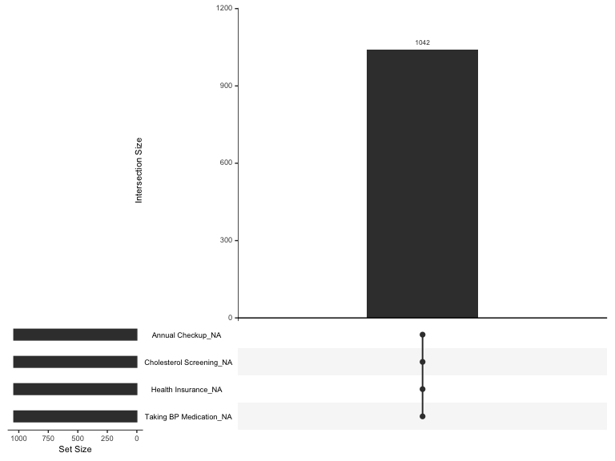

# Introduction
The United States has a high prevalence of chronic diseases such as heart disease, cancer, and diabetes. 
These diseases are the leading causes of death and disability in the United States. 
The Centers for Disease Control and Prevention (CDC) estimates that chronic diseases account for 7 out of 10 deaths in the United States. 
The CDC also estimates that chronic diseases are responsible for 86% of the nation's healthcare costs. 
The prevalence of chronic diseases in the United States is a major public health concern.

Preventive health measures such as vaccinations, screenings, and lifestyle changes can help reduce the risk of chronic diseases.
The CDC recommends that individuals receive vaccinations, screenings, and make lifestyle changes to reduce their risk of chronic diseases.
However, many individuals in the United States do not receive preventive health measures.

The purpose of this analysis is to examine the prevalence of chronic diseases in the United States in light of preventive health measures.
We will analyze the prevalence of chronic diseases in the United States and the use of preventive health measures.
We will also examine the relationship between chronic diseases and preventive health measures.

# Data
## About the data source
For this analysis, we will use PLACES: Local Data for Better Health, Place Data 2023 release.
Here's a brief description of the dataset (as provided by the CDC, source cited below):

* This dataset contains model-based county estimates. 
* PLACES covers the entire United States—50 states and the District of Columbia—at county, place, census tract, and ZIP Code Tabulation Area levels. 
* It provides information uniformly on this large scale for local areas at four geographic levels. 
* Estimates were provided by the Centers for Disease Control and Prevention (CDC), Division of Population Health, Epidemiology and Surveillance Branch. 
* PLACES was funded by the Robert Wood Johnson Foundation in conjunction with the CDC Foundation. 

* This dataset includes estimates for 36 measures: 
    * 13 for health outcomes, 
    * 10 for preventive services use, 
    * 4 for chronic disease-related health risk behaviors, 
    * 7 for disabilities, and 3 for health status. 

* Data sources used to generate these model-based estimates are:
    * Behavioral Risk Factor Surveillance System (BRFSS) 2021 or 2020 data, 
    * Census Bureau 2021 or 2020 county population estimate data, and 
    * American Community Survey 2017–2021, or 2016–2020 estimates. 

* The 2023 release uses 2021 BRFSS data for 29 measures and 2020 BRFSS data for 7 measures 
    (all teeth lost, dental visits, mammograms, cervical cancer screening, colorectal cancer screening, core preventive services among older adults, and sleeping less than 7 hours) 
    that the survey collects data on every other year. 

* More information about the methodology can be found at www.cdc.gov/places.

**Source:** 
    
* https://data.cdc.gov/500-Cities-Places/PLACES-Local-Data-for-Better-Health-Place-Data-202/eav7-hnsx/about_data

* Further information about the dataset can be found here: https://www.cdc.gov/places/about/index.html


## Quick glimpse into the data
Lets start by loading the data and examining the first few rows.


```r
    # loading data
    library(readr)

    # google drive location of the files
    prevalence_raw_url <- 'https://drive.google.com/file/d/1YPqH7BBPuoZjumdfMnqw-O82HZLoxq1t/view?usp=sharing'

    # define a function to read the data
    read_data <- function(url){
    # extract file id from the url
    file_id <- strsplit(url, '/')[[1]][6]
    
    # create a read path
    read_path <- paste0('https://drive.usercontent.google.com/download?id=', file_id, '&export=download&authuser=0&confirm=t')
    
    # read the data
    df <- read_csv(read_path)
    return(df)
    }

    # read the data
    prevalence <- read_data(prevalence_raw_url)

    # display the first few rows
    head(prevalence)
```

<div data-pagedtable="false">
  <script data-pagedtable-source type="application/json">
{"columns":[{"label":["Year"],"name":[1],"type":["dbl"],"align":["right"]},{"label":["StateAbbr"],"name":[2],"type":["chr"],"align":["left"]},{"label":["StateDesc"],"name":[3],"type":["chr"],"align":["left"]},{"label":["LocationName"],"name":[4],"type":["chr"],"align":["left"]},{"label":["DataSource"],"name":[5],"type":["chr"],"align":["left"]},{"label":["Category"],"name":[6],"type":["chr"],"align":["left"]},{"label":["Measure"],"name":[7],"type":["chr"],"align":["left"]},{"label":["Data_Value_Unit"],"name":[8],"type":["chr"],"align":["left"]},{"label":["Data_Value_Type"],"name":[9],"type":["chr"],"align":["left"]},{"label":["Data_Value"],"name":[10],"type":["dbl"],"align":["right"]},{"label":["Data_Value_Footnote_Symbol"],"name":[11],"type":["chr"],"align":["left"]},{"label":["Data_Value_Footnote"],"name":[12],"type":["chr"],"align":["left"]},{"label":["Low_Confidence_Limit"],"name":[13],"type":["dbl"],"align":["right"]},{"label":["High_Confidence_Limit"],"name":[14],"type":["dbl"],"align":["right"]},{"label":["TotalPopulation"],"name":[15],"type":["dbl"],"align":["right"]},{"label":["Geolocation"],"name":[16],"type":["chr"],"align":["left"]},{"label":["LocationID"],"name":[17],"type":["chr"],"align":["left"]},{"label":["CategoryID"],"name":[18],"type":["chr"],"align":["left"]},{"label":["MeasureId"],"name":[19],"type":["chr"],"align":["left"]},{"label":["DataValueTypeID"],"name":[20],"type":["chr"],"align":["left"]},{"label":["Short_Question_Text"],"name":[21],"type":["chr"],"align":["left"]}],"data":[{"1":"2020","2":"AK","3":"Alaska","4":"Kiana","5":"BRFSS","6":"Health Outcomes","7":"All teeth lost among adults aged >=65 years","8":"%","9":"Crude prevalence","10":"38.5","11":"NA","12":"NA","13":"29.0","14":"48.0","15":"347","16":"POINT (-160.4343638 66.97258641)","17":"0239300","18":"HLTHOUT","19":"TEETHLOST","20":"CrdPrv","21":"All Teeth Lost"},{"1":"2021","2":"AK","3":"Alaska","4":"Koliganek","5":"BRFSS","6":"Health Outcomes","7":"Arthritis among adults aged >=18 years","8":"%","9":"Crude prevalence","10":"22.0","11":"NA","12":"NA","13":"18.5","14":"25.7","15":"209","16":"POINT (-157.2259091 59.69715239)","17":"0241500","18":"HLTHOUT","19":"ARTHRITIS","20":"CrdPrv","21":"Arthritis"},{"1":"2021","2":"AK","3":"Alaska","4":"Kongiganak","5":"BRFSS","6":"Health Outcomes","7":"Arthritis among adults aged >=18 years","8":"%","9":"Crude prevalence","10":"23.5","11":"NA","12":"NA","13":"20.2","14":"27.0","15":"439","16":"POINT (-162.8830767 59.95797089)","17":"0241610","18":"HLTHOUT","19":"ARTHRITIS","20":"CrdPrv","21":"Arthritis"},{"1":"2021","2":"AK","3":"Alaska","4":"Lakes","5":"BRFSS","6":"Health Outcomes","7":"Obesity among adults aged >=18 years","8":"%","9":"Crude prevalence","10":"36.7","11":"NA","12":"NA","13":"32.5","14":"41.2","15":"8364","16":"POINT (-149.3066764 61.60526948)","17":"0242832","18":"HLTHOUT","19":"OBESITY","20":"CrdPrv","21":"Obesity"},{"1":"2021","2":"AK","3":"Alaska","4":"Mountain Village","5":"BRFSS","6":"Health Outcomes","7":"Obesity among adults aged >=18 years","8":"%","9":"Crude prevalence","10":"47.3","11":"NA","12":"NA","13":"39.2","14":"56.1","15":"813","16":"POINT (-163.7209368 62.09111567)","17":"0251180","18":"HLTHOUT","19":"OBESITY","20":"CrdPrv","21":"Obesity"},{"1":"2021","2":"AK","3":"Alaska","4":"Nanwalek","5":"BRFSS","6":"Disability","7":"Any disability among adults aged >=18 years","8":"%","9":"Crude prevalence","10":"33.9","11":"NA","12":"NA","13":"29.4","14":"38.7","15":"254","16":"POINT (-151.9106261 59.32986778)","17":"0252210","18":"DISABLT","19":"DISABILITY","20":"CrdPrv","21":"Any Disability"}],"options":{"columns":{"min":{},"max":[10]},"rows":{"min":[10],"max":[10]},"pages":{}}}
  </script>
</div>

### Features in the dataset
The dataset contains the following columns:

```r
    # display the column names
    colnames(prevalence)
```

```
##  [1] "Year"                       "StateAbbr"                 
##  [3] "StateDesc"                  "LocationName"              
##  [5] "DataSource"                 "Category"                  
##  [7] "Measure"                    "Data_Value_Unit"           
##  [9] "Data_Value_Type"            "Data_Value"                
## [11] "Data_Value_Footnote_Symbol" "Data_Value_Footnote"       
## [13] "Low_Confidence_Limit"       "High_Confidence_Limit"     
## [15] "TotalPopulation"            "Geolocation"               
## [17] "LocationID"                 "CategoryID"                
## [19] "MeasureId"                  "DataValueTypeID"           
## [21] "Short_Question_Text"
```

Some basic data type conversions, before we proceed with the analysis:

```r
    library(sf)
    library(dplyr)

    # convert the Year column to integer
    prevalence$Year <- as.integer(prevalence$Year)

    # convert the Data_Value column to numeric
    prevalence$Data_Value <- as.numeric(prevalence$Data_Value)

    # convert LocationID to double
    prevalence$LocationID <- as.double(prevalence$LocationID)
```

### Features of interest
#### Health outcomes
Let's examine the 13 health outcomes:

```r
    library(dplyr)

    # filter the health outcomes
    health_outcomes <- prevalence %>% 
        filter(Category == 'Health Outcomes') %>%
        select(Year, Short_Question_Text, Measure) %>%
        distinct()

    # display the health outcomes
    health_outcomes
```

<div data-pagedtable="false">
  <script data-pagedtable-source type="application/json">
{"columns":[{"label":["Year"],"name":[1],"type":["int"],"align":["right"]},{"label":["Short_Question_Text"],"name":[2],"type":["chr"],"align":["left"]},{"label":["Measure"],"name":[3],"type":["chr"],"align":["left"]}],"data":[{"1":"2020","2":"All Teeth Lost","3":"All teeth lost among adults aged >=65 years"},{"1":"2021","2":"Arthritis","3":"Arthritis among adults aged >=18 years"},{"1":"2021","2":"Obesity","3":"Obesity among adults aged >=18 years"},{"1":"2021","2":"Current Asthma","3":"Current asthma among adults aged >=18 years"},{"1":"2021","2":"Stroke","3":"Stroke among adults aged >=18 years"},{"1":"2021","2":"High Blood Pressure","3":"High blood pressure among adults aged >=18 years"},{"1":"2021","2":"Depression","3":"Depression among adults aged >=18 years"},{"1":"2021","2":"Diabetes","3":"Diagnosed diabetes among adults aged >=18 years"},{"1":"2021","2":"Coronary Heart Disease","3":"Coronary heart disease among adults aged >=18 years"},{"1":"2021","2":"Cancer (except skin)","3":"Cancer (excluding skin cancer) among adults aged >=18 years"},{"1":"2021","2":"COPD","3":"Chronic obstructive pulmonary disease among adults aged >=18 years"},{"1":"2021","2":"High Cholesterol","3":"High cholesterol among adults aged >=18 years who have been screened in the past 5 years"},{"1":"2021","2":"Chronic Kidney Disease","3":"Chronic kidney disease among adults aged >=18 years"}],"options":{"columns":{"min":{},"max":[10]},"rows":{"min":[10],"max":[10]},"pages":{}}}
  </script>
</div>
As we can see all the health outcomes are measures from 2021, except for the measure 'All Teeth Lost' which is from 2020.
So we will filter out the 'All Teeth Lost' measure from the health outcomes.


```r
    # filter the health outcomes
    health_outcomes_filtered <- health_outcomes %>% 
        filter(Short_Question_Text != 'All Teeth Lost')
```

Quick check for missing values in the health outcomes:

```r
    # check for missing values in health outcomes
    missing_health_outcomes <- health_outcomes_filtered %>% 
        summarise_all(~sum(is.na(.)))

    # display the missing values
    missing_health_outcomes
```

<div data-pagedtable="false">
  <script data-pagedtable-source type="application/json">
{"columns":[{"label":["Year"],"name":[1],"type":["int"],"align":["right"]},{"label":["Short_Question_Text"],"name":[2],"type":["int"],"align":["right"]},{"label":["Measure"],"name":[3],"type":["int"],"align":["right"]}],"data":[{"1":"0","2":"0","3":"0"}],"options":{"columns":{"min":{},"max":[10]},"rows":{"min":[10],"max":[10]},"pages":{}}}
  </script>
</div>
Looks like there are no missing values in the health outcomes.


#### Preventive services
And, here are the 10 preventive services use measures:

```r
    # filter the preventive services
    preventive_services <- prevalence %>% 
        filter(Category == 'Prevention') %>%
        select(Year, Short_Question_Text, Measure) %>%
        distinct()

    # display the preventive services
    preventive_services
```

<div data-pagedtable="false">
  <script data-pagedtable-source type="application/json">
{"columns":[{"label":["Year"],"name":[1],"type":["int"],"align":["right"]},{"label":["Short_Question_Text"],"name":[2],"type":["chr"],"align":["left"]},{"label":["Measure"],"name":[3],"type":["chr"],"align":["left"]}],"data":[{"1":"2020","2":"Mammography","3":"Mammography use among women aged 50-74 years"},{"1":"2021","2":"Taking BP Medication","3":"Taking medicine for high blood pressure control among adults aged >=18 years with high blood pressure"},{"1":"2020","2":"Core preventive services for older men","3":"Older adult men aged >=65 years who are up to date on a core set of clinical preventive services: Flu shot past year, PPV shot ever, Colorectal cancer screening"},{"1":"2021","2":"Annual Checkup","3":"Visits to doctor for routine checkup within the past year among adults aged >=18 years"},{"1":"2020","2":"Dental Visit","3":"Visits to dentist or dental clinic among adults aged >=18 years"},{"1":"2021","2":"Health Insurance","3":"Current lack of health insurance among adults aged 18-64 years"},{"1":"2021","2":"Cholesterol Screening","3":"Cholesterol screening among adults aged >=18 years"},{"1":"2020","2":"Colorectal Cancer Screening","3":"Fecal occult blood test, sigmoidoscopy, or colonoscopy among adults aged 50-75 years"},{"1":"2020","2":"Cervical Cancer Screening","3":"Cervical cancer screening among adult women aged 21-65 years"},{"1":"2020","2":"Core preventive services for older women","3":"Older adult women aged >=65 years who are up to date on a core set of clinical preventive services: Flu shot past year, PPV shot ever, Colorectal cancer screening, and Mammogram past 2 years"}],"options":{"columns":{"min":{},"max":[10]},"rows":{"min":[10],"max":[10]},"pages":{}}}
  </script>
</div>
Similar to the health outcomes, we will filter out the preventive services measures from 2020.


```r
    # filter the preventive services
    preventive_services_filtered <- preventive_services %>% 
        filter(Year == 2021)
```

Quick check for missing values in the preventive services:

```r
    # check for missing values in preventive services
    missing_preventive_services <- preventive_services_filtered %>% 
        summarise_all(~sum(is.na(.)))

    # display the missing values
    missing_preventive_services
```

<div data-pagedtable="false">
  <script data-pagedtable-source type="application/json">
{"columns":[{"label":["Year"],"name":[1],"type":["int"],"align":["right"]},{"label":["Short_Question_Text"],"name":[2],"type":["int"],"align":["right"]},{"label":["Measure"],"name":[3],"type":["int"],"align":["right"]}],"data":[{"1":"0","2":"0","3":"0"}],"options":{"columns":{"min":{},"max":[10]},"rows":{"min":[10],"max":[10]},"pages":{}}}
  </script>
</div>
Looks like there are no missing values in the preventive services.


### Data Granularity
Each of these measures is estimated at the county level.

Here's number of counties (LocationName) and their total population (TotalPopulation) by state (StateDesc) in the dataset:

```r
    # count of counties, sum of total population by state
    counties_by_state <- prevalence %>% 
        select(StateDesc, LocationName, TotalPopulation) %>%
        distinct() %>%
        group_by(StateDesc) %>%
        summarise(Counties = n_distinct(LocationName), TotalPopulation = sum(TotalPopulation)) %>%
        arrange(desc(TotalPopulation))

    # display the counties by state
    counties_by_state
```

<div data-pagedtable="false">
  <script data-pagedtable-source type="application/json">
{"columns":[{"label":["StateDesc"],"name":[1],"type":["chr"],"align":["left"]},{"label":["Counties"],"name":[2],"type":["int"],"align":["right"]},{"label":["TotalPopulation"],"name":[3],"type":["dbl"],"align":["right"]}],"data":[{"1":"California","2":"1455","3":"35249103"},{"1":"Texas","2":"1667","3":"19818766"},{"1":"New York","2":"1183","3":"15713253"},{"1":"Florida","2":"904","3":"14350439"},{"1":"Illinois","2":"1351","3":"11261924"},{"1":"Ohio","2":"1203","3":"8110172"},{"1":"Pennsylvania","2":"1718","3":"7069500"},{"1":"Arizona","2":"417","3":"5927186"},{"1":"North Carolina","2":"730","3":"5638905"},{"1":"Washington","2":"610","3":"5544822"},{"1":"Michigan","2":"688","3":"5532041"},{"1":"Virginia","2":"589","3":"5434671"},{"1":"New Jersey","2":"539","3":"5287190"},{"1":"Georgia","2":"622","3":"4761354"},{"1":"Maryland","2":"507","3":"4752879"},{"1":"Massachusetts","2":"244","3":"4636215"},{"1":"Indiana","2":"675","3":"4472613"},{"1":"Minnesota","2":"870","3":"4371554"},{"1":"Colorado","2":"429","3":"4309860"},{"1":"Wisconsin","2":"772","3":"4220077"},{"1":"Missouri","2":"978","3":"4177284"},{"1":"Tennessee","2":"427","3":"3948244"},{"1":"Alabama","2":"576","3":"3115688"},{"1":"Oregon","2":"368","3":"3040749"},{"1":"Louisiana","2":"473","3":"2985275"},{"1":"Oklahoma","2":"703","3":"2919710"},{"1":"Utah","2":"318","3":"2643778"},{"1":"Nevada","2":"123","3":"2564178"},{"1":"Kentucky","2":"535","3":"2524410"},{"1":"Iowa","2":"958","3":"2425903"},{"1":"Kansas","2":"631","3":"2375693"},{"1":"Connecticut","2":"142","3":"2182023"},{"1":"South Carolina","2":"393","3":"2161188"},{"1":"Arkansas","2":"531","3":"1954780"},{"1":"New Mexico","2":"413","3":"1704456"},{"1":"Mississippi","2":"361","3":"1634960"},{"1":"Nebraska","2":"526","3":"1471279"},{"1":"Hawaii","2":"147","3":"1307728"},{"1":"Idaho","2":"216","3":"1106863"},{"1":"West Virginia","2":"402","3":"803648"},{"1":"Alaska","2":"295","3":"688431"},{"1":"Montana","2":"345","3":"685970"},{"1":"Rhode Island","2":"36","3":"649582"},{"1":"New Hampshire","2":"97","3":"628321"},{"1":"Maine","2":"130","3":"620697"},{"1":"South Dakota","2":"335","3":"612009"},{"1":"District of Columbia","2":"1","3":"601723"},{"1":"North Dakota","2":"317","3":"524407"},{"1":"Wyoming","2":"181","3":"438228"},{"1":"Delaware","2":"77","3":"390233"},{"1":"Vermont","2":"121","3":"242649"}],"options":{"columns":{"min":{},"max":[10]},"rows":{"min":[10],"max":[10]},"pages":{}}}
  </script>
</div>

### Types of measures
Each measure is represented in the dataset by 3 different types (Data_Value_Type):

```r
    # count of data value types
    data_value_types <- prevalence %>% 
        group_by(Data_Value_Type) %>%
        summarise(Count = n_distinct(Measure)) %>%
        arrange(desc(Count))

    # display the data value types
    data_value_types
```

<div data-pagedtable="false">
  <script data-pagedtable-source type="application/json">
{"columns":[{"label":["Data_Value_Type"],"name":[1],"type":["chr"],"align":["left"]},{"label":["Count"],"name":[2],"type":["int"],"align":["right"]}],"data":[{"1":"Age-adjusted prevalence","2":"37"},{"1":"Crude prevalence","2":"37"}],"options":{"columns":{"min":{},"max":[10]},"rows":{"min":[10],"max":[10]},"pages":{}}}
  </script>
</div>
We will be using the 'Age-adjusted prevalence' for our analysis.

### Data Value Units
Here's the distribution of data value units:

```r
    # count of data value units
    data_value_units <- prevalence %>% 
        group_by(Data_Value_Unit) %>%
        summarise(Count = n_distinct(Measure)) %>%
        arrange(desc(Count))

    # display the data value units
    data_value_units
```

<div data-pagedtable="false">
  <script data-pagedtable-source type="application/json">
{"columns":[{"label":["Data_Value_Unit"],"name":[1],"type":["chr"],"align":["left"]},{"label":["Count"],"name":[2],"type":["int"],"align":["right"]}],"data":[{"1":"%","2":"37"}],"options":{"columns":{"min":{},"max":[10]},"rows":{"min":[10],"max":[10]},"pages":{}}}
  </script>
</div>
It appears that the data value unit is 'Percent' for all the measures.
This is great as it will allow us to compare the measures directly.

## Preparing dataset for our analysis
For the purpose of our analysis, we will create a few component datasets:
1. Measures
2. Counties
3. Health outcomes
4. Preventive services

We analyze these datasets to understand the data and check for missing values.
Once we are satisfied with the data, we will combine these datasets and transform the data in the right shape for our analysis.
We will also save the prepared dataset on Google Drive for future use.


### Measures

```r
    # filter the measures
    # we will use the 'Age-adjusted prevalence' data value type
    # and Year = 2021
    measures_data <- prevalence %>% 
        filter(Year == 2021) %>%
        filter(Data_Value_Type == 'Age-adjusted prevalence') %>%
        select(Year, Category, Short_Question_Text, Measure, Data_Value_Type, Data_Value_Unit) %>%
        distinct()

    # display measures
    measures_data
```

<div data-pagedtable="false">
  <script data-pagedtable-source type="application/json">
{"columns":[{"label":["Year"],"name":[1],"type":["int"],"align":["right"]},{"label":["Category"],"name":[2],"type":["chr"],"align":["left"]},{"label":["Short_Question_Text"],"name":[3],"type":["chr"],"align":["left"]},{"label":["Measure"],"name":[4],"type":["chr"],"align":["left"]},{"label":["Data_Value_Type"],"name":[5],"type":["chr"],"align":["left"]},{"label":["Data_Value_Unit"],"name":[6],"type":["chr"],"align":["left"]}],"data":[{"1":"2021","2":"Health Outcomes","3":"Arthritis","4":"Arthritis among adults aged >=18 years","5":"Age-adjusted prevalence","6":"%"},{"1":"2021","2":"Health Outcomes","3":"Stroke","4":"Stroke among adults aged >=18 years","5":"Age-adjusted prevalence","6":"%"},{"1":"2021","2":"Health Outcomes","3":"Obesity","4":"Obesity among adults aged >=18 years","5":"Age-adjusted prevalence","6":"%"},{"1":"2021","2":"Health Outcomes","3":"Depression","4":"Depression among adults aged >=18 years","5":"Age-adjusted prevalence","6":"%"},{"1":"2021","2":"Disability","3":"Any Disability","4":"Any disability among adults aged >=18 years","5":"Age-adjusted prevalence","6":"%"},{"1":"2021","2":"Prevention","3":"Taking BP Medication","4":"Taking medicine for high blood pressure control among adults aged >=18 years with high blood pressure","5":"Age-adjusted prevalence","6":"%"},{"1":"2021","2":"Health Outcomes","3":"Current Asthma","4":"Current asthma among adults aged >=18 years","5":"Age-adjusted prevalence","6":"%"},{"1":"2021","2":"Health Outcomes","3":"Coronary Heart Disease","4":"Coronary heart disease among adults aged >=18 years","5":"Age-adjusted prevalence","6":"%"},{"1":"2021","2":"Disability","3":"Cognitive Disability","4":"Cognitive disability among adults ages >=18 years","5":"Age-adjusted prevalence","6":"%"},{"1":"2021","2":"Health Risk Behaviors","3":"Physical Inactivity","4":"No leisure-time physical activity among adults aged >=18 years","5":"Age-adjusted prevalence","6":"%"},{"1":"2021","2":"Health Status","3":"Mental Health","4":"Mental health not good for >=14 days among adults aged >=18 years","5":"Age-adjusted prevalence","6":"%"},{"1":"2021","2":"Disability","3":"Independent Living Disability","4":"Independent living disability among adults aged >=18 years","5":"Age-adjusted prevalence","6":"%"},{"1":"2021","2":"Health Risk Behaviors","3":"Binge Drinking","4":"Binge drinking among adults aged >=18 years","5":"Age-adjusted prevalence","6":"%"},{"1":"2021","2":"Health Risk Behaviors","3":"Current Smoking","4":"Current smoking among adults aged >=18 years","5":"Age-adjusted prevalence","6":"%"},{"1":"2021","2":"Health Outcomes","3":"Diabetes","4":"Diagnosed diabetes among adults aged >=18 years","5":"Age-adjusted prevalence","6":"%"},{"1":"2021","2":"Prevention","3":"Cholesterol Screening","4":"Cholesterol screening among adults aged >=18 years","5":"Age-adjusted prevalence","6":"%"},{"1":"2021","2":"Health Outcomes","3":"High Blood Pressure","4":"High blood pressure among adults aged >=18 years","5":"Age-adjusted prevalence","6":"%"},{"1":"2021","2":"Health Outcomes","3":"High Cholesterol","4":"High cholesterol among adults aged >=18 years who have been screened in the past 5 years","5":"Age-adjusted prevalence","6":"%"},{"1":"2021","2":"Prevention","3":"Health Insurance","4":"Current lack of health insurance among adults aged 18-64 years","5":"Age-adjusted prevalence","6":"%"},{"1":"2021","2":"Health Outcomes","3":"Cancer (except skin)","4":"Cancer (excluding skin cancer) among adults aged >=18 years","5":"Age-adjusted prevalence","6":"%"},{"1":"2021","2":"Health Outcomes","3":"COPD","4":"Chronic obstructive pulmonary disease among adults aged >=18 years","5":"Age-adjusted prevalence","6":"%"},{"1":"2021","2":"Disability","3":"Self-care Disability","4":"Self-care disability among adults aged >=18 years","5":"Age-adjusted prevalence","6":"%"},{"1":"2021","2":"Health Status","3":"General Health","4":"Fair or poor self-rated health status among adults aged >=18 years","5":"Age-adjusted prevalence","6":"%"},{"1":"2021","2":"Health Status","3":"Physical Health","4":"Physical health not good for >=14 days among adults aged >=18 years","5":"Age-adjusted prevalence","6":"%"},{"1":"2021","2":"Prevention","3":"Annual Checkup","4":"Visits to doctor for routine checkup within the past year among adults aged >=18 years","5":"Age-adjusted prevalence","6":"%"},{"1":"2021","2":"Disability","3":"Mobility Disability","4":"Mobility disability among adults aged >=18 years","5":"Age-adjusted prevalence","6":"%"},{"1":"2021","2":"Disability","3":"Hearing Disability","4":"Hearing disability among adults aged >=18 years","5":"Age-adjusted prevalence","6":"%"},{"1":"2021","2":"Disability","3":"Vision Disability","4":"Vision disability among adults aged >=18 years","5":"Age-adjusted prevalence","6":"%"},{"1":"2021","2":"Health Outcomes","3":"Chronic Kidney Disease","4":"Chronic kidney disease among adults aged >=18 years","5":"Age-adjusted prevalence","6":"%"}],"options":{"columns":{"min":{},"max":[10]},"rows":{"min":[10],"max":[10]},"pages":{}}}
  </script>
</div>

### Counties

```r
    # filter the counties
    counties_data <- prevalence %>% 
        select(LocationID, LocationName, StateDesc, StateAbbr, TotalPopulation, Geolocation) %>%
        distinct()

    # load urban rural classification data
    urban_rural_url <- 'https://drive.google.com/file/d/1-w2AvZj4_sqEzMMS-NCPsILAZzKPaVvE/view?usp=sharing'
    urban_rural_data <- read_data(urban_rural_url)
    head(urban_rural_data)
```

<div data-pagedtable="false">
  <script data-pagedtable-source type="application/json">
{"columns":[{"label":["FIPS code"],"name":[1],"type":["dbl"],"align":["right"]},{"label":["State Abr."],"name":[2],"type":["chr"],"align":["left"]},{"label":["County name"],"name":[3],"type":["chr"],"align":["left"]},{"label":["CBSA title"],"name":[4],"type":["chr"],"align":["left"]},{"label":["CBSA 2012 pop"],"name":[5],"type":["chr"],"align":["left"]},{"label":["County 2012 pop"],"name":[6],"type":["dbl"],"align":["right"]},{"label":["2013 code"],"name":[7],"type":["dbl"],"align":["right"]},{"label":["2006 code"],"name":[8],"type":["dbl"],"align":["right"]},{"label":["1990-based code"],"name":[9],"type":["chr"],"align":["left"]},{"label":["...10"],"name":[10],"type":["lgl"],"align":["right"]}],"data":[{"1":"1001","2":"AL","3":"Autauga County","4":"Montgomery, AL","5":"377149","6":"55514","7":"3","8":"3","9":"3","10":"NA"},{"1":"1003","2":"AL","3":"Baldwin County","4":"Daphne-Fairhope-Foley, AL","5":"190790","6":"190790","7":"4","8":"5","9":"3","10":"NA"},{"1":"1005","2":"AL","3":"Barbour County","4":"NA","5":".","6":"27201","7":"6","8":"5","9":"5","10":"NA"},{"1":"1007","2":"AL","3":"Bibb County","4":"Birmingham-Hoover, AL","5":"1136650","6":"22597","7":"2","8":"2","9":"6","10":"NA"},{"1":"1009","2":"AL","3":"Blount County","4":"Birmingham-Hoover, AL","5":"1136650","6":"57826","7":"2","8":"2","9":"3","10":"NA"},{"1":"1011","2":"AL","3":"Bullock County","4":"NA","5":".","6":"10474","7":"6","8":"6","9":"6","10":"NA"}],"options":{"columns":{"min":{},"max":[10]},"rows":{"min":[10],"max":[10]},"pages":{}}}
  </script>
</div>

```r
    # select the required columns
    # 'State Abr.', 'County name', 'FIPS code', '2013 code'
    # rename to: 'StateAbbr', 'LocationName', 'FIPS', 'urban_rural_code'
    # stip 'County' from 'County name'
    urban_rural_data <- urban_rural_data %>%
        select(`State Abr.` = 'State Abr.', `County name` = 'County name', `FIPS code` = 'FIPS code', `2013 code` = '2013 code') %>%
        rename(StateAbbr = `State Abr.`, LocationName = `County name`, FIPS = `FIPS code`, urban_rural_code = `2013 code`) %>%
        mutate(LocationName = gsub(' County', '', LocationName))
    head(urban_rural_data)
```

<div data-pagedtable="false">
  <script data-pagedtable-source type="application/json">
{"columns":[{"label":["StateAbbr"],"name":[1],"type":["chr"],"align":["left"]},{"label":["LocationName"],"name":[2],"type":["chr"],"align":["left"]},{"label":["FIPS"],"name":[3],"type":["dbl"],"align":["right"]},{"label":["urban_rural_code"],"name":[4],"type":["dbl"],"align":["right"]}],"data":[{"1":"AL","2":"Autauga","3":"1001","4":"3"},{"1":"AL","2":"Baldwin","3":"1003","4":"4"},{"1":"AL","2":"Barbour","3":"1005","4":"6"},{"1":"AL","2":"Bibb","3":"1007","4":"2"},{"1":"AL","2":"Blount","3":"1009","4":"2"},{"1":"AL","2":"Bullock","3":"1011","4":"6"}],"options":{"columns":{"min":{},"max":[10]},"rows":{"min":[10],"max":[10]},"pages":{}}}
  </script>
</div>

```r
    # merge the counties data with urban rural classification
    # join based on LocationID in counties_data and FIPS in urban_rural_data
    counties_data$LocationID <- as.numeric(counties_data$LocationID)
    counties_data <- counties_data %>%
        left_join(urban_rural_data, by = c('LocationID' = 'FIPS'))

    # create a new column 'urban_rural_classification' based on 'urban_rural_code'
    # 1 - "Large central metro", 2 - "Large fringe metro", 3 - "Medium metro", 4 - "Small metro", 5 - "Micropolitan", 6 - "Noncore"
    counties_data <- counties_data %>%
        mutate(urban_rural_classification = case_when(
            urban_rural_code == 1 ~ "Large central metro",
            urban_rural_code == 2 ~ "Large fringe metro",
            urban_rural_code == 3 ~ "Medium metro",
            urban_rural_code == 4 ~ "Small metro",
            urban_rural_code == 5 ~ "Micropolitan",
            urban_rural_code == 6 ~ "Noncore",
            TRUE ~ "Unknown"
        ))
    
    # display the missing values
    missing_counties <- counties_data %>%
        filter(is.na(urban_rural_code))

    # display the missing counties
    head(missing_counties)
```

<div data-pagedtable="false">
  <script data-pagedtable-source type="application/json">
{"columns":[{"label":["LocationID"],"name":[1],"type":["dbl"],"align":["right"]},{"label":["LocationName.x"],"name":[2],"type":["chr"],"align":["left"]},{"label":["StateDesc"],"name":[3],"type":["chr"],"align":["left"]},{"label":["StateAbbr.x"],"name":[4],"type":["chr"],"align":["left"]},{"label":["TotalPopulation"],"name":[5],"type":["dbl"],"align":["right"]},{"label":["Geolocation"],"name":[6],"type":["chr"],"align":["left"]},{"label":["StateAbbr.y"],"name":[7],"type":["chr"],"align":["left"]},{"label":["LocationName.y"],"name":[8],"type":["chr"],"align":["left"]},{"label":["urban_rural_code"],"name":[9],"type":["dbl"],"align":["right"]},{"label":["urban_rural_classification"],"name":[10],"type":["chr"],"align":["left"]}],"data":[{"1":"239300","2":"Kiana","3":"Alaska","4":"AK","5":"347","6":"POINT (-160.4343638 66.97258641)","7":"NA","8":"NA","9":"NA","10":"Unknown"},{"1":"241500","2":"Koliganek","3":"Alaska","4":"AK","5":"209","6":"POINT (-157.2259091 59.69715239)","7":"NA","8":"NA","9":"NA","10":"Unknown"},{"1":"241610","2":"Kongiganak","3":"Alaska","4":"AK","5":"439","6":"POINT (-162.8830767 59.95797089)","7":"NA","8":"NA","9":"NA","10":"Unknown"},{"1":"242832","2":"Lakes","3":"Alaska","4":"AK","5":"8364","6":"POINT (-149.3066764 61.60526948)","7":"NA","8":"NA","9":"NA","10":"Unknown"},{"1":"251180","2":"Mountain Village","3":"Alaska","4":"AK","5":"813","6":"POINT (-163.7209368 62.09111567)","7":"NA","8":"NA","9":"NA","10":"Unknown"},{"1":"252210","2":"Nanwalek","3":"Alaska","4":"AK","5":"254","6":"POINT (-151.9106261 59.32986778)","7":"NA","8":"NA","9":"NA","10":"Unknown"}],"options":{"columns":{"min":{},"max":[10]},"rows":{"min":[10],"max":[10]},"pages":{}}}
  </script>
</div>


### Health outcomes
Let's prepare the health outcomes dataset and take a quick look at few rows.

```r
    library(tidyr)

    # filter the health outcomes
    health_outcomes_data <- prevalence %>% 
        filter(Category == 'Health Outcomes') %>%
        filter(Short_Question_Text != 'All Teeth Lost') %>%
        filter(Data_Value_Type == 'Age-adjusted prevalence') %>%
        select(Year, LocationID, Short_Question_Text, Data_Value)

    # few rows of health outcomes
    head(health_outcomes_data)    
```

<div data-pagedtable="false">
  <script data-pagedtable-source type="application/json">
{"columns":[{"label":["Year"],"name":[1],"type":["int"],"align":["right"]},{"label":["LocationID"],"name":[2],"type":["dbl"],"align":["right"]},{"label":["Short_Question_Text"],"name":[3],"type":["chr"],"align":["left"]},{"label":["Data_Value"],"name":[4],"type":["dbl"],"align":["right"]}],"data":[{"1":"2021","2":"272960","3":"Arthritis","4":"25.5"},{"1":"2021","2":"459900","3":"Stroke","4":"2.9"},{"1":"2021","2":"555280","3":"Arthritis","4":"27.4"},{"1":"2021","2":"560380","3":"Arthritis","4":"29.3"},{"1":"2021","2":"560380","3":"Obesity","4":"40.8"},{"1":"2021","2":"563020","3":"Arthritis","4":"27.0"}],"options":{"columns":{"min":{},"max":[10]},"rows":{"min":[10],"max":[10]},"pages":{}}}
  </script>
</div>

Now let's check for missing values in the health outcomes:

```r
    # pivot the data
    health_outcomes_data <- spread(health_outcomes_data, key = Short_Question_Text, value = Data_Value)

    # plot the missing values
    library(naniar)
    gg_miss_upset(health_outcomes_data)
```

<!-- -->
As we can see from the plot, the number of missing values is very low and we can safely ignore them.

```r
    # remove missing values
    health_outcomes_data <- health_outcomes_data %>% 
        drop_na()
```

### Preventive services
Let's prepare the preventive services dataset and check for missing values:

```r
    # filter the preventive services
    # filter for Short_Question_Text in Annual Checkup, Cholesterol Screening, Health Insurance, Taking BP Medication
    preventive_services_data <- prevalence %>% 
        filter(Category == 'Prevention') %>%
        filter(Short_Question_Text %in% c('Annual Checkup', 'Cholesterol Screening', 'Health Insurance', 'Taking BP Medication')) %>%
        filter(Data_Value_Type == 'Age-adjusted prevalence') %>%
        select(Year, LocationID, Short_Question_Text, Data_Value)

    # few rows of preventive services
    head(preventive_services_data)
```

<div data-pagedtable="false">
  <script data-pagedtable-source type="application/json">
{"columns":[{"label":["Year"],"name":[1],"type":["int"],"align":["right"]},{"label":["LocationID"],"name":[2],"type":["dbl"],"align":["right"]},{"label":["Short_Question_Text"],"name":[3],"type":["chr"],"align":["left"]},{"label":["Data_Value"],"name":[4],"type":["dbl"],"align":["right"]}],"data":[{"1":"2021","2":"2741480","3":"Taking BP Medication","4":"55.1"},{"1":"2021","2":"102836","3":"Cholesterol Screening","4":"82.4"},{"1":"2021","2":"130496","3":"Health Insurance","4":"12.3"},{"1":"2021","2":"127088","3":"Health Insurance","4":"10.8"},{"1":"2021","2":"114392","3":"Taking BP Medication","4":"71.0"},{"1":"2021","2":"128312","3":"Cholesterol Screening","4":"84.2"}],"options":{"columns":{"min":{},"max":[10]},"rows":{"min":[10],"max":[10]},"pages":{}}}
  </script>
</div>

Check for missing values in the preventive services:

```r
    # pivot the data
    preventive_services_data <- spread(preventive_services_data, key = Short_Question_Text, value = Data_Value)

    # plot the missing values
    gg_miss_upset(preventive_services_data)
```

<!-- -->

As we can see from the plot, the number of missing values is very low and we can safely ignore them.

```r
    # remove missing values
    preventive_services_data <- preventive_services_data %>% 
        drop_na()
```

### Combined dataset

```r
    # combine the health outcomes and preventive services data
    combined_data <- left_join(health_outcomes_data, preventive_services_data, by = c('Year', 'LocationID'))

    # combine the combined data with the counties data
    combined_data <- left_join(combined_data, counties_data, by = 'LocationID')

    # display the first few rows
    head(combined_data)
```

<div data-pagedtable="false">
  <script data-pagedtable-source type="application/json">
{"columns":[{"label":["Year"],"name":[1],"type":["int"],"align":["right"]},{"label":["LocationID"],"name":[2],"type":["dbl"],"align":["right"]},{"label":["Arthritis"],"name":[3],"type":["dbl"],"align":["right"]},{"label":["Cancer (except skin)"],"name":[4],"type":["dbl"],"align":["right"]},{"label":["Chronic Kidney Disease"],"name":[5],"type":["dbl"],"align":["right"]},{"label":["COPD"],"name":[6],"type":["dbl"],"align":["right"]},{"label":["Coronary Heart Disease"],"name":[7],"type":["dbl"],"align":["right"]},{"label":["Current Asthma"],"name":[8],"type":["dbl"],"align":["right"]},{"label":["Depression"],"name":[9],"type":["dbl"],"align":["right"]},{"label":["Diabetes"],"name":[10],"type":["dbl"],"align":["right"]},{"label":["High Blood Pressure"],"name":[11],"type":["dbl"],"align":["right"]},{"label":["High Cholesterol"],"name":[12],"type":["dbl"],"align":["right"]},{"label":["Obesity"],"name":[13],"type":["dbl"],"align":["right"]},{"label":["Stroke"],"name":[14],"type":["dbl"],"align":["right"]},{"label":["Annual Checkup"],"name":[15],"type":["dbl"],"align":["right"]},{"label":["Cholesterol Screening"],"name":[16],"type":["dbl"],"align":["right"]},{"label":["Health Insurance"],"name":[17],"type":["dbl"],"align":["right"]},{"label":["Taking BP Medication"],"name":[18],"type":["dbl"],"align":["right"]},{"label":["LocationName.x"],"name":[19],"type":["chr"],"align":["left"]},{"label":["StateDesc"],"name":[20],"type":["chr"],"align":["left"]},{"label":["StateAbbr.x"],"name":[21],"type":["chr"],"align":["left"]},{"label":["TotalPopulation"],"name":[22],"type":["dbl"],"align":["right"]},{"label":["Geolocation"],"name":[23],"type":["chr"],"align":["left"]},{"label":["StateAbbr.y"],"name":[24],"type":["chr"],"align":["left"]},{"label":["LocationName.y"],"name":[25],"type":["chr"],"align":["left"]},{"label":["urban_rural_code"],"name":[26],"type":["dbl"],"align":["right"]},{"label":["urban_rural_classification"],"name":[27],"type":["chr"],"align":["left"]}],"data":[{"1":"2021","2":"100100","3":"30.3","4":"6.1","5":"3.5","6":"9.4","7":"6.9","8":"11.6","9":"24.7","10":"14.3","11":"41.5","12":"33.4","13":"44.7","14":"4.1","15":"76.4","16":"82.3","17":"15.0","18":"67.0","19":"Abanda","20":"Alabama","21":"AL","22":"192","23":"POINT (-85.524638 33.09136893)","24":"NA","25":"NA","26":"NA","27":"Unknown"},{"1":"2021","2":"100124","3":"29.6","4":"6.1","5":"3.5","6":"9.4","7":"6.9","8":"11.7","9":"22.9","10":"14.3","11":"41.5","12":"33.2","13":"42.3","14":"4.1","15":"77.3","16":"83.0","17":"15.3","18":"68.1","19":"Abbeville","20":"Alabama","21":"AL","22":"2688","23":"POINT (-85.25278085 31.56640742)","24":"NA","25":"NA","26":"NA","27":"Unknown"},{"1":"2021","2":"100460","3":"29.6","4":"6.1","5":"3.3","6":"7.9","7":"6.5","8":"11.1","9":"23.6","10":"13.5","11":"41.3","12":"32.5","13":"41.8","14":"3.7","15":"76.2","16":"83.5","17":"13.7","18":"68.0","19":"Adamsville","20":"Alabama","21":"AL","22":"4522","23":"POINT (-87.007999 33.62019948)","24":"NA","25":"NA","26":"NA","27":"Unknown"},{"1":"2021","2":"100484","3":"28.6","4":"6.6","5":"2.9","6":"8.9","7":"6.4","8":"10.6","9":"26.6","10":"10.6","11":"35.5","12":"33.6","13":"38.2","14":"3.2","15":"73.4","16":"82.5","17":"12.2","18":"63.0","19":"Addison","20":"Alabama","21":"AL","22":"758","23":"POINT (-87.17656313 34.20163288)","24":"NA","25":"NA","26":"NA","27":"Unknown"},{"1":"2021","2":"100676","3":"29.9","4":"5.6","5":"3.8","6":"7.9","7":"6.4","8":"12.4","9":"20.0","10":"16.2","11":"46.9","12":"31.7","13":"47.7","14":"4.5","15":"81.1","16":"85.6","17":"14.4","18":"70.0","19":"Akron","20":"Alabama","21":"AL","22":"356","23":"POINT (-87.74285611 32.87854106)","24":"NA","25":"NA","26":"NA","27":"Unknown"},{"1":"2021","2":"100820","3":"27.0","4":"6.5","5":"2.6","6":"5.8","7":"5.1","8":"9.5","9":"22.3","10":"9.3","11":"34.8","12":"31.9","13":"34.3","14":"2.6","15":"76.6","16":"86.7","17":"9.5","18":"63.6","19":"Alabaster","20":"Alabama","21":"AL","22":"31367","23":"POINT (-86.847219 33.19676585)","24":"NA","25":"NA","26":"NA","27":"Unknown"}],"options":{"columns":{"min":{},"max":[10]},"rows":{"min":[10],"max":[10]},"pages":{}}}
  </script>
</div>

Check for missing values in the combined dataset:

```r
    # check for missing values in the combined data
    missing_combined_data <- combined_data %>% 
        summarise_all(~sum(is.na(.)))

    # display the missing values
    missing_combined_data
```

<div data-pagedtable="false">
  <script data-pagedtable-source type="application/json">
{"columns":[{"label":["Year"],"name":[1],"type":["int"],"align":["right"]},{"label":["LocationID"],"name":[2],"type":["int"],"align":["right"]},{"label":["Arthritis"],"name":[3],"type":["int"],"align":["right"]},{"label":["Cancer (except skin)"],"name":[4],"type":["int"],"align":["right"]},{"label":["Chronic Kidney Disease"],"name":[5],"type":["int"],"align":["right"]},{"label":["COPD"],"name":[6],"type":["int"],"align":["right"]},{"label":["Coronary Heart Disease"],"name":[7],"type":["int"],"align":["right"]},{"label":["Current Asthma"],"name":[8],"type":["int"],"align":["right"]},{"label":["Depression"],"name":[9],"type":["int"],"align":["right"]},{"label":["Diabetes"],"name":[10],"type":["int"],"align":["right"]},{"label":["High Blood Pressure"],"name":[11],"type":["int"],"align":["right"]},{"label":["High Cholesterol"],"name":[12],"type":["int"],"align":["right"]},{"label":["Obesity"],"name":[13],"type":["int"],"align":["right"]},{"label":["Stroke"],"name":[14],"type":["int"],"align":["right"]},{"label":["Annual Checkup"],"name":[15],"type":["int"],"align":["right"]},{"label":["Cholesterol Screening"],"name":[16],"type":["int"],"align":["right"]},{"label":["Health Insurance"],"name":[17],"type":["int"],"align":["right"]},{"label":["Taking BP Medication"],"name":[18],"type":["int"],"align":["right"]},{"label":["LocationName.x"],"name":[19],"type":["int"],"align":["right"]},{"label":["StateDesc"],"name":[20],"type":["int"],"align":["right"]},{"label":["StateAbbr.x"],"name":[21],"type":["int"],"align":["right"]},{"label":["TotalPopulation"],"name":[22],"type":["int"],"align":["right"]},{"label":["Geolocation"],"name":[23],"type":["int"],"align":["right"]},{"label":["StateAbbr.y"],"name":[24],"type":["int"],"align":["right"]},{"label":["LocationName.y"],"name":[25],"type":["int"],"align":["right"]},{"label":["urban_rural_code"],"name":[26],"type":["int"],"align":["right"]},{"label":["urban_rural_classification"],"name":[27],"type":["int"],"align":["right"]}],"data":[{"1":"0","2":"0","3":"0","4":"0","5":"0","6":"0","7":"0","8":"0","9":"0","10":"0","11":"0","12":"0","13":"0","14":"0","15":"0","16":"0","17":"0","18":"0","19":"0","20":"0","21":"0","22":"0","23":"0","24":"26531","25":"26531","26":"26531","27":"0"}],"options":{"columns":{"min":{},"max":[10]},"rows":{"min":[10],"max":[10]},"pages":{}}}
  </script>
</div>
No missing values in the combined dataset.

