# Introduction
The United States has a high prevalence of chronic diseases such as heart disease, cancer, and diabetes. 
These diseases are the leading causes of death and disability in the United States. 
The Centers for Disease Control and Prevention (CDC) estimates that chronic diseases account for 7 out of 10 deaths in the United States. 
The CDC also estimates that chronic diseases are responsible for 86% of the nation's healthcare costs. 
The prevalence of chronic diseases in the United States is a major public health concern.

The CDC's PLACES project provides county-level data on chronic disease prevalence, health outcomes, and health behaviors in the United States.
The PLACES project aims to provide data that can be used to identify and address health disparities at the local level.
The PLACES data can be used to identify areas with high rates of chronic diseases and to develop targeted interventions to improve health outcomes.

In this analysis, we will use the PLACES: County Data, 2023 release to examine the prevalence of chronic diseases in the United States.
We will analyze the prevalence of chronic diseases such as arthritis, high blood pressure, cancer, asthma, and diabetes.
We will also examine other health outcomes, health behaviors, and social determinants of health in the United States.
The goal of this analysis is to identify areas with high rates of chronic diseases and to explore the factors that contribute to these disparities.

# Data Source Description
For this analysis, we will use PLACES: Local Data for Better Health, Place Data 2023 release.
Here's a brief description of the dataset (as provided by the CDC, source cited below):

* This dataset contains model-based county estimates. 
* PLACES covers the entire United States—50 states and the District of Columbia—at county, place, census tract, and ZIP Code Tabulation Area levels. 
* It provides information uniformly on this large scale for local areas at four geographic levels. 
* Estimates were provided by the Centers for Disease Control and Prevention (CDC), Division of Population Health, Epidemiology and Surveillance Branch. 
* PLACES was funded by the Robert Wood Johnson Foundation in conjunction with the CDC Foundation. 

* This dataset includes estimates for 36 measures: 
    * 13 for health outcomes, 
    * 10 for preventive services use, 
    * 4 for chronic disease-related health risk behaviors, 
    * 7 for disabilities, and 3 for health status. 

* Data sources used to generate these model-based estimates are:
    * Behavioral Risk Factor Surveillance System (BRFSS) 2021 or 2020 data, 
    * Census Bureau 2021 or 2020 county population estimate data, and 
    * American Community Survey 2017–2021, or 2016–2020 estimates. 

* The 2023 release uses 2021 BRFSS data for 29 measures and 2020 BRFSS data for 7 measures 
    (all teeth lost, dental visits, mammograms, cervical cancer screening, colorectal cancer screening, core preventive services among older adults, and sleeping less than 7 hours) 
    that the survey collects data on every other year. 

* More information about the methodology can be found at www.cdc.gov/places.

**Source:** 
    
* https://data.cdc.gov/500-Cities-Places/PLACES-Local-Data-for-Better-Health-Place-Data-202/eav7-hnsx/about_data

* Further information about the dataset can be found here: https://www.cdc.gov/places/about/index.html

# Exploration and Data Preparation
## Quick glimpse into the data
Lets start by loading the data and examining the first few rows.

```r
    # loading data
    library(readr)

    # google drive location of the files
    places_county_2023_url <- 'https://drive.google.com/file/d/1XN8AfQ36pSBkfFXMI3rLpjij0Rt67WCj/view?usp=sharing'

    # define a function to read the data
    read_data <- function(url){
    # extract file id from the url
    file_id <- strsplit(url, '/')[[1]][6]
    
    # create a read path
    read_path <- paste0('https://drive.usercontent.google.com/download?id=', file_id, '&export=download&authuser=0&confirm=t')
    
    # read the data
    df <- read_csv(read_path)
    return(df)
    }

    # read the data
    places_county_2023 <- read_data(places_county_2023_url)

    # display the first few rows
    head(places_county_2023)
```

<div data-pagedtable="false">
  <script data-pagedtable-source type="application/json">
{"columns":[{"label":["StateAbbr"],"name":[1],"type":["chr"],"align":["left"]},{"label":["StateDesc"],"name":[2],"type":["chr"],"align":["left"]},{"label":["CountyName"],"name":[3],"type":["chr"],"align":["left"]},{"label":["CountyFIPS"],"name":[4],"type":["chr"],"align":["left"]},{"label":["TotalPopulation"],"name":[5],"type":["dbl"],"align":["right"]},{"label":["ACCESS2_CrudePrev"],"name":[6],"type":["dbl"],"align":["right"]},{"label":["ACCESS2_Crude95CI"],"name":[7],"type":["chr"],"align":["left"]},{"label":["ACCESS2_AdjPrev"],"name":[8],"type":["dbl"],"align":["right"]},{"label":["ACCESS2_Adj95CI"],"name":[9],"type":["chr"],"align":["left"]},{"label":["ARTHRITIS_CrudePrev"],"name":[10],"type":["dbl"],"align":["right"]},{"label":["ARTHRITIS_Crude95CI"],"name":[11],"type":["chr"],"align":["left"]},{"label":["ARTHRITIS_AdjPrev"],"name":[12],"type":["dbl"],"align":["right"]},{"label":["ARTHRITIS_Adj95CI"],"name":[13],"type":["chr"],"align":["left"]},{"label":["BINGE_CrudePrev"],"name":[14],"type":["dbl"],"align":["right"]},{"label":["BINGE_Crude95CI"],"name":[15],"type":["chr"],"align":["left"]},{"label":["BINGE_AdjPrev"],"name":[16],"type":["dbl"],"align":["right"]},{"label":["BINGE_Adj95CI"],"name":[17],"type":["chr"],"align":["left"]},{"label":["BPHIGH_CrudePrev"],"name":[18],"type":["dbl"],"align":["right"]},{"label":["BPHIGH_Crude95CI"],"name":[19],"type":["chr"],"align":["left"]},{"label":["BPHIGH_AdjPrev"],"name":[20],"type":["dbl"],"align":["right"]},{"label":["BPHIGH_Adj95CI"],"name":[21],"type":["chr"],"align":["left"]},{"label":["BPMED_CrudePrev"],"name":[22],"type":["dbl"],"align":["right"]},{"label":["BPMED_Crude95CI"],"name":[23],"type":["chr"],"align":["left"]},{"label":["BPMED_AdjPrev"],"name":[24],"type":["dbl"],"align":["right"]},{"label":["BPMED_Adj95CI"],"name":[25],"type":["chr"],"align":["left"]},{"label":["CANCER_CrudePrev"],"name":[26],"type":["dbl"],"align":["right"]},{"label":["CANCER_Crude95CI"],"name":[27],"type":["chr"],"align":["left"]},{"label":["CANCER_AdjPrev"],"name":[28],"type":["dbl"],"align":["right"]},{"label":["CANCER_Adj95CI"],"name":[29],"type":["chr"],"align":["left"]},{"label":["CASTHMA_CrudePrev"],"name":[30],"type":["dbl"],"align":["right"]},{"label":["CASTHMA_Crude95CI"],"name":[31],"type":["chr"],"align":["left"]},{"label":["CASTHMA_AdjPrev"],"name":[32],"type":["dbl"],"align":["right"]},{"label":["CASTHMA_Adj95CI"],"name":[33],"type":["chr"],"align":["left"]},{"label":["CERVICAL_CrudePrev"],"name":[34],"type":["dbl"],"align":["right"]},{"label":["CERVICAL_Crude95CI"],"name":[35],"type":["chr"],"align":["left"]},{"label":["CERVICAL_AdjPrev"],"name":[36],"type":["dbl"],"align":["right"]},{"label":["CERVICAL_Adj95CI"],"name":[37],"type":["chr"],"align":["left"]},{"label":["CHD_CrudePrev"],"name":[38],"type":["dbl"],"align":["right"]},{"label":["CHD_Crude95CI"],"name":[39],"type":["chr"],"align":["left"]},{"label":["CHD_AdjPrev"],"name":[40],"type":["dbl"],"align":["right"]},{"label":["CHD_Adj95CI"],"name":[41],"type":["chr"],"align":["left"]},{"label":["CHECKUP_CrudePrev"],"name":[42],"type":["dbl"],"align":["right"]},{"label":["CHECKUP_Crude95CI"],"name":[43],"type":["chr"],"align":["left"]},{"label":["CHECKUP_AdjPrev"],"name":[44],"type":["dbl"],"align":["right"]},{"label":["CHECKUP_Adj95CI"],"name":[45],"type":["chr"],"align":["left"]},{"label":["CHOLSCREEN_CrudePrev"],"name":[46],"type":["dbl"],"align":["right"]},{"label":["CHOLSCREEN_Crude95CI"],"name":[47],"type":["chr"],"align":["left"]},{"label":["CHOLSCREEN_AdjPrev"],"name":[48],"type":["dbl"],"align":["right"]},{"label":["CHOLSCREEN_Adj95CI"],"name":[49],"type":["chr"],"align":["left"]},{"label":["COLON_SCREEN_CrudePrev"],"name":[50],"type":["dbl"],"align":["right"]},{"label":["COLON_SCREEN_Crude95CI"],"name":[51],"type":["chr"],"align":["left"]},{"label":["COLON_SCREEN_AdjPrev"],"name":[52],"type":["dbl"],"align":["right"]},{"label":["COLON_SCREEN_Adj95CI"],"name":[53],"type":["chr"],"align":["left"]},{"label":["COPD_CrudePrev"],"name":[54],"type":["dbl"],"align":["right"]},{"label":["COPD_Crude95CI"],"name":[55],"type":["chr"],"align":["left"]},{"label":["COPD_AdjPrev"],"name":[56],"type":["dbl"],"align":["right"]},{"label":["COPD_Adj95CI"],"name":[57],"type":["chr"],"align":["left"]},{"label":["COREM_CrudePrev"],"name":[58],"type":["dbl"],"align":["right"]},{"label":["COREM_Crude95CI"],"name":[59],"type":["chr"],"align":["left"]},{"label":["COREM_AdjPrev"],"name":[60],"type":["dbl"],"align":["right"]},{"label":["COREM_Adj95CI"],"name":[61],"type":["chr"],"align":["left"]},{"label":["COREW_CrudePrev"],"name":[62],"type":["dbl"],"align":["right"]},{"label":["COREW_Crude95CI"],"name":[63],"type":["chr"],"align":["left"]},{"label":["COREW_AdjPrev"],"name":[64],"type":["dbl"],"align":["right"]},{"label":["COREW_Adj95CI"],"name":[65],"type":["chr"],"align":["left"]},{"label":["CSMOKING_CrudePrev"],"name":[66],"type":["dbl"],"align":["right"]},{"label":["CSMOKING_Crude95CI"],"name":[67],"type":["chr"],"align":["left"]},{"label":["CSMOKING_AdjPrev"],"name":[68],"type":["dbl"],"align":["right"]},{"label":["CSMOKING_Adj95CI"],"name":[69],"type":["chr"],"align":["left"]},{"label":["DENTAL_CrudePrev"],"name":[70],"type":["dbl"],"align":["right"]},{"label":["DENTAL_Crude95CI"],"name":[71],"type":["chr"],"align":["left"]},{"label":["DENTAL_AdjPrev"],"name":[72],"type":["dbl"],"align":["right"]},{"label":["DENTAL_Adj95CI"],"name":[73],"type":["chr"],"align":["left"]},{"label":["DEPRESSION_CrudePrev"],"name":[74],"type":["dbl"],"align":["right"]},{"label":["DEPRESSION_Crude95CI"],"name":[75],"type":["chr"],"align":["left"]},{"label":["DEPRESSION_AdjPrev"],"name":[76],"type":["dbl"],"align":["right"]},{"label":["DEPRESSION_Adj95CI"],"name":[77],"type":["chr"],"align":["left"]},{"label":["DIABETES_CrudePrev"],"name":[78],"type":["dbl"],"align":["right"]},{"label":["DIABETES_Crude95CI"],"name":[79],"type":["chr"],"align":["left"]},{"label":["DIABETES_AdjPrev"],"name":[80],"type":["dbl"],"align":["right"]},{"label":["DIABETES_Adj95CI"],"name":[81],"type":["chr"],"align":["left"]},{"label":["GHLTH_CrudePrev"],"name":[82],"type":["dbl"],"align":["right"]},{"label":["GHLTH_Crude95CI"],"name":[83],"type":["chr"],"align":["left"]},{"label":["GHLTH_AdjPrev"],"name":[84],"type":["dbl"],"align":["right"]},{"label":["GHLTH_Adj95CI"],"name":[85],"type":["chr"],"align":["left"]},{"label":["HIGHCHOL_CrudePrev"],"name":[86],"type":["dbl"],"align":["right"]},{"label":["HIGHCHOL_Crude95CI"],"name":[87],"type":["chr"],"align":["left"]},{"label":["HIGHCHOL_AdjPrev"],"name":[88],"type":["dbl"],"align":["right"]},{"label":["HIGHCHOL_Adj95CI"],"name":[89],"type":["chr"],"align":["left"]},{"label":["KIDNEY_CrudePrev"],"name":[90],"type":["dbl"],"align":["right"]},{"label":["KIDNEY_Crude95CI"],"name":[91],"type":["chr"],"align":["left"]},{"label":["KIDNEY_AdjPrev"],"name":[92],"type":["dbl"],"align":["right"]},{"label":["KIDNEY_Adj95CI"],"name":[93],"type":["chr"],"align":["left"]},{"label":["LPA_CrudePrev"],"name":[94],"type":["dbl"],"align":["right"]},{"label":["LPA_Crude95CI"],"name":[95],"type":["chr"],"align":["left"]},{"label":["LPA_AdjPrev"],"name":[96],"type":["dbl"],"align":["right"]},{"label":["LPA_Adj95CI"],"name":[97],"type":["chr"],"align":["left"]},{"label":["MAMMOUSE_CrudePrev"],"name":[98],"type":["dbl"],"align":["right"]},{"label":["MAMMOUSE_Crude95CI"],"name":[99],"type":["chr"],"align":["left"]},{"label":["MAMMOUSE_AdjPrev"],"name":[100],"type":["dbl"],"align":["right"]},{"label":["MAMMOUSE_Adj95CI"],"name":[101],"type":["chr"],"align":["left"]},{"label":["MHLTH_CrudePrev"],"name":[102],"type":["dbl"],"align":["right"]},{"label":["MHLTH_Crude95CI"],"name":[103],"type":["chr"],"align":["left"]},{"label":["MHLTH_AdjPrev"],"name":[104],"type":["dbl"],"align":["right"]},{"label":["MHLTH_Adj95CI"],"name":[105],"type":["chr"],"align":["left"]},{"label":["OBESITY_CrudePrev"],"name":[106],"type":["dbl"],"align":["right"]},{"label":["OBESITY_Crude95CI"],"name":[107],"type":["chr"],"align":["left"]},{"label":["OBESITY_AdjPrev"],"name":[108],"type":["dbl"],"align":["right"]},{"label":["OBESITY_Adj95CI"],"name":[109],"type":["chr"],"align":["left"]},{"label":["PHLTH_CrudePrev"],"name":[110],"type":["dbl"],"align":["right"]},{"label":["PHLTH_Crude95CI"],"name":[111],"type":["chr"],"align":["left"]},{"label":["PHLTH_AdjPrev"],"name":[112],"type":["dbl"],"align":["right"]},{"label":["PHLTH_Adj95CI"],"name":[113],"type":["chr"],"align":["left"]},{"label":["SLEEP_CrudePrev"],"name":[114],"type":["dbl"],"align":["right"]},{"label":["SLEEP_Crude95CI"],"name":[115],"type":["chr"],"align":["left"]},{"label":["SLEEP_AdjPrev"],"name":[116],"type":["dbl"],"align":["right"]},{"label":["SLEEP_Adj95CI"],"name":[117],"type":["chr"],"align":["left"]},{"label":["STROKE_CrudePrev"],"name":[118],"type":["dbl"],"align":["right"]},{"label":["STROKE_Crude95CI"],"name":[119],"type":["chr"],"align":["left"]},{"label":["STROKE_AdjPrev"],"name":[120],"type":["dbl"],"align":["right"]},{"label":["STROKE_Adj95CI"],"name":[121],"type":["chr"],"align":["left"]},{"label":["TEETHLOST_CrudePrev"],"name":[122],"type":["dbl"],"align":["right"]},{"label":["TEETHLOST_Crude95CI"],"name":[123],"type":["chr"],"align":["left"]},{"label":["TEETHLOST_AdjPrev"],"name":[124],"type":["dbl"],"align":["right"]},{"label":["TEETHLOST_Adj95CI"],"name":[125],"type":["chr"],"align":["left"]},{"label":["HEARING_CrudePrev"],"name":[126],"type":["dbl"],"align":["right"]},{"label":["HEARING_Crude95CI"],"name":[127],"type":["chr"],"align":["left"]},{"label":["HEARING_AdjPrev"],"name":[128],"type":["dbl"],"align":["right"]},{"label":["HEARING_Adj95CI"],"name":[129],"type":["chr"],"align":["left"]},{"label":["VISION_CrudePrev"],"name":[130],"type":["dbl"],"align":["right"]},{"label":["VISION_Crude95CI"],"name":[131],"type":["chr"],"align":["left"]},{"label":["VISION_AdjPrev"],"name":[132],"type":["dbl"],"align":["right"]},{"label":["VISION_Adj95CI"],"name":[133],"type":["chr"],"align":["left"]},{"label":["COGNITION_CrudePrev"],"name":[134],"type":["dbl"],"align":["right"]},{"label":["COGNITION_Crude95CI"],"name":[135],"type":["chr"],"align":["left"]},{"label":["COGNITION_AdjPrev"],"name":[136],"type":["dbl"],"align":["right"]},{"label":["COGNITION_Adj95CI"],"name":[137],"type":["chr"],"align":["left"]},{"label":["MOBILITY_CrudePrev"],"name":[138],"type":["dbl"],"align":["right"]},{"label":["MOBILITY_Crude95CI"],"name":[139],"type":["chr"],"align":["left"]},{"label":["MOBILITY_AdjPrev"],"name":[140],"type":["dbl"],"align":["right"]},{"label":["MOBILITY_Adj95CI"],"name":[141],"type":["chr"],"align":["left"]},{"label":["SELFCARE_CrudePrev"],"name":[142],"type":["dbl"],"align":["right"]},{"label":["SELFCARE_Crude95CI"],"name":[143],"type":["chr"],"align":["left"]},{"label":["SELFCARE_AdjPrev"],"name":[144],"type":["dbl"],"align":["right"]},{"label":["SELFCARE_Adj95CI"],"name":[145],"type":["chr"],"align":["left"]},{"label":["INDEPLIVE_CrudePrev"],"name":[146],"type":["dbl"],"align":["right"]},{"label":["INDEPLIVE_Crude95CI"],"name":[147],"type":["chr"],"align":["left"]},{"label":["INDEPLIVE_AdjPrev"],"name":[148],"type":["dbl"],"align":["right"]},{"label":["INDEPLIVE_Adj95CI"],"name":[149],"type":["chr"],"align":["left"]},{"label":["DISABILITY_CrudePrev"],"name":[150],"type":["dbl"],"align":["right"]},{"label":["DISABILITY_Crude95CI"],"name":[151],"type":["chr"],"align":["left"]},{"label":["DISABILITY_AdjPrev"],"name":[152],"type":["dbl"],"align":["right"]},{"label":["DISABILITY_Adj95CI"],"name":[153],"type":["chr"],"align":["left"]},{"label":["Geolocation"],"name":[154],"type":["chr"],"align":["left"]}],"data":[{"1":"AL","2":"Alabama","3":"Autauga","4":"01001","5":"59095","6":"10.0","7":"( 7.7, 12.6)","8":"10.4","9":"( 8.0, 13.1)","10":"31.6","11":"(27.5, 36.2)","12":"28.2","13":"(24.4, 32.5)","14":"14.4","15":"(11.6, 17.5)","16":"15.5","17":"(12.5, 18.7)","18":"40.7","19":"(36.3, 45.4)","20":"37.2","21":"(33.0, 41.9)","22":"80.9","23":"(77.9, 83.7)","24":"65.3","25":"(60.5, 70.0)","26":"7.2","27":"( 6.5,  8.0)","28":"6.3","29":"( 5.7,  7.0)","30":"10.1","31":"( 8.9, 11.5)","32":"10.2","33":"( 8.9, 11.6)","34":"84.1","35":"(81.7, 86.3)","36":"84.3","37":"(82.0, 86.5)","38":"6.7","39":"( 5.8,  7.6)","40":"5.7","41":"( 4.9,  6.5)","42":"77.5","43":"(72.8, 81.7)","44":"76.0","45":"(71.2, 80.5)","46":"86.7","47":"(84.1, 89.3)","48":"85.1","49":"(82.1, 88.0)","50":"72.9","51":"(70.0, 75.6)","52":"71.5","53":"(68.5, 74.5)","54":"7.6","55":"( 6.3,  9.2)","56":"6.8","57":"( 5.6,  8.1)","58":"43.5","59":"(35.1, 52.0)","60":"44.0","61":"(35.5, 52.3)","62":"41.7","63":"(34.5, 48.6)","64":"41.3","65":"(34.1, 48.1)","66":"16.8","67":"(13.5, 20.9)","68":"16.9","69":"(13.6, 21.1)","70":"63.2","71":"(59.6, 66.4)","72":"62.9","73":"(59.1, 66.2)","74":"22.2","75":"(18.6, 26.5)","76":"22.7","77":"(19.0, 27.1)","78":"12.3","79":"(10.5, 14.4)","80":"10.7","81":"( 9.2, 12.5)","82":"18.4","83":"(15.6, 21.6)","84":"17.3","85":"(14.6, 20.4)","86":"36.9","87":"(32.3, 41.7)","88":"32.1","89":"(27.5, 36.9)","90":"3.2","91":"( 2.9,  3.6)","92":"2.9","93":"( 2.6,  3.2)","94":"30.0","95":"(25.2, 36.0)","96":"29.1","97":"(24.3, 35.1)","98":"74.7","99":"(70.9, 78.6)","100":"74.8","101":"(70.9, 78.5)","102":"17.1","103":"(14.9, 19.8)","104":"18.0","105":"(15.7, 20.7)","106":"39.3","107":"(32.1, 47.0)","108":"38.9","109":"(31.8, 46.3)","110":"12.4","111":"(10.7, 14.6)","112":"11.7","113":"(10.0, 13.6)","114":"37.0","115":"(35.4, 38.5)","116":"37.5","117":"(35.9, 39.1)","118":"3.4","119":"( 3.0,  3.9)","120":"3.0","121":"( 2.6,  3.4)","122":"12.1","123":"( 8.2, 16.6)","124":"12.7","125":"( 8.5, 17.5)","126":"6.7","127":"( 5.8,  7.7)","128":"6.0","129":"( 5.2,  6.9)","130":"4.9","131":"( 4.2,  5.7)","132":"4.7","133":"( 4.0,  5.4)","134":"13.8","135":"(11.9, 16.3)","136":"14.3","137":"(12.1, 16.8)","138":"16.5","139":"(14.0, 19.4)","140":"14.7","141":"(12.5, 17.2)","142":"4.0","143":"( 3.4,  4.7)","144":"3.7","145":"( 3.2,  4.2)","146":"8.3","147":"( 7.1,  9.8)","148":"8.2","149":"( 7.0,  9.6)","150":"31.5","151":"(27.1, 36.3)","152":"30.2","153":"(26.0, 34.9)","154":"POINT (-86.6464395 32.5322367)"},{"1":"AL","2":"Alabama","3":"Bullock","4":"01011","5":"10320","6":"18.7","7":"(15.3, 23.0)","8":"19.2","9":"(15.7, 23.6)","10":"33.8","11":"(29.4, 38.5)","12":"30.0","13":"(25.8, 34.4)","14":"11.5","15":"( 9.2, 14.2)","16":"12.4","17":"( 9.9, 15.3)","18":"52.7","19":"(47.9, 57.4)","20":"48.9","21":"(44.0, 53.7)","22":"82.7","23":"(80.2, 85.2)","24":"70.3","25":"(65.8, 74.9)","26":"6.5","27":"( 5.8,  7.2)","28":"5.5","29":"( 5.0,  6.1)","30":"11.6","31":"(10.1, 13.2)","32":"11.6","33":"(10.1, 13.3)","34":"82.5","35":"(80.2, 84.8)","36":"82.9","37":"(80.5, 85.1)","38":"9.3","39":"( 8.2, 10.4)","40":"7.9","41":"( 7.0,  8.8)","42":"79.6","43":"(75.0, 83.8)","44":"78.2","45":"(73.3, 82.6)","46":"84.1","47":"(81.0, 86.8)","48":"82.1","49":"(78.7, 85.2)","50":"72.3","51":"(69.7, 75.0)","52":"69.7","53":"(66.9, 72.7)","54":"11.1","55":"( 9.4, 12.8)","56":"9.8","57":"( 8.3, 11.2)","58":"31.9","59":"(25.8, 38.3)","60":"32.8","61":"(26.8, 38.9)","62":"31.6","63":"(26.0, 37.4)","64":"31.8","65":"(26.3, 37.5)","66":"25.5","67":"(21.2, 29.8)","68":"25.7","69":"(21.3, 30.0)","70":"45.3","71":"(41.7, 48.5)","72":"45.0","73":"(41.5, 48.3)","74":"19.7","75":"(16.0, 23.7)","76":"20.2","77":"(16.3, 24.2)","78":"21.3","79":"(18.7, 24.0)","80":"18.7","81":"(16.3, 21.2)","82":"32.3","83":"(28.2, 36.4)","84":"30.7","85":"(26.7, 34.7)","86":"38.7","87":"(33.9, 43.8)","88":"33.4","89":"(28.6, 38.5)","90":"4.7","91":"( 4.3,  5.1)","92":"4.1","93":"( 3.7,  4.5)","94":"44.9","95":"(38.8, 50.7)","96":"43.6","97":"(37.4, 49.5)","98":"75.1","99":"(71.7, 78.3)","100":"75.1","101":"(71.4, 78.5)","102":"19.6","103":"(16.9, 22.2)","104":"20.5","105":"(17.7, 23.3)","106":"49.2","107":"(40.4, 57.9)","108":"48.9","109":"(40.1, 57.5)","110":"17.7","111":"(15.4, 20.0)","112":"16.6","113":"(14.3, 18.8)","114":"45.5","115":"(44.0, 46.9)","116":"46.0","117":"(44.6, 47.4)","118":"5.9","119":"( 5.2,  6.6)","120":"5.1","121":"( 4.5,  5.7)","122":"22.6","123":"(17.6, 27.8)","124":"24.3","125":"(18.5, 30.2)","126":"7.7","127":"( 6.8,  8.7)","128":"6.9","129":"( 6.0,  7.7)","130":"11.0","131":"( 9.6, 12.6)","132":"10.4","133":"( 9.0, 11.8)","134":"20.0","135":"(17.2, 22.8)","136":"20.6","137":"(17.6, 23.5)","138":"26.8","139":"(23.6, 29.9)","140":"23.9","141":"(20.8, 26.8)","142":"8.7","143":"( 7.5,  9.9)","144":"8.0","145":"( 6.9,  9.0)","146":"14.5","147":"(12.5, 16.5)","148":"14.1","149":"(12.2, 16.1)","150":"43.5","151":"(38.4, 48.6)","152":"41.9","153":"(36.7, 47.1)","154":"POINT (-85.7172613 32.1017589)"},{"1":"AL","2":"Alabama","3":"Chilton","4":"01021","5":"45274","6":"13.5","7":"(10.8, 16.9)","8":"14.1","9":"(11.2, 17.6)","10":"33.4","11":"(29.0, 37.8)","12":"29.0","13":"(24.9, 33.1)","14":"14.3","15":"(11.6, 17.5)","16":"15.8","17":"(12.8, 19.2)","18":"41.9","19":"(37.3, 46.3)","20":"37.5","21":"(33.1, 41.7)","22":"81.2","23":"(78.3, 83.9)","24":"64.4","25":"(59.5, 69.3)","26":"7.5","27":"( 6.8,  8.3)","28":"6.3","29":"( 5.7,  7.0)","30":"10.3","31":"( 9.0, 11.7)","32":"10.4","33":"( 9.1, 11.8)","34":"81.1","35":"(78.8, 83.5)","36":"81.6","37":"(79.4, 83.9)","38":"7.9","39":"( 6.9,  9.1)","40":"6.5","41":"( 5.7,  7.4)","42":"74.8","43":"(69.7, 79.5)","44":"72.7","45":"(67.3, 77.7)","46":"85.1","47":"(82.3, 87.7)","48":"83.0","49":"(79.8, 85.9)","50":"72.2","51":"(69.3, 75.0)","52":"70.2","53":"(67.2, 73.2)","54":"9.7","55":"( 8.0, 11.4)","56":"8.3","57":"( 6.9,  9.8)","58":"44.4","59":"(35.7, 52.7)","60":"44.8","61":"(36.3, 52.8)","62":"36.3","63":"(29.1, 43.5)","64":"36.1","65":"(28.9, 43.3)","66":"21.3","67":"(17.2, 25.3)","68":"21.7","69":"(17.6, 25.8)","70":"55.5","71":"(51.8, 59.0)","72":"55.0","73":"(51.1, 58.6)","74":"23.6","75":"(19.5, 27.8)","76":"24.3","77":"(20.2, 28.7)","78":"13.7","79":"(11.6, 15.7)","80":"11.5","81":"( 9.8, 13.2)","82":"22.1","83":"(18.9, 25.5)","84":"20.6","85":"(17.6, 23.8)","86":"39.8","87":"(35.3, 44.5)","88":"33.8","89":"(29.2, 38.7)","90":"3.5","91":"( 3.2,  3.9)","92":"3.0","93":"( 2.7,  3.4)","94":"35.4","95":"(30.0, 41.1)","96":"34.1","97":"(28.8, 39.8)","98":"69.4","99":"(64.7, 74.1)","100":"69.3","101":"(64.3, 74.0)","102":"18.7","103":"(16.2, 21.3)","104":"19.7","105":"(17.1, 22.6)","106":"42.6","107":"(35.0, 50.1)","108":"42.3","109":"(34.7, 49.8)","110":"14.6","111":"(12.5, 16.8)","112":"13.6","113":"(11.6, 15.6)","114":"40.1","115":"(38.6, 41.5)","116":"40.8","117":"(39.2, 42.3)","118":"3.9","119":"( 3.4,  4.4)","120":"3.3","121":"( 2.9,  3.7)","122":"15.9","123":"(11.4, 20.8)","124":"16.8","125":"(12.0, 22.3)","126":"8.0","127":"( 7.0,  9.0)","128":"7.0","129":"( 6.1,  7.8)","130":"6.1","131":"( 5.2,  7.0)","132":"5.7","133":"( 4.9,  6.6)","134":"16.6","135":"(14.1, 19.2)","136":"17.2","137":"(14.6, 20.0)","138":"19.9","139":"(17.1, 22.8)","140":"17.3","141":"(14.8, 19.8)","142":"4.9","143":"( 4.2,  5.7)","144":"4.4","145":"( 3.8,  5.1)","146":"10.1","147":"( 8.7, 11.8)","148":"9.9","149":"( 8.4, 11.4)","150":"37.3","151":"(32.5, 42.0)","152":"35.4","153":"(30.6, 40.1)","154":"POINT (-86.7266071 32.8540514)"},{"1":"AL","2":"Alabama","3":"Cleburne","4":"01029","5":"15103","6":"11.8","7":"( 8.9, 15.1)","8":"12.5","9":"( 9.4, 16.0)","10":"34.6","11":"(29.9, 39.4)","12":"28.7","13":"(24.5, 33.2)","14":"13.9","15":"(11.2, 17.0)","16":"15.9","17":"(12.8, 19.5)","18":"41.7","19":"(37.0, 46.5)","20":"35.7","21":"(31.3, 40.4)","22":"82.2","23":"(79.2, 85.0)","24":"63.4","25":"(58.3, 68.5)","26":"8.2","27":"( 7.4,  9.1)","28":"6.4","29":"( 5.8,  7.1)","30":"10.3","31":"( 9.0, 11.8)","32":"10.5","33":"( 9.2, 12.0)","34":"82.0","35":"(79.2, 84.6)","36":"82.4","37":"(79.6, 85.1)","38":"8.5","39":"( 7.3,  9.7)","40":"6.5","41":"( 5.6,  7.4)","42":"76.6","43":"(71.6, 81.4)","44":"73.7","45":"(68.3, 79.0)","46":"85.8","47":"(82.8, 88.5)","48":"82.8","49":"(79.2, 86.2)","50":"72.7","51":"(69.4, 75.7)","52":"70.5","53":"(66.9, 73.8)","54":"10.3","55":"( 8.4, 12.3)","56":"8.5","57":"( 7.0, 10.2)","58":"41.7","59":"(32.3, 51.2)","60":"41.9","61":"(32.9, 51.3)","62":"37.8","63":"(29.9, 46.0)","64":"37.7","65":"(29.8, 46.0)","66":"20.0","67":"(15.9, 24.5)","68":"20.7","69":"(16.2, 25.5)","70":"59.6","71":"(55.4, 63.7)","72":"59.0","73":"(54.4, 63.1)","74":"24.7","75":"(20.5, 29.4)","76":"26.0","77":"(21.5, 30.9)","78":"13.8","79":"(11.7, 16.1)","80":"11.0","81":"( 9.3, 12.8)","82":"21.8","83":"(18.3, 25.6)","84":"19.8","85":"(16.4, 23.3)","86":"40.6","87":"(35.6, 45.9)","88":"33.4","89":"(28.6, 38.5)","90":"3.7","91":"( 3.3,  4.1)","92":"3.0","93":"( 2.7,  3.3)","94":"34.1","95":"(28.0, 40.1)","96":"32.2","97":"(26.5, 38.3)","98":"70.9","99":"(65.8, 75.7)","100":"71.1","101":"(65.7, 75.8)","102":"18.3","103":"(15.7, 21.0)","104":"19.9","105":"(17.1, 23.0)","106":"36.4","107":"(28.7, 44.8)","108":"36.1","109":"(28.4, 44.6)","110":"15.0","111":"(12.8, 17.5)","112":"13.6","113":"(11.5, 15.8)","114":"35.9","115":"(34.1, 37.6)","116":"36.9","117":"(35.0, 38.7)","118":"4.0","119":"( 3.5,  4.6)","120":"3.2","121":"( 2.8,  3.6)","122":"14.9","123":"( 9.9, 19.8)","124":"15.6","125":"(10.6, 21.3)","126":"8.7","127":"( 7.6,  9.9)","128":"7.1","129":"( 6.2,  8.1)","130":"5.9","131":"( 5.0,  7.0)","132":"5.3","133":"( 4.5,  6.2)","134":"16.3","135":"(13.6, 19.3)","136":"17.1","137":"(14.2, 20.4)","138":"20.2","139":"(17.2, 23.4)","140":"16.6","141":"(14.1, 19.4)","142":"4.9","143":"( 4.1,  5.7)","144":"4.2","145":"( 3.6,  5.0)","146":"10.1","147":"( 8.4, 11.9)","148":"9.7","149":"( 8.1, 11.4)","150":"37.2","151":"(32.1, 42.5)","152":"34.5","153":"(29.4, 39.8)","154":"POINT (-85.5161261 33.6719637)"},{"1":"AL","2":"Alabama","3":"DeKalb","4":"01049","5":"71813","6":"15.9","7":"(12.5, 20.1)","8":"16.7","9":"(13.2, 21.1)","10":"34.8","11":"(30.5, 39.3)","12":"30.2","13":"(26.1, 34.4)","14":"13.6","15":"(11.1, 16.5)","16":"15.0","17":"(12.2, 18.2)","18":"41.2","19":"(36.8, 45.9)","20":"36.7","21":"(32.4, 41.2)","22":"81.7","23":"(78.9, 84.4)","24":"64.4","25":"(59.5, 69.2)","26":"7.6","27":"( 6.9,  8.4)","28":"6.3","29":"( 5.7,  7.0)","30":"10.7","31":"( 9.4, 12.2)","32":"10.8","33":"( 9.4, 12.3)","34":"79.4","35":"(76.5, 82.0)","36":"80.0","37":"(77.3, 82.5)","38":"8.7","39":"( 7.5, 10.0)","40":"7.1","41":"( 6.2,  8.2)","42":"74.1","43":"(69.1, 78.8)","44":"71.8","45":"(66.6, 76.9)","46":"83.9","47":"(80.9, 86.9)","48":"81.7","49":"(78.2, 85.0)","50":"70.3","51":"(67.4, 73.3)","52":"68.3","53":"(65.1, 71.5)","54":"11.0","55":"( 9.2, 13.1)","56":"9.5","57":"( 7.9, 11.2)","58":"39.6","59":"(30.9, 49.3)","60":"39.7","61":"(31.2, 48.8)","62":"37.1","63":"(29.4, 45.6)","64":"36.8","65":"(29.1, 45.2)","66":"21.7","67":"(17.6, 26.0)","68":"22.2","69":"(17.9, 26.7)","70":"53.5","71":"(49.6, 57.2)","72":"52.9","73":"(49.1, 56.7)","74":"25.1","75":"(21.0, 29.5)","76":"25.8","77":"(21.6, 30.4)","78":"14.8","79":"(12.7, 17.2)","80":"12.5","81":"(10.7, 14.5)","82":"24.7","83":"(21.0, 28.7)","84":"23.1","85":"(19.6, 26.7)","86":"40.8","87":"(36.1, 45.7)","88":"34.5","89":"(29.9, 39.4)","90":"3.8","91":"( 3.4,  4.2)","92":"3.2","93":"( 2.9,  3.6)","94":"36.2","95":"(30.6, 42.0)","96":"35.0","97":"(29.3, 40.8)","98":"69.5","99":"(64.9, 74.0)","100":"69.8","101":"(64.8, 74.3)","102":"19.5","103":"(16.9, 22.2)","104":"20.7","105":"(17.9, 23.5)","106":"41.2","107":"(33.6, 49.0)","108":"41.0","109":"(33.6, 48.9)","110":"16.3","111":"(14.0, 18.7)","112":"15.1","113":"(13.0, 17.4)","114":"36.2","115":"(34.8, 37.5)","116":"37.0","117":"(35.4, 38.3)","118":"4.2","119":"( 3.6,  4.8)","120":"3.5","121":"( 3.1,  4.0)","122":"17.8","123":"(12.0, 24.3)","124":"18.6","125":"(12.6, 25.5)","126":"9.0","127":"( 7.9, 10.2)","128":"7.8","129":"( 6.8,  8.9)","130":"7.2","131":"( 6.1,  8.4)","132":"6.7","133":"( 5.8,  7.8)","134":"18.3","135":"(15.5, 21.1)","136":"18.9","137":"(16.0, 21.9)","138":"21.9","139":"(18.9, 25.1)","140":"19.0","141":"(16.3, 21.8)","142":"5.8","143":"( 4.9,  6.7)","144":"5.2","145":"( 4.5,  6.0)","146":"11.4","147":"( 9.7, 13.3)","148":"11.1","149":"( 9.4, 12.8)","150":"39.5","151":"(34.4, 44.8)","152":"37.5","153":"(32.5, 42.7)","154":"POINT (-85.8040207 34.4609148)"},{"1":"AL","2":"Alabama","3":"Lamar","4":"01075","5":"13689","6":"12.2","7":"( 9.6, 15.3)","8":"12.9","9":"(10.1, 16.3)","10":"36.0","11":"(31.0, 41.0)","12":"28.9","13":"(24.5, 33.4)","14":"13.1","15":"(10.5, 16.0)","16":"15.6","17":"(12.5, 18.9)","18":"44.8","19":"(39.8, 49.6)","20":"37.4","21":"(32.8, 42.0)","22":"83.3","23":"(80.3, 85.8)","24":"64.2","25":"(59.2, 69.1)","26":"8.6","27":"( 7.7,  9.5)","28":"6.3","29":"( 5.7,  7.0)","30":"10.4","31":"( 9.0, 11.9)","32":"10.6","33":"( 9.2, 12.2)","34":"81.5","35":"(79.0, 84.0)","36":"82.0","37":"(79.7, 84.3)","38":"9.2","39":"( 7.9, 10.4)","40":"6.6","41":"( 5.7,  7.5)","42":"77.5","43":"(72.5, 82.1)","44":"74.0","45":"(68.4, 79.1)","46":"86.3","47":"(83.6, 88.8)","48":"82.8","49":"(79.3, 86.0)","50":"73.8","51":"(71.1, 76.6)","52":"71.1","53":"(68.0, 74.3)","54":"10.8","55":"( 8.9, 12.7)","56":"8.6","57":"( 7.1, 10.2)","58":"43.2","59":"(34.6, 51.9)","60":"43.4","61":"(34.8, 52.1)","62":"36.0","63":"(29.2, 43.2)","64":"36.4","65":"(29.6, 43.7)","66":"20.5","67":"(16.4, 24.6)","68":"21.7","69":"(17.5, 25.8)","70":"55.8","71":"(52.1, 59.4)","72":"54.9","73":"(51.0, 58.9)","74":"23.4","75":"(19.1, 28.0)","76":"25.1","77":"(20.6, 29.9)","78":"15.0","79":"(12.7, 17.4)","80":"11.5","81":"( 9.8, 13.4)","82":"23.2","83":"(19.7, 26.8)","84":"20.7","85":"(17.4, 23.9)","86":"41.2","87":"(36.1, 46.8)","88":"33.1","89":"(28.3, 38.4)","90":"4.0","91":"( 3.6,  4.5)","92":"3.1","93":"( 2.7,  3.4)","94":"37.0","95":"(31.0, 42.9)","96":"34.6","97":"(28.8, 40.7)","98":"71.0","99":"(66.7, 75.1)","100":"71.5","101":"(67.0, 75.7)","102":"18.1","103":"(15.6, 20.6)","104":"20.1","105":"(17.4, 22.9)","106":"38.7","107":"(30.3, 47.4)","108":"38.7","109":"(30.5, 47.4)","110":"15.5","111":"(13.2, 17.8)","112":"13.8","113":"(11.8, 15.9)","114":"38.1","115":"(36.6, 39.6)","116":"39.6","117":"(37.9, 41.1)","118":"4.5","119":"( 4.0,  5.1)","120":"3.4","121":"( 3.0,  3.8)","122":"14.7","123":"(10.4, 19.8)","124":"15.7","125":"(11.1, 21.3)","126":"9.2","127":"( 8.1, 10.4)","128":"7.1","129":"( 6.2,  8.0)","130":"6.5","131":"( 5.5,  7.5)","132":"5.7","133":"( 4.8,  6.6)","134":"16.3","135":"(13.7, 19.0)","136":"17.4","137":"(14.6, 20.0)","138":"21.8","139":"(18.6, 24.8)","140":"17.2","141":"(14.7, 19.8)","142":"5.3","143":"( 4.6,  6.1)","144":"4.5","145":"( 3.9,  5.1)","146":"10.6","147":"( 9.0, 12.3)","148":"10.0","149":"( 8.5, 11.6)","150":"38.3","151":"(32.9, 43.6)","152":"34.8","153":"(29.8, 40.1)","154":"POINT (-88.0874309 33.7870852)"}],"options":{"columns":{"min":{},"max":[10]},"rows":{"min":[10],"max":[10]},"pages":{}}}
  </script>
</div>


The dataset contains the following columns:

```r
    # display the column names
    colnames(places_county_2023)
```

```
##   [1] "StateAbbr"              "StateDesc"              "CountyName"            
##   [4] "CountyFIPS"             "TotalPopulation"        "ACCESS2_CrudePrev"     
##   [7] "ACCESS2_Crude95CI"      "ACCESS2_AdjPrev"        "ACCESS2_Adj95CI"       
##  [10] "ARTHRITIS_CrudePrev"    "ARTHRITIS_Crude95CI"    "ARTHRITIS_AdjPrev"     
##  [13] "ARTHRITIS_Adj95CI"      "BINGE_CrudePrev"        "BINGE_Crude95CI"       
##  [16] "BINGE_AdjPrev"          "BINGE_Adj95CI"          "BPHIGH_CrudePrev"      
##  [19] "BPHIGH_Crude95CI"       "BPHIGH_AdjPrev"         "BPHIGH_Adj95CI"        
##  [22] "BPMED_CrudePrev"        "BPMED_Crude95CI"        "BPMED_AdjPrev"         
##  [25] "BPMED_Adj95CI"          "CANCER_CrudePrev"       "CANCER_Crude95CI"      
##  [28] "CANCER_AdjPrev"         "CANCER_Adj95CI"         "CASTHMA_CrudePrev"     
##  [31] "CASTHMA_Crude95CI"      "CASTHMA_AdjPrev"        "CASTHMA_Adj95CI"       
##  [34] "CERVICAL_CrudePrev"     "CERVICAL_Crude95CI"     "CERVICAL_AdjPrev"      
##  [37] "CERVICAL_Adj95CI"       "CHD_CrudePrev"          "CHD_Crude95CI"         
##  [40] "CHD_AdjPrev"            "CHD_Adj95CI"            "CHECKUP_CrudePrev"     
##  [43] "CHECKUP_Crude95CI"      "CHECKUP_AdjPrev"        "CHECKUP_Adj95CI"       
##  [46] "CHOLSCREEN_CrudePrev"   "CHOLSCREEN_Crude95CI"   "CHOLSCREEN_AdjPrev"    
##  [49] "CHOLSCREEN_Adj95CI"     "COLON_SCREEN_CrudePrev" "COLON_SCREEN_Crude95CI"
##  [52] "COLON_SCREEN_AdjPrev"   "COLON_SCREEN_Adj95CI"   "COPD_CrudePrev"        
##  [55] "COPD_Crude95CI"         "COPD_AdjPrev"           "COPD_Adj95CI"          
##  [58] "COREM_CrudePrev"        "COREM_Crude95CI"        "COREM_AdjPrev"         
##  [61] "COREM_Adj95CI"          "COREW_CrudePrev"        "COREW_Crude95CI"       
##  [64] "COREW_AdjPrev"          "COREW_Adj95CI"          "CSMOKING_CrudePrev"    
##  [67] "CSMOKING_Crude95CI"     "CSMOKING_AdjPrev"       "CSMOKING_Adj95CI"      
##  [70] "DENTAL_CrudePrev"       "DENTAL_Crude95CI"       "DENTAL_AdjPrev"        
##  [73] "DENTAL_Adj95CI"         "DEPRESSION_CrudePrev"   "DEPRESSION_Crude95CI"  
##  [76] "DEPRESSION_AdjPrev"     "DEPRESSION_Adj95CI"     "DIABETES_CrudePrev"    
##  [79] "DIABETES_Crude95CI"     "DIABETES_AdjPrev"       "DIABETES_Adj95CI"      
##  [82] "GHLTH_CrudePrev"        "GHLTH_Crude95CI"        "GHLTH_AdjPrev"         
##  [85] "GHLTH_Adj95CI"          "HIGHCHOL_CrudePrev"     "HIGHCHOL_Crude95CI"    
##  [88] "HIGHCHOL_AdjPrev"       "HIGHCHOL_Adj95CI"       "KIDNEY_CrudePrev"      
##  [91] "KIDNEY_Crude95CI"       "KIDNEY_AdjPrev"         "KIDNEY_Adj95CI"        
##  [94] "LPA_CrudePrev"          "LPA_Crude95CI"          "LPA_AdjPrev"           
##  [97] "LPA_Adj95CI"            "MAMMOUSE_CrudePrev"     "MAMMOUSE_Crude95CI"    
## [100] "MAMMOUSE_AdjPrev"       "MAMMOUSE_Adj95CI"       "MHLTH_CrudePrev"       
## [103] "MHLTH_Crude95CI"        "MHLTH_AdjPrev"          "MHLTH_Adj95CI"         
## [106] "OBESITY_CrudePrev"      "OBESITY_Crude95CI"      "OBESITY_AdjPrev"       
## [109] "OBESITY_Adj95CI"        "PHLTH_CrudePrev"        "PHLTH_Crude95CI"       
## [112] "PHLTH_AdjPrev"          "PHLTH_Adj95CI"          "SLEEP_CrudePrev"       
## [115] "SLEEP_Crude95CI"        "SLEEP_AdjPrev"          "SLEEP_Adj95CI"         
## [118] "STROKE_CrudePrev"       "STROKE_Crude95CI"       "STROKE_AdjPrev"        
## [121] "STROKE_Adj95CI"         "TEETHLOST_CrudePrev"    "TEETHLOST_Crude95CI"   
## [124] "TEETHLOST_AdjPrev"      "TEETHLOST_Adj95CI"      "HEARING_CrudePrev"     
## [127] "HEARING_Crude95CI"      "HEARING_AdjPrev"        "HEARING_Adj95CI"       
## [130] "VISION_CrudePrev"       "VISION_Crude95CI"       "VISION_AdjPrev"        
## [133] "VISION_Adj95CI"         "COGNITION_CrudePrev"    "COGNITION_Crude95CI"   
## [136] "COGNITION_AdjPrev"      "COGNITION_Adj95CI"      "MOBILITY_CrudePrev"    
## [139] "MOBILITY_Crude95CI"     "MOBILITY_AdjPrev"       "MOBILITY_Adj95CI"      
## [142] "SELFCARE_CrudePrev"     "SELFCARE_Crude95CI"     "SELFCARE_AdjPrev"      
## [145] "SELFCARE_Adj95CI"       "INDEPLIVE_CrudePrev"    "INDEPLIVE_Crude95CI"   
## [148] "INDEPLIVE_AdjPrev"      "INDEPLIVE_Adj95CI"      "DISABILITY_CrudePrev"  
## [151] "DISABILITY_Crude95CI"   "DISABILITY_AdjPrev"     "DISABILITY_Adj95CI"    
## [154] "Geolocation"
```


## Descriptive Analysis
The dataset contains a wide range of features related to chronic diseases, health outcomes, health behaviors, and social determinants of health.
We will start by exploring the data and understanding the distribution of key variables.
We will also identify any missing values and outliers in the dataset.


```r
    library(dplyr)
    library(tidyr)
    library(ggplot2)
```


### US Counties Data
These are our key columns in the dataset.

The dataset is at the county level and includes information about the state, county name, county FIPS code, total population, and geolocation.
All observations in the dataset are identified by the following key columns:


```r
    key_cols <- c('StateAbbr', 'StateDesc', 'CountyName', 'CountyFIPS', 'TotalPopulation', 'Geolocation')
    places_county_2023[key_cols] %>% head()
```

<div data-pagedtable="false">
  <script data-pagedtable-source type="application/json">
{"columns":[{"label":["StateAbbr"],"name":[1],"type":["chr"],"align":["left"]},{"label":["StateDesc"],"name":[2],"type":["chr"],"align":["left"]},{"label":["CountyName"],"name":[3],"type":["chr"],"align":["left"]},{"label":["CountyFIPS"],"name":[4],"type":["chr"],"align":["left"]},{"label":["TotalPopulation"],"name":[5],"type":["dbl"],"align":["right"]},{"label":["Geolocation"],"name":[6],"type":["chr"],"align":["left"]}],"data":[{"1":"AL","2":"Alabama","3":"Autauga","4":"01001","5":"59095","6":"POINT (-86.6464395 32.5322367)"},{"1":"AL","2":"Alabama","3":"Bullock","4":"01011","5":"10320","6":"POINT (-85.7172613 32.1017589)"},{"1":"AL","2":"Alabama","3":"Chilton","4":"01021","5":"45274","6":"POINT (-86.7266071 32.8540514)"},{"1":"AL","2":"Alabama","3":"Cleburne","4":"01029","5":"15103","6":"POINT (-85.5161261 33.6719637)"},{"1":"AL","2":"Alabama","3":"DeKalb","4":"01049","5":"71813","6":"POINT (-85.8040207 34.4609148)"},{"1":"AL","2":"Alabama","3":"Lamar","4":"01075","5":"13689","6":"POINT (-88.0874309 33.7870852)"}],"options":{"columns":{"min":{},"max":[10]},"rows":{"min":[10],"max":[10]},"pages":{}}}
  </script>
</div>


We will start by preparing counties dataset, as this is the granularity level for all our data.

```r
    # using key_cols to filter the required columns
    counties_data <- places_county_2023[key_cols] %>% distinct()

    # check for missing values
    missing_values <- sapply(counties_data, function(x) sum(is.na(x)))
    missing_values
```

```
##       StateAbbr       StateDesc      CountyName      CountyFIPS TotalPopulation 
##               0               0               0               0               0 
##     Geolocation 
##               0
```
As we can see, no missing values are present in the counties dataset.


For our analysis, we will enrich the counties dataset with additional information about the location type - whether it is a city, town, or rural area.
This will be useful for understanding the context of the counties and their health outcomes.

```r
    # load urban rural classification data
    urban_rural_url <- 'https://drive.google.com/file/d/1-w2AvZj4_sqEzMMS-NCPsILAZzKPaVvE/view?usp=sharing'
    urban_rural_data <- read_data(urban_rural_url)

    # select the required columns
    # 'State Abr.', 'County name', 'FIPS code', '2013 code'
    # rename to: 'StateAbbr', 'LocationName', 'FIPS', 'urban_rural_code'
    # stip 'County' from 'County name'
    urban_rural_data <- urban_rural_data %>%
        select(`State Abr.` = 'State Abr.', `County name` = 'County name', `FIPS code` = 'FIPS code', `2013 code` = '2013 code') %>%
        rename(StateAbbr = `State Abr.`, LocationName = `County name`, FIPS = `FIPS code`, urban_rural_code = `2013 code`) %>%
        mutate(LocationName = gsub(' County', '', LocationName))

    # transform FIPS column
    # if length of FIPS is less than 5, add leading zeros
    urban_rural_data$FIPS <- sprintf('%05d', urban_rural_data$FIPS)

    # create a new column 'urban_rural_classification' based on 'urban_rural_code'
    # 1 - "Large central metro", 2 - "Large fringe metro", 3 - "Medium metro", 4 - "Small metro", 5 - "Micropolitan", 6 - "Noncore"
    urban_rural_data$urban_rural_classification <- case_when(
        urban_rural_data$urban_rural_code == 1 ~ 'Large central metro',
        urban_rural_data$urban_rural_code == 2 ~ 'Large fringe metro',
        urban_rural_data$urban_rural_code == 3 ~ 'Medium metro',
        urban_rural_data$urban_rural_code == 4 ~ 'Small metro',
        urban_rural_data$urban_rural_code == 5 ~ 'Micropolitan',
        urban_rural_data$urban_rural_code == 6 ~ 'Noncore'
    )

    head(urban_rural_data)
```

<div data-pagedtable="false">
  <script data-pagedtable-source type="application/json">
{"columns":[{"label":["StateAbbr"],"name":[1],"type":["chr"],"align":["left"]},{"label":["LocationName"],"name":[2],"type":["chr"],"align":["left"]},{"label":["FIPS"],"name":[3],"type":["chr"],"align":["left"]},{"label":["urban_rural_code"],"name":[4],"type":["dbl"],"align":["right"]},{"label":["urban_rural_classification"],"name":[5],"type":["chr"],"align":["left"]}],"data":[{"1":"AL","2":"Autauga","3":"01001","4":"3","5":"Medium metro"},{"1":"AL","2":"Baldwin","3":"01003","4":"4","5":"Small metro"},{"1":"AL","2":"Barbour","3":"01005","4":"6","5":"Noncore"},{"1":"AL","2":"Bibb","3":"01007","4":"2","5":"Large fringe metro"},{"1":"AL","2":"Blount","3":"01009","4":"2","5":"Large fringe metro"},{"1":"AL","2":"Bullock","3":"01011","4":"6","5":"Noncore"}],"options":{"columns":{"min":{},"max":[10]},"rows":{"min":[10],"max":[10]},"pages":{}}}
  </script>
</div>

```r
    # join urban_rural_data with key_cols and get the urban_rural_classification
    # join on 'FIPS' in urban_rural_data and 'CountyFIPS' in key_cols
    enriched_county_data <- counties_data %>%
        left_join(urban_rural_data %>% select(FIPS, urban_rural_code, urban_rural_classification), by = c('CountyFIPS' = 'FIPS'))

    # display the county data
    head(enriched_county_data)
```

<div data-pagedtable="false">
  <script data-pagedtable-source type="application/json">
{"columns":[{"label":["StateAbbr"],"name":[1],"type":["chr"],"align":["left"]},{"label":["StateDesc"],"name":[2],"type":["chr"],"align":["left"]},{"label":["CountyName"],"name":[3],"type":["chr"],"align":["left"]},{"label":["CountyFIPS"],"name":[4],"type":["chr"],"align":["left"]},{"label":["TotalPopulation"],"name":[5],"type":["dbl"],"align":["right"]},{"label":["Geolocation"],"name":[6],"type":["chr"],"align":["left"]},{"label":["urban_rural_code"],"name":[7],"type":["dbl"],"align":["right"]},{"label":["urban_rural_classification"],"name":[8],"type":["chr"],"align":["left"]}],"data":[{"1":"AL","2":"Alabama","3":"Autauga","4":"01001","5":"59095","6":"POINT (-86.6464395 32.5322367)","7":"3","8":"Medium metro"},{"1":"AL","2":"Alabama","3":"Bullock","4":"01011","5":"10320","6":"POINT (-85.7172613 32.1017589)","7":"6","8":"Noncore"},{"1":"AL","2":"Alabama","3":"Chilton","4":"01021","5":"45274","6":"POINT (-86.7266071 32.8540514)","7":"2","8":"Large fringe metro"},{"1":"AL","2":"Alabama","3":"Cleburne","4":"01029","5":"15103","6":"POINT (-85.5161261 33.6719637)","7":"6","8":"Noncore"},{"1":"AL","2":"Alabama","3":"DeKalb","4":"01049","5":"71813","6":"POINT (-85.8040207 34.4609148)","7":"6","8":"Noncore"},{"1":"AL","2":"Alabama","3":"Lamar","4":"01075","5":"13689","6":"POINT (-88.0874309 33.7870852)","7":"6","8":"Noncore"}],"options":{"columns":{"min":{},"max":[10]},"rows":{"min":[10],"max":[10]},"pages":{}}}
  </script>
</div>

```r
    # group by urban_rural_classification and get the count
    urban_rural_count <- enriched_county_data %>%
        group_by(urban_rural_classification) %>%
        summarise(count = n())

    # display the urban_rural_count
    urban_rural_count
```

<div data-pagedtable="false">
  <script data-pagedtable-source type="application/json">
{"columns":[{"label":["urban_rural_classification"],"name":[1],"type":["chr"],"align":["left"]},{"label":["count"],"name":[2],"type":["int"],"align":["right"]}],"data":[{"1":"Large central metro","2":"68"},{"1":"Large fringe metro","2":"368"},{"1":"Medium metro","2":"372"},{"1":"Micropolitan","2":"641"},{"1":"Noncore","2":"1334"},{"1":"Small metro","2":"358"},{"1":"NA","2":"2"}],"options":{"columns":{"min":{},"max":[10]},"rows":{"min":[10],"max":[10]},"pages":{}}}
  </script>
</div>

```r
    # display where urban_rural_classification is missing
    missing_urban_rural <- enriched_county_data %>%
        filter(is.na(urban_rural_classification))
    missing_urban_rural
```

<div data-pagedtable="false">
  <script data-pagedtable-source type="application/json">
{"columns":[{"label":["StateAbbr"],"name":[1],"type":["chr"],"align":["left"]},{"label":["StateDesc"],"name":[2],"type":["chr"],"align":["left"]},{"label":["CountyName"],"name":[3],"type":["chr"],"align":["left"]},{"label":["CountyFIPS"],"name":[4],"type":["chr"],"align":["left"]},{"label":["TotalPopulation"],"name":[5],"type":["dbl"],"align":["right"]},{"label":["Geolocation"],"name":[6],"type":["chr"],"align":["left"]},{"label":["urban_rural_code"],"name":[7],"type":["dbl"],"align":["right"]},{"label":["urban_rural_classification"],"name":[8],"type":["chr"],"align":["left"]}],"data":[{"1":"AK","2":"Alaska","3":"Copper River","4":"02066","5":"2630","6":"POINT (-143.9221674 62.034479)","7":"NA","8":"NA"},{"1":"AK","2":"Alaska","3":"Chugach","4":"02063","5":"6941","6":"POINT (-146.2030924 60.4884737)","7":"NA","8":"NA"}],"options":{"columns":{"min":{},"max":[10]},"rows":{"min":[10],"max":[10]},"pages":{}}}
  </script>
</div>

```r
    # the 2 counties we are missing urban_rural_classification for are: 'Copper River' and 'Chugach' counties both in Alaska
    # we will manually set the urban_rural_code and urban_rural_classification for these counties
    enriched_county_data <- enriched_county_data %>%
        mutate(
            urban_rural_code = case_when(
                CountyName == 'Copper River' ~ 6,
                CountyName == 'Chugach' ~ 6,
                TRUE ~ urban_rural_code
            ),
            urban_rural_classification = case_when(
                CountyName == 'Copper River' ~ 'Noncore',
                CountyName == 'Chugach' ~ 'Noncore',
                TRUE ~ urban_rural_classification
            )
        )

    # check for missing values
    missing_values <- sapply(enriched_county_data, function(x) sum(is.na(x)))
    missing_values
```

```
##                  StateAbbr                  StateDesc 
##                          0                          0 
##                 CountyName                 CountyFIPS 
##                          0                          0 
##            TotalPopulation                Geolocation 
##                          0                          0 
##           urban_rural_code urban_rural_classification 
##                          0                          0
```

```r
    # finally, for ease of joining with other datasets, we will create a LocationID column
    # which is a combination of StateAbbr and CountyFIPS
    enriched_county_data$LocationID <- paste(enriched_county_data$StateAbbr, enriched_county_data$CountyFIPS, sep = '_')

    # urban_rural_code and urban_rural_classification are now available for all counties
    # we can convert urban_rural_code to a factor for better analysis
    enriched_county_data$urban_rural_code <- as.factor(enriched_county_data$urban_rural_code)
    enriched_county_data$urban_rural_classification <- as.factor(enriched_county_data$urban_rural_classification)

    # display the enriched county data
    head(enriched_county_data)
```

<div data-pagedtable="false">
  <script data-pagedtable-source type="application/json">
{"columns":[{"label":["StateAbbr"],"name":[1],"type":["chr"],"align":["left"]},{"label":["StateDesc"],"name":[2],"type":["chr"],"align":["left"]},{"label":["CountyName"],"name":[3],"type":["chr"],"align":["left"]},{"label":["CountyFIPS"],"name":[4],"type":["chr"],"align":["left"]},{"label":["TotalPopulation"],"name":[5],"type":["dbl"],"align":["right"]},{"label":["Geolocation"],"name":[6],"type":["chr"],"align":["left"]},{"label":["urban_rural_code"],"name":[7],"type":["fct"],"align":["left"]},{"label":["urban_rural_classification"],"name":[8],"type":["fct"],"align":["left"]},{"label":["LocationID"],"name":[9],"type":["chr"],"align":["left"]}],"data":[{"1":"AL","2":"Alabama","3":"Autauga","4":"01001","5":"59095","6":"POINT (-86.6464395 32.5322367)","7":"3","8":"Medium metro","9":"AL_01001"},{"1":"AL","2":"Alabama","3":"Bullock","4":"01011","5":"10320","6":"POINT (-85.7172613 32.1017589)","7":"6","8":"Noncore","9":"AL_01011"},{"1":"AL","2":"Alabama","3":"Chilton","4":"01021","5":"45274","6":"POINT (-86.7266071 32.8540514)","7":"2","8":"Large fringe metro","9":"AL_01021"},{"1":"AL","2":"Alabama","3":"Cleburne","4":"01029","5":"15103","6":"POINT (-85.5161261 33.6719637)","7":"6","8":"Noncore","9":"AL_01029"},{"1":"AL","2":"Alabama","3":"DeKalb","4":"01049","5":"71813","6":"POINT (-85.8040207 34.4609148)","7":"6","8":"Noncore","9":"AL_01049"},{"1":"AL","2":"Alabama","3":"Lamar","4":"01075","5":"13689","6":"POINT (-88.0874309 33.7870852)","7":"6","8":"Noncore","9":"AL_01075"}],"options":{"columns":{"min":{},"max":[10]},"rows":{"min":[10],"max":[10]},"pages":{}}}
  </script>
</div>

### Chronic Disease Data
The dataset includes several features related to chronic diseases such as arthritis, high blood pressure, cancer, asthma, and diabetes.
Here are some of the key features related to chronic diseases:

```r
    chronic_disease_cols <- c('ARTHRITIS_AdjPrev', 'BPHIGH_AdjPrev', 'CANCER_AdjPrev', 'CASTHMA_AdjPrev', 'CHD_AdjPrev', 
                                'COPD_AdjPrev', 'DEPRESSION_AdjPrev', 'DIABETES_AdjPrev', 'KIDNEY_AdjPrev', 'STROKE_AdjPrev')
    places_county_2023[chronic_disease_cols] %>% head()
```

<div data-pagedtable="false">
  <script data-pagedtable-source type="application/json">
{"columns":[{"label":["ARTHRITIS_AdjPrev"],"name":[1],"type":["dbl"],"align":["right"]},{"label":["BPHIGH_AdjPrev"],"name":[2],"type":["dbl"],"align":["right"]},{"label":["CANCER_AdjPrev"],"name":[3],"type":["dbl"],"align":["right"]},{"label":["CASTHMA_AdjPrev"],"name":[4],"type":["dbl"],"align":["right"]},{"label":["CHD_AdjPrev"],"name":[5],"type":["dbl"],"align":["right"]},{"label":["COPD_AdjPrev"],"name":[6],"type":["dbl"],"align":["right"]},{"label":["DEPRESSION_AdjPrev"],"name":[7],"type":["dbl"],"align":["right"]},{"label":["DIABETES_AdjPrev"],"name":[8],"type":["dbl"],"align":["right"]},{"label":["KIDNEY_AdjPrev"],"name":[9],"type":["dbl"],"align":["right"]},{"label":["STROKE_AdjPrev"],"name":[10],"type":["dbl"],"align":["right"]}],"data":[{"1":"28.2","2":"37.2","3":"6.3","4":"10.2","5":"5.7","6":"6.8","7":"22.7","8":"10.7","9":"2.9","10":"3.0"},{"1":"30.0","2":"48.9","3":"5.5","4":"11.6","5":"7.9","6":"9.8","7":"20.2","8":"18.7","9":"4.1","10":"5.1"},{"1":"29.0","2":"37.5","3":"6.3","4":"10.4","5":"6.5","6":"8.3","7":"24.3","8":"11.5","9":"3.0","10":"3.3"},{"1":"28.7","2":"35.7","3":"6.4","4":"10.5","5":"6.5","6":"8.5","7":"26.0","8":"11.0","9":"3.0","10":"3.2"},{"1":"30.2","2":"36.7","3":"6.3","4":"10.8","5":"7.1","6":"9.5","7":"25.8","8":"12.5","9":"3.2","10":"3.5"},{"1":"28.9","2":"37.4","3":"6.3","4":"10.6","5":"6.6","6":"8.6","7":"25.1","8":"11.5","9":"3.1","10":"3.4"}],"options":{"columns":{"min":{},"max":[10]},"rows":{"min":[10],"max":[10]},"pages":{}}}
  </script>
</div>

Column descriptions:

* ARTHRITIS_AdjPrev: Model-based estimate for age-adjusted prevalence of arthritis among adults aged >=18 years, 2021
* BPHIGH_AdjPrev: Model-based estimate for age-adjusted prevalence of high blood pressure among adults aged >=18 years, 2021
* CANCER_AdjPrev: Model-based estimate for age-adjusted prevalence of cancer (excluding skin cancer) among adults aged >=18 years, 2021
* CASTHMA_AdjPrev: Model-based estimate for age-adjusted prevalence of current asthma among adults aged >=18 years, 2021
* CHD_AdjPrev: Model-based estimate for age-adjusted prevalence of coronary heart disease among adults aged >=18 years, 2021
* COPD_AdjPrev: Model-based estimate for age-adjusted prevalence of chronic obstructive pulmonary disease among adults aged >=18 years, 2021
* DEPRESSION_AdjPrev: Model-based estimate for age-adjusted prevalence of depression among adults aged >=18 years, 2021
* DIABETES_AdjPrev: Model-based estimate for age-adjusted prevalence of diagnosed diabetes among adults aged >=18 years, 2021
* KIDNEY_AdjPrev: Model-based estimate for age-adjusted prevalence of chronic kidney disease among adults aged >=18 years, 2021
* STROKE_AdjPrev: Model-based estimate for age-adjusted prevalence of stroke among adults aged >=18 years, 2021

Next, we will prepare the chronic disease data by filtering the required columns and handling missing values.

```r
    # for this dataset we will select the key_cols and chronic_disease_cols
    chronic_disease_data <- places_county_2023[key_cols %>% union(chronic_disease_cols)] %>% distinct()

    # create a LocationID column and drop key_cols
    chronic_disease_data$LocationID <- paste(chronic_disease_data$StateAbbr, chronic_disease_data$CountyFIPS, sep = '_')
    chronic_disease_data <- chronic_disease_data %>% select(-key_cols)

    # check for missing values
    missing_values <- sapply(chronic_disease_data, function(x) sum(is.na(x)))
    missing_values
```

```
##  ARTHRITIS_AdjPrev     BPHIGH_AdjPrev     CANCER_AdjPrev    CASTHMA_AdjPrev 
##                 67                 67                 67                 67 
##        CHD_AdjPrev       COPD_AdjPrev DEPRESSION_AdjPrev   DIABETES_AdjPrev 
##                 67                 67                 67                 67 
##     KIDNEY_AdjPrev     STROKE_AdjPrev         LocationID 
##                 67                 67                  0
```

```r
    # as the number of missing values is small, we will drop the rows with missing values
    chronic_disease_data <- chronic_disease_data %>% drop_na()

    # display the chronic disease data
    head(chronic_disease_data)
```

<div data-pagedtable="false">
  <script data-pagedtable-source type="application/json">
{"columns":[{"label":["ARTHRITIS_AdjPrev"],"name":[1],"type":["dbl"],"align":["right"]},{"label":["BPHIGH_AdjPrev"],"name":[2],"type":["dbl"],"align":["right"]},{"label":["CANCER_AdjPrev"],"name":[3],"type":["dbl"],"align":["right"]},{"label":["CASTHMA_AdjPrev"],"name":[4],"type":["dbl"],"align":["right"]},{"label":["CHD_AdjPrev"],"name":[5],"type":["dbl"],"align":["right"]},{"label":["COPD_AdjPrev"],"name":[6],"type":["dbl"],"align":["right"]},{"label":["DEPRESSION_AdjPrev"],"name":[7],"type":["dbl"],"align":["right"]},{"label":["DIABETES_AdjPrev"],"name":[8],"type":["dbl"],"align":["right"]},{"label":["KIDNEY_AdjPrev"],"name":[9],"type":["dbl"],"align":["right"]},{"label":["STROKE_AdjPrev"],"name":[10],"type":["dbl"],"align":["right"]},{"label":["LocationID"],"name":[11],"type":["chr"],"align":["left"]}],"data":[{"1":"28.2","2":"37.2","3":"6.3","4":"10.2","5":"5.7","6":"6.8","7":"22.7","8":"10.7","9":"2.9","10":"3.0","11":"AL_01001"},{"1":"30.0","2":"48.9","3":"5.5","4":"11.6","5":"7.9","6":"9.8","7":"20.2","8":"18.7","9":"4.1","10":"5.1","11":"AL_01011"},{"1":"29.0","2":"37.5","3":"6.3","4":"10.4","5":"6.5","6":"8.3","7":"24.3","8":"11.5","9":"3.0","10":"3.3","11":"AL_01021"},{"1":"28.7","2":"35.7","3":"6.4","4":"10.5","5":"6.5","6":"8.5","7":"26.0","8":"11.0","9":"3.0","10":"3.2","11":"AL_01029"},{"1":"30.2","2":"36.7","3":"6.3","4":"10.8","5":"7.1","6":"9.5","7":"25.8","8":"12.5","9":"3.2","10":"3.5","11":"AL_01049"},{"1":"28.9","2":"37.4","3":"6.3","4":"10.6","5":"6.6","6":"8.6","7":"25.1","8":"11.5","9":"3.1","10":"3.4","11":"AL_01075"}],"options":{"columns":{"min":{},"max":[10]},"rows":{"min":[10],"max":[10]},"pages":{}}}
  </script>
</div>

#### Distribution
Before we proceed with the analysis, we will check the normality of the chronic disease data.
This is important as many statistical tests assume that the data is normally distributed.
We will start by visualizing the distribution of the data using histograms and Q-Q plots.

```r
    # distribution of chronic disease data
    chronic_disease_data %>% gather(key = 'disease', value = 'prevalence', -LocationID) %>%
        ggplot(aes(x = prevalence)) +
        geom_histogram(bins = 20) +
        facet_wrap(~disease, scales = 'free') +
        theme_minimal()
```

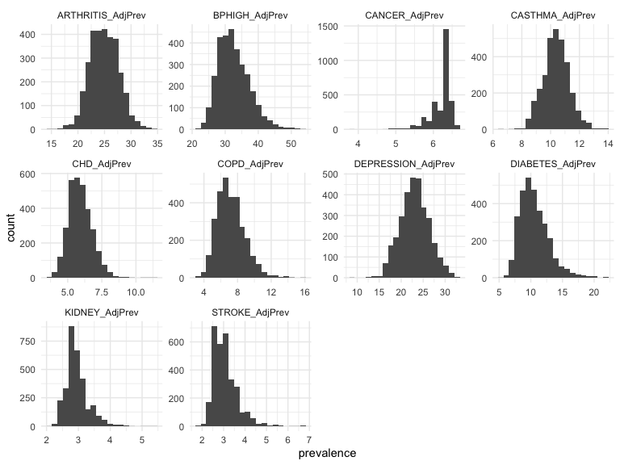<!-- -->

#### Normality

```r
    # normality test for chronic disease data
    chronic_disease_data %>% gather(key = 'disease', value = 'prevalence', -LocationID) %>%
        ggplot(aes(sample = prevalence)) +
        stat_qq() +
        facet_wrap(~disease, scales = 'free') +
        theme_minimal()
```

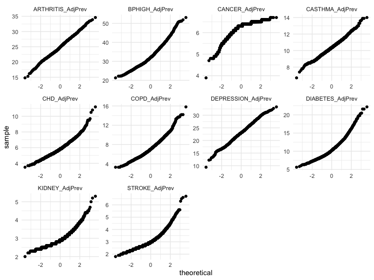<!-- -->

The Q-Q plots show that the data for each chronic disease is not normally distributed.
We can confirm this by performing a Shapiro-Wilk test for normality.

```r
    # normality test for chronic disease data
    normality_test <- chronic_disease_data %>% gather(key = 'disease', value = 'prevalence', -LocationID) %>%
        group_by(disease) %>%
        summarise(p_value = shapiro.test(prevalence)$p.value)

    normality_test
```

<div data-pagedtable="false">
  <script data-pagedtable-source type="application/json">
{"columns":[{"label":["disease"],"name":[1],"type":["chr"],"align":["left"]},{"label":["p_value"],"name":[2],"type":["dbl"],"align":["right"]}],"data":[{"1":"ARTHRITIS_AdjPrev","2":"2.506004e-04"},{"1":"BPHIGH_AdjPrev","2":"6.184426e-25"},{"1":"CANCER_AdjPrev","2":"1.934598e-50"},{"1":"CASTHMA_AdjPrev","2":"2.473584e-08"},{"1":"CHD_AdjPrev","2":"9.124305e-23"},{"1":"COPD_AdjPrev","2":"1.566150e-23"},{"1":"DEPRESSION_AdjPrev","2":"1.161262e-03"},{"1":"DIABETES_AdjPrev","2":"1.842578e-32"},{"1":"KIDNEY_AdjPrev","2":"1.167671e-38"},{"1":"STROKE_AdjPrev","2":"2.639553e-39"}],"options":{"columns":{"min":{},"max":[10]},"rows":{"min":[10],"max":[10]},"pages":{}}}
  </script>
</div>
The p-values from the Shapiro-Wilk test are all less than 0.05, indicating that the data is not normally distributed.
This means that we should be cautious when applying statistical tests that assume normality.

#### Outliers
Outliers can also affect the results of statistical tests and models. 
We will check for outliers in the chronic disease data using boxplots and z-scores.

```r
    # boxplot for chronic disease data
    # for labels, strip the '_AdjPrev' suffix, create new data frame for plotting
    chronic_disease_data_plot <- chronic_disease_data %>% 
        gather(key = 'disease', value = 'prevalence', -LocationID) %>%
        mutate(disease = gsub('_AdjPrev', '', disease))

    # boxplot (log scale on y-axis)
    chronic_disease_data_plot %>% ggplot(aes(x = disease, y = prevalence)) +
        geom_boxplot() +
        scale_y_log10() +
        labs(title = 'Chronic Disease Prevalence Distribution',
             x = 'Disease',
             y = 'Prevalence (log scale)') +
        theme_minimal()
```

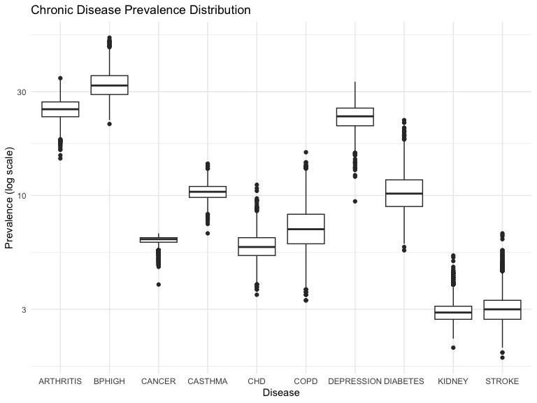<!-- -->

```r
    # outlier detection
    # calculate z-scores for each disease and location
    # may need to pivot the data to calculate z-scores
    chronic_disease_data_zscores <- chronic_disease_data %>% 
        pivot_longer(cols = -LocationID, names_to = 'disease', values_to = 'prevalence') %>%
        group_by(disease) %>%
        mutate(zscore = (prevalence - mean(prevalence)) / sd(prevalence))

    # plot z-scores
    # for labels, strip the '_AdjPrev' suffix, create new data frame for plotting
    chronic_disease_data_zscores_plot <- chronic_disease_data_zscores %>% 
        mutate(disease = gsub('_AdjPrev', '', disease))

    # boxplot of z-scores
    chronic_disease_data_zscores_plot %>% ggplot(aes(x = disease, y = zscore)) +
        geom_boxplot() +
        labs(title = 'Chronic Disease Prevalence Z-Scores',
             x = 'Disease',
             y = 'Z-Score') +
        theme_minimal()
```

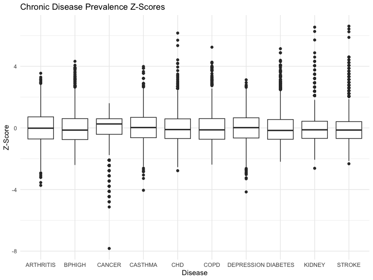<!-- -->

```r
    # for each disease, calculate the number of outliers and percentage of total
    # using z-score threshold of 3
    outliers <- chronic_disease_data_zscores %>% 
        group_by(disease) %>%
        summarize(outliers = sum(abs(zscore) > 3),
                  total = n(),
                  percentage = outliers / total * 100)

    outliers
```

<div data-pagedtable="false">
  <script data-pagedtable-source type="application/json">
{"columns":[{"label":["disease"],"name":[1],"type":["chr"],"align":["left"]},{"label":["outliers"],"name":[2],"type":["int"],"align":["right"]},{"label":["total"],"name":[3],"type":["int"],"align":["right"]},{"label":["percentage"],"name":[4],"type":["dbl"],"align":["right"]}],"data":[{"1":"ARTHRITIS_AdjPrev","2":"11","3":"3076","4":"0.3576073"},{"1":"BPHIGH_AdjPrev","2":"26","3":"3076","4":"0.8452536"},{"1":"CANCER_AdjPrev","2":"53","3":"3076","4":"1.7230169"},{"1":"CASTHMA_AdjPrev","2":"12","3":"3076","4":"0.3901170"},{"1":"CHD_AdjPrev","2":"21","3":"3076","4":"0.6827048"},{"1":"COPD_AdjPrev","2":"28","3":"3076","4":"0.9102731"},{"1":"DEPRESSION_AdjPrev","2":"5","3":"3076","4":"0.1625488"},{"1":"DIABETES_AdjPrev","2":"37","3":"3076","4":"1.2028609"},{"1":"KIDNEY_AdjPrev","2":"33","3":"3076","4":"1.0728218"},{"1":"STROKE_AdjPrev","2":"45","3":"3076","4":"1.4629389"}],"options":{"columns":{"min":{},"max":[10]},"rows":{"min":[10],"max":[10]},"pages":{}}}
  </script>
</div>

The boxplots show the distribution of chronic disease prevalence for each disease, with some diseases having a higher prevalence than others. 
The z-score boxplots show the presence of outliers for each disease, with some diseases having more outliers than others. 
The table summarizes the number of outliers and the percentage of total observations that are considered outliers for each disease.

Based on the z-score threshold of 3, the percentage of outliers ranges from 0.16% to 1.72% across different diseases.
Overall, the chronic disease data shows variations in prevalence and the presence of outliers for some diseases.

Strategy for Handling Outliers:
- For the analysis, we will keep the outliers in the dataset as they represent valid data points.
- We will consider the outliers during the analysis and interpretation of results.

Finally, as all the chronic_disease_cols are our target variables, we will not perform any feature selection or dimensionality reduction on this dataset.
Considering the non-normal distribution of the data, we will use non-parametric tests for the analysis.

### Health Status Data
The dataset also includes features related to general health status, mental health, and physical health.
Here are some of the key features related to general health:

```r
    health_status_cols <- c('GHLTH_AdjPrev', 'MHLTH_AdjPrev', 'PHLTH_AdjPrev')
    places_county_2023[health_status_cols] %>% head()
```

<div data-pagedtable="false">
  <script data-pagedtable-source type="application/json">
{"columns":[{"label":["GHLTH_AdjPrev"],"name":[1],"type":["dbl"],"align":["right"]},{"label":["MHLTH_AdjPrev"],"name":[2],"type":["dbl"],"align":["right"]},{"label":["PHLTH_AdjPrev"],"name":[3],"type":["dbl"],"align":["right"]}],"data":[{"1":"17.3","2":"18.0","3":"11.7"},{"1":"30.7","2":"20.5","3":"16.6"},{"1":"20.6","2":"19.7","3":"13.6"},{"1":"19.8","2":"19.9","3":"13.6"},{"1":"23.1","2":"20.7","3":"15.1"},{"1":"20.7","2":"20.1","3":"13.8"}],"options":{"columns":{"min":{},"max":[10]},"rows":{"min":[10],"max":[10]},"pages":{}}}
  </script>
</div>

Next, we will prepare the health status data by filtering the required columns and handling missing values.

```r
    # for this dataset we will select the key_cols and health_status_cols
    health_status_data <- places_county_2023[key_cols %>% union(health_status_cols)] %>% distinct()

    # create a LocationID column and drop key_cols
    health_status_data$LocationID <- paste(health_status_data$StateAbbr, health_status_data$CountyFIPS, sep = '_')
    health_status_data <- health_status_data %>% select(-key_cols)

    # check for missing values
    missing_values <- sapply(health_status_data, function(x) sum(is.na(x)))
    missing_values
```

```
## GHLTH_AdjPrev MHLTH_AdjPrev PHLTH_AdjPrev    LocationID 
##            67            67            67             0
```

```r
    # as the number of missing values is small, we will drop the rows with missing values
    health_status_data <- health_status_data %>% drop_na()

    # display the health status data
    head(health_status_data)
```

<div data-pagedtable="false">
  <script data-pagedtable-source type="application/json">
{"columns":[{"label":["GHLTH_AdjPrev"],"name":[1],"type":["dbl"],"align":["right"]},{"label":["MHLTH_AdjPrev"],"name":[2],"type":["dbl"],"align":["right"]},{"label":["PHLTH_AdjPrev"],"name":[3],"type":["dbl"],"align":["right"]},{"label":["LocationID"],"name":[4],"type":["chr"],"align":["left"]}],"data":[{"1":"17.3","2":"18.0","3":"11.7","4":"AL_01001"},{"1":"30.7","2":"20.5","3":"16.6","4":"AL_01011"},{"1":"20.6","2":"19.7","3":"13.6","4":"AL_01021"},{"1":"19.8","2":"19.9","3":"13.6","4":"AL_01029"},{"1":"23.1","2":"20.7","3":"15.1","4":"AL_01049"},{"1":"20.7","2":"20.1","3":"13.8","4":"AL_01075"}],"options":{"columns":{"min":{},"max":[10]},"rows":{"min":[10],"max":[10]},"pages":{}}}
  </script>
</div>

Let's explore the distribution, outliers, and summary statistics of the health status data using boxplots.

```r
    # boxplot for health status data
    # for labels, strip the '_AdjPrev' suffix, create new data frame for plotting
    health_status_data_plot <- health_status_data %>% 
        gather(key = 'status', value = 'prevalence', -LocationID) %>%
        mutate(status = gsub('_AdjPrev', '', status))

    # boxplot (log scale on y-axis)
    health_status_data_plot %>% ggplot(aes(x = status, y = prevalence)) +
        geom_boxplot() +
        scale_y_log10() +
        labs(title = 'Health Status Prevalence Distribution',
             x = 'Health Status',
             y = 'Prevalence (log scale)') +
        theme_minimal()
```

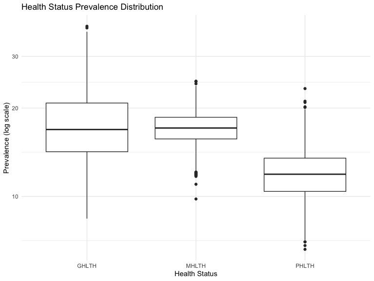<!-- -->

```r
    # outlier detection
    # calculate z-scores for each health status and location
    # may need to pivot the data to calculate z-scores
    health_status_data_zscores <- health_status_data %>% 
        pivot_longer(cols = -LocationID, names_to = 'status', values_to = 'prevalence') %>%
        group_by(status) %>%
        mutate(zscore = (prevalence - mean(prevalence)) / sd(prevalence))

    # plot z-scores
    # for labels, strip the '_AdjPrev' suffix, create new data frame for plotting
    health_status_data_zscores_plot <- health_status_data_zscores %>% 
        mutate(status = gsub('_AdjPrev', '', status))

    # boxplot of z-scores
    health_status_data_zscores_plot %>% ggplot(aes(x = status, y = zscore)) +
        geom_boxplot() +
        labs(title = 'Health Status Prevalence Z-Scores',
             x = 'Health Status',
             y = 'Z-Score') +
        theme_minimal()
```

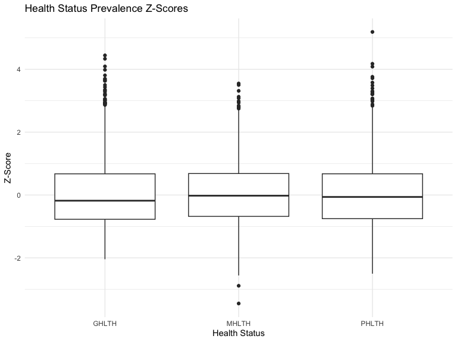<!-- -->

```r
    # for each health status, calculate the number of outliers and percentage of total
    # using z-score threshold of 3
    outliers <- health_status_data_zscores %>% 
        group_by(status) %>%
        summarize(outliers = sum(abs(zscore) > 3),
                  total = n(),
                  percentage = outliers / total * 100)

    outliers
```

<div data-pagedtable="false">
  <script data-pagedtable-source type="application/json">
{"columns":[{"label":["status"],"name":[1],"type":["chr"],"align":["left"]},{"label":["outliers"],"name":[2],"type":["int"],"align":["right"]},{"label":["total"],"name":[3],"type":["int"],"align":["right"]},{"label":["percentage"],"name":[4],"type":["dbl"],"align":["right"]}],"data":[{"1":"GHLTH_AdjPrev","2":"20","3":"3076","4":"0.6501951"},{"1":"MHLTH_AdjPrev","2":"6","3":"3076","4":"0.1950585"},{"1":"PHLTH_AdjPrev","2":"18","3":"3076","4":"0.5851756"}],"options":{"columns":{"min":{},"max":[10]},"rows":{"min":[10],"max":[10]},"pages":{}}}
  </script>
</div>
The outliers range from 0.19% to 0.65% across different health status indicators.
This indicates that the health status data has relatively few outliers compared to the chronic disease data.

Strategy for Handling Outliers:
- Similar to the chronic disease data, we will keep the outliers in the dataset as they represent valid data points.
- We will consider the outliers during the analysis and interpretation of results.

Collinearity check is important to ensure that the predictors are not highly correlated with each other.
We will calculate the correlation matrix for the health status data to identify any potential collinearity issues.

```r
    # calculate correlation matrix for health status data
    health_status_correlation <- health_status_data %>% select(-LocationID) %>% cor()

    # display correlation matrix
    health_status_correlation
```

```
##               GHLTH_AdjPrev MHLTH_AdjPrev PHLTH_AdjPrev
## GHLTH_AdjPrev     1.0000000     0.8122762     0.9493872
## MHLTH_AdjPrev     0.8122762     1.0000000     0.9155974
## PHLTH_AdjPrev     0.9493872     0.9155974     1.0000000
```
The correlation matrix shows that the health status indicators are highly correlated with each other.
This high correlation is expected as the indicators are related to different aspects of health status.
We can combine these indicators into a single health status index or score.

Next, we will create a health status index by combining the general health, mental health, and physical health indicators.

```r
    # create a health status index by averaging the general health, mental health, and physical health indicators
    health_status_data$HealthStatusIndex <- rowMeans(health_status_data %>% select(contains('AdjPrev')))

    # display the health status data with the index
    head(health_status_data)
```

<div data-pagedtable="false">
  <script data-pagedtable-source type="application/json">
{"columns":[{"label":["GHLTH_AdjPrev"],"name":[1],"type":["dbl"],"align":["right"]},{"label":["MHLTH_AdjPrev"],"name":[2],"type":["dbl"],"align":["right"]},{"label":["PHLTH_AdjPrev"],"name":[3],"type":["dbl"],"align":["right"]},{"label":["LocationID"],"name":[4],"type":["chr"],"align":["left"]},{"label":["HealthStatusIndex"],"name":[5],"type":["dbl"],"align":["right"]}],"data":[{"1":"17.3","2":"18.0","3":"11.7","4":"AL_01001","5":"15.66667"},{"1":"30.7","2":"20.5","3":"16.6","4":"AL_01011","5":"22.60000"},{"1":"20.6","2":"19.7","3":"13.6","4":"AL_01021","5":"17.96667"},{"1":"19.8","2":"19.9","3":"13.6","4":"AL_01029","5":"17.76667"},{"1":"23.1","2":"20.7","3":"15.1","4":"AL_01049","5":"19.63333"},{"1":"20.7","2":"20.1","3":"13.8","4":"AL_01075","5":"18.20000"}],"options":{"columns":{"min":{},"max":[10]},"rows":{"min":[10],"max":[10]},"pages":{}}}
  </script>
</div>
The health status index provides a single measure that combines the general health, mental health, and physical health indicators.

### Preventive Care Data (Potential Predictors)
The dataset includes features related to preventive care such as mammography screening, regular checkups, etc.

```r
    preventive_care_cols <- c('BPMED_AdjPrev', 'CERVICAL_AdjPrev', 'CHECKUP_AdjPrev', 'CHOLSCREEN_AdjPrev', 'COLON_SCREEN_AdjPrev')
    places_county_2023[preventive_care_cols] %>% head()
```

<div data-pagedtable="false">
  <script data-pagedtable-source type="application/json">
{"columns":[{"label":["BPMED_AdjPrev"],"name":[1],"type":["dbl"],"align":["right"]},{"label":["CERVICAL_AdjPrev"],"name":[2],"type":["dbl"],"align":["right"]},{"label":["CHECKUP_AdjPrev"],"name":[3],"type":["dbl"],"align":["right"]},{"label":["CHOLSCREEN_AdjPrev"],"name":[4],"type":["dbl"],"align":["right"]},{"label":["COLON_SCREEN_AdjPrev"],"name":[5],"type":["dbl"],"align":["right"]}],"data":[{"1":"65.3","2":"84.3","3":"76.0","4":"85.1","5":"71.5"},{"1":"70.3","2":"82.9","3":"78.2","4":"82.1","5":"69.7"},{"1":"64.4","2":"81.6","3":"72.7","4":"83.0","5":"70.2"},{"1":"63.4","2":"82.4","3":"73.7","4":"82.8","5":"70.5"},{"1":"64.4","2":"80.0","3":"71.8","4":"81.7","5":"68.3"},{"1":"64.2","2":"82.0","3":"74.0","4":"82.8","5":"71.1"}],"options":{"columns":{"min":{},"max":[10]},"rows":{"min":[10],"max":[10]},"pages":{}}}
  </script>
</div>
Next, we will prepare the preventive care data by filtering the required columns and handling missing values.

```r
    # for this dataset we will select the key_cols and preventive_care_cols
    preventive_care_data <- places_county_2023[key_cols %>% union(preventive_care_cols)] %>% distinct()

    # create a LocationID column and drop key_cols
    preventive_care_data$LocationID <- paste(preventive_care_data$StateAbbr, preventive_care_data$CountyFIPS, sep = '_')
    preventive_care_data <- preventive_care_data %>% select(-key_cols)

    # check for missing values
    missing_values <- sapply(preventive_care_data, function(x) sum(is.na(x)))
    missing_values
```

```
##        BPMED_AdjPrev     CERVICAL_AdjPrev      CHECKUP_AdjPrev 
##                   67                    0                   67 
##   CHOLSCREEN_AdjPrev COLON_SCREEN_AdjPrev           LocationID 
##                   67                    0                    0
```

```r
    # as the number of missing values is small, we will drop the rows with missing values
    preventive_care_data <- preventive_care_data %>% drop_na()

    # display the preventive care data
    head(preventive_care_data)
```

<div data-pagedtable="false">
  <script data-pagedtable-source type="application/json">
{"columns":[{"label":["BPMED_AdjPrev"],"name":[1],"type":["dbl"],"align":["right"]},{"label":["CERVICAL_AdjPrev"],"name":[2],"type":["dbl"],"align":["right"]},{"label":["CHECKUP_AdjPrev"],"name":[3],"type":["dbl"],"align":["right"]},{"label":["CHOLSCREEN_AdjPrev"],"name":[4],"type":["dbl"],"align":["right"]},{"label":["COLON_SCREEN_AdjPrev"],"name":[5],"type":["dbl"],"align":["right"]},{"label":["LocationID"],"name":[6],"type":["chr"],"align":["left"]}],"data":[{"1":"65.3","2":"84.3","3":"76.0","4":"85.1","5":"71.5","6":"AL_01001"},{"1":"70.3","2":"82.9","3":"78.2","4":"82.1","5":"69.7","6":"AL_01011"},{"1":"64.4","2":"81.6","3":"72.7","4":"83.0","5":"70.2","6":"AL_01021"},{"1":"63.4","2":"82.4","3":"73.7","4":"82.8","5":"70.5","6":"AL_01029"},{"1":"64.4","2":"80.0","3":"71.8","4":"81.7","5":"68.3","6":"AL_01049"},{"1":"64.2","2":"82.0","3":"74.0","4":"82.8","5":"71.1","6":"AL_01075"}],"options":{"columns":{"min":{},"max":[10]},"rows":{"min":[10],"max":[10]},"pages":{}}}
  </script>
</div>

Let's explore the distribution of preventive care indicators using boxplots.

```r
    # gather the data for plotting
    preventive_care_data_plot <- preventive_care_data %>% 
        gather(key = 'care', value = 'prevalence', -LocationID) %>%
        mutate(care = gsub('_AdjPrev', '', care))

    # boxplot (log scale on y-axis)
    preventive_care_data_plot %>% ggplot(aes(x = care, y = prevalence)) +
        geom_boxplot() +
        scale_y_log10() +
        labs(title = 'Preventive Care Prevalence Distribution',
             x = 'Preventive Care',
             y = 'Prevalence (log scale)') +
        theme_minimal()
```

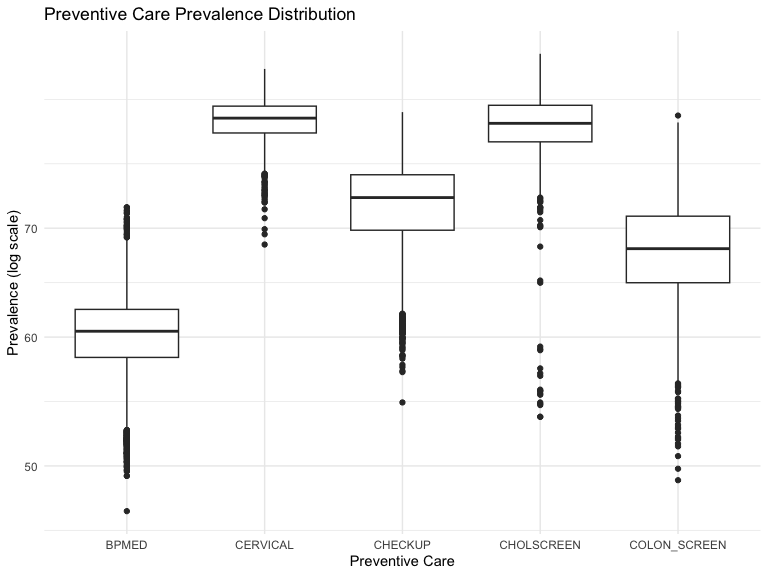<!-- -->

The boxplots show the distribution of preventive care indicators across different counties.
The prevalence of preventive care indicators varies, with some indicators having higher median values than others.

Next, we will calculate the correlation matrix for the preventive care data to identify any potential collinearity issues.

```r
    # calculate correlation matrix for preventive care data
    preventive_care_correlation <- preventive_care_data %>% select(-LocationID) %>% cor()

    # display correlation matrix
    preventive_care_correlation
```

```
##                      BPMED_AdjPrev CERVICAL_AdjPrev CHECKUP_AdjPrev
## BPMED_AdjPrev           1.00000000       0.04324499       0.7623895
## CERVICAL_AdjPrev        0.04324499       1.00000000       0.2887087
## CHECKUP_AdjPrev         0.76238945       0.28870867       1.0000000
## CHOLSCREEN_AdjPrev      0.27872238       0.44391767       0.4061088
## COLON_SCREEN_AdjPrev    0.11973147       0.69523500       0.3783285
##                      CHOLSCREEN_AdjPrev COLON_SCREEN_AdjPrev
## BPMED_AdjPrev                 0.2787224            0.1197315
## CERVICAL_AdjPrev              0.4439177            0.6952350
## CHECKUP_AdjPrev               0.4061088            0.3783285
## CHOLSCREEN_AdjPrev            1.0000000            0.4264531
## COLON_SCREEN_AdjPrev          0.4264531            1.0000000
```
The correlation matrix shows that the preventive care indicators are moderately correlated with each other.
This moderate correlation is expected as the indicators are related to different aspects of preventive care.

### Risk Factors Data
The dataset includes features related to risk factors for chronic diseases such as high cholesterol and obesity.
Here are some of the key features related to risk factors:

```r
    risk_factors_cols <- c('HIGHCHOL_AdjPrev', 'OBESITY_AdjPrev')
    places_county_2023[risk_factors_cols] %>% head()
```

<div data-pagedtable="false">
  <script data-pagedtable-source type="application/json">
{"columns":[{"label":["HIGHCHOL_AdjPrev"],"name":[1],"type":["dbl"],"align":["right"]},{"label":["OBESITY_AdjPrev"],"name":[2],"type":["dbl"],"align":["right"]}],"data":[{"1":"32.1","2":"38.9"},{"1":"33.4","2":"48.9"},{"1":"33.8","2":"42.3"},{"1":"33.4","2":"36.1"},{"1":"34.5","2":"41.0"},{"1":"33.1","2":"38.7"}],"options":{"columns":{"min":{},"max":[10]},"rows":{"min":[10],"max":[10]},"pages":{}}}
  </script>
</div>

Next, we will prepare the risk factors data by filtering the required columns and handling missing values.

```r
    # for this dataset we will select the key_cols and risk_factors_cols
    risk_factors_data <- places_county_2023[key_cols %>% union(risk_factors_cols)] %>% distinct()

    # create a LocationID column and drop key_cols
    risk_factors_data$LocationID <- paste(risk_factors_data$StateAbbr, risk_factors_data$CountyFIPS, sep = '_')
    risk_factors_data <- risk_factors_data %>% select(-key_cols)

    # check for missing values
    missing_values <- sapply(risk_factors_data, function(x) sum(is.na(x)))
    missing_values
```

```
## HIGHCHOL_AdjPrev  OBESITY_AdjPrev       LocationID 
##               67               67                0
```

```r
    # as the number of missing values is small, we will drop the rows with missing values
    risk_factors_data <- risk_factors_data %>% drop_na()

    # display the risk factors data
    head(risk_factors_data)
```

<div data-pagedtable="false">
  <script data-pagedtable-source type="application/json">
{"columns":[{"label":["HIGHCHOL_AdjPrev"],"name":[1],"type":["dbl"],"align":["right"]},{"label":["OBESITY_AdjPrev"],"name":[2],"type":["dbl"],"align":["right"]},{"label":["LocationID"],"name":[3],"type":["chr"],"align":["left"]}],"data":[{"1":"32.1","2":"38.9","3":"AL_01001"},{"1":"33.4","2":"48.9","3":"AL_01011"},{"1":"33.8","2":"42.3","3":"AL_01021"},{"1":"33.4","2":"36.1","3":"AL_01029"},{"1":"34.5","2":"41.0","3":"AL_01049"},{"1":"33.1","2":"38.7","3":"AL_01075"}],"options":{"columns":{"min":{},"max":[10]},"rows":{"min":[10],"max":[10]},"pages":{}}}
  </script>
</div>

Let's explore the distribution, outliers, and summary statistics of the risk factors data using boxplots.

```r
    # boxplot for risk factors data
    # for labels, strip the '_AdjPrev' suffix, create new data frame for plotting
    risk_factors_data_plot <- risk_factors_data %>% 
        gather(key = 'factor', value = 'prevalence', -LocationID) %>%
        mutate(factor = gsub('_AdjPrev', '', factor))

    # boxplot (log scale on y-axis)
    risk_factors_data_plot %>% ggplot(aes(x = factor, y = prevalence)) +
        geom_boxplot() +
        scale_y_log10() +
        labs(title = 'Risk Factors Prevalence Distribution',
             x = 'Risk Factor',
             y = 'Prevalence (log scale)') +
        theme_minimal()
```

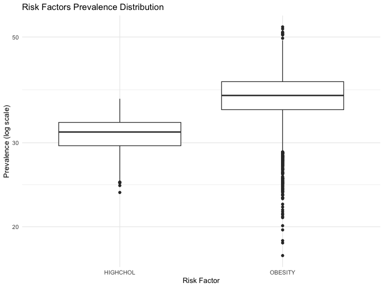<!-- -->

```r
    # outlier detection
    # calculate z-scores for each risk factor and location
    # may need to pivot the data to calculate z-scores
    risk_factors_data_zscores <- risk_factors_data %>% 
        pivot_longer(cols = -LocationID, names_to = 'factor', values_to = 'prevalence') %>%
        group_by(factor) %>%
        mutate(zscore = (prevalence - mean(prevalence)) / sd(prevalence))

    # plot z-scores
    # for labels, strip the '_AdjPrev' suffix, create new data frame for plotting
    risk_factors_data_zscores_plot <- risk_factors_data_zscores %>% 
        mutate(factor = gsub('_AdjPrev', '', factor))

    # boxplot of z-scores
    risk_factors_data_zscores_plot %>% ggplot(aes(x = factor, y = zscore)) +
        geom_boxplot() +
        labs(title = 'Risk Factors Prevalence Z-Scores',
             x = 'Risk Factor',
             y = 'Z-Score') +
        theme_minimal()
```

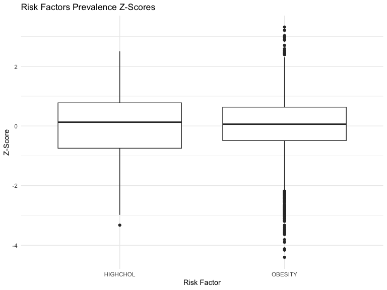<!-- -->

```r
    # for each risk factor, calculate the number of outliers and percentage of total
    # using z-score threshold of 3
    outliers <- risk_factors_data_zscores %>% 
        group_by(factor) %>%
        summarize(outliers = sum(abs(zscore) > 3),
                  total = n(),
                  percentage = outliers / total * 100)

    outliers
```

<div data-pagedtable="false">
  <script data-pagedtable-source type="application/json">
{"columns":[{"label":["factor"],"name":[1],"type":["chr"],"align":["left"]},{"label":["outliers"],"name":[2],"type":["int"],"align":["right"]},{"label":["total"],"name":[3],"type":["int"],"align":["right"]},{"label":["percentage"],"name":[4],"type":["dbl"],"align":["right"]}],"data":[{"1":"HIGHCHOL_AdjPrev","2":"1","3":"3076","4":"0.03250975"},{"1":"OBESITY_AdjPrev","2":"28","3":"3076","4":"0.91027308"}],"options":{"columns":{"min":{},"max":[10]},"rows":{"min":[10],"max":[10]},"pages":{}}}
  </script>
</div>
We only have 1 outlier for 'HIGHCHOL_AdjPrev' and 0.91% outliers for 'OBESITY_AdjPrev'.
This indicates that the risk factors data has relatively few outliers.
We will keep the outliers in the dataset and consider them during the analysis.

Collinearity Check for Risk Factors Data

```r
    # calculate correlation matrix for risk factors data
    risk_factors_correlation <- risk_factors_data %>% select(-LocationID) %>% cor()

    # display correlation matrix
    risk_factors_correlation
```

```
##                  HIGHCHOL_AdjPrev OBESITY_AdjPrev
## HIGHCHOL_AdjPrev        1.0000000       0.4505985
## OBESITY_AdjPrev         0.4505985       1.0000000
```
The correlation matrix shows a moderate positive correlation between 'HIGHCHOL_AdjPrev' and 'OBESITY_AdjPrev'.
This indicates that there is some collinearity between these two risk factors.


### Disabilities Data
The dataset includes features related to disabilities such as disability status and disability prevalence.
Here are some of the key features related to disabilities:

```r
    disabilities_cols <- c('DISABILITY_AdjPrev', 'HEARING_AdjPrev', 'VISION_AdjPrev', 'COGNITION_AdjPrev', 'MOBILITY_AdjPrev', 'SELFCARE_AdjPrev', 'INDEPLIVE_AdjPrev')
    places_county_2023[disabilities_cols] %>% head()
```

<div data-pagedtable="false">
  <script data-pagedtable-source type="application/json">
{"columns":[{"label":["DISABILITY_AdjPrev"],"name":[1],"type":["dbl"],"align":["right"]},{"label":["HEARING_AdjPrev"],"name":[2],"type":["dbl"],"align":["right"]},{"label":["VISION_AdjPrev"],"name":[3],"type":["dbl"],"align":["right"]},{"label":["COGNITION_AdjPrev"],"name":[4],"type":["dbl"],"align":["right"]},{"label":["MOBILITY_AdjPrev"],"name":[5],"type":["dbl"],"align":["right"]},{"label":["SELFCARE_AdjPrev"],"name":[6],"type":["dbl"],"align":["right"]},{"label":["INDEPLIVE_AdjPrev"],"name":[7],"type":["dbl"],"align":["right"]}],"data":[{"1":"30.2","2":"6.0","3":"4.7","4":"14.3","5":"14.7","6":"3.7","7":"8.2"},{"1":"41.9","2":"6.9","3":"10.4","4":"20.6","5":"23.9","6":"8.0","7":"14.1"},{"1":"35.4","2":"7.0","3":"5.7","4":"17.2","5":"17.3","6":"4.4","7":"9.9"},{"1":"34.5","2":"7.1","3":"5.3","4":"17.1","5":"16.6","6":"4.2","7":"9.7"},{"1":"37.5","2":"7.8","3":"6.7","4":"18.9","5":"19.0","6":"5.2","7":"11.1"},{"1":"34.8","2":"7.1","3":"5.7","4":"17.4","5":"17.2","6":"4.5","7":"10.0"}],"options":{"columns":{"min":{},"max":[10]},"rows":{"min":[10],"max":[10]},"pages":{}}}
  </script>
</div>

Next, we will prepare the disabilities data by filtering the required columns and handling missing values.

```r
    # for this dataset we will select the key_cols and disabilities_cols
    disabilities_data <- places_county_2023[key_cols %>% union(disabilities_cols)] %>% distinct()

    # create a LocationID column and drop key_cols
    disabilities_data$LocationID <- paste(disabilities_data$StateAbbr, disabilities_data$CountyFIPS, sep = '_')
    disabilities_data <- disabilities_data %>% select(-key_cols)

    # check for missing values
    missing_values <- sapply(disabilities_data, function(x) sum(is.na(x)))
    missing_values
```

```
## DISABILITY_AdjPrev    HEARING_AdjPrev     VISION_AdjPrev  COGNITION_AdjPrev 
##                 67                 67                 67                 67 
##   MOBILITY_AdjPrev   SELFCARE_AdjPrev  INDEPLIVE_AdjPrev         LocationID 
##                 67                 67                 67                  0
```

```r
    # as the number of missing values is small, we will drop the rows with missing values
    disabilities_data <- disabilities_data %>% drop_na()

    # display the disabilities data
    head(disabilities_data)
```

<div data-pagedtable="false">
  <script data-pagedtable-source type="application/json">
{"columns":[{"label":["DISABILITY_AdjPrev"],"name":[1],"type":["dbl"],"align":["right"]},{"label":["HEARING_AdjPrev"],"name":[2],"type":["dbl"],"align":["right"]},{"label":["VISION_AdjPrev"],"name":[3],"type":["dbl"],"align":["right"]},{"label":["COGNITION_AdjPrev"],"name":[4],"type":["dbl"],"align":["right"]},{"label":["MOBILITY_AdjPrev"],"name":[5],"type":["dbl"],"align":["right"]},{"label":["SELFCARE_AdjPrev"],"name":[6],"type":["dbl"],"align":["right"]},{"label":["INDEPLIVE_AdjPrev"],"name":[7],"type":["dbl"],"align":["right"]},{"label":["LocationID"],"name":[8],"type":["chr"],"align":["left"]}],"data":[{"1":"30.2","2":"6.0","3":"4.7","4":"14.3","5":"14.7","6":"3.7","7":"8.2","8":"AL_01001"},{"1":"41.9","2":"6.9","3":"10.4","4":"20.6","5":"23.9","6":"8.0","7":"14.1","8":"AL_01011"},{"1":"35.4","2":"7.0","3":"5.7","4":"17.2","5":"17.3","6":"4.4","7":"9.9","8":"AL_01021"},{"1":"34.5","2":"7.1","3":"5.3","4":"17.1","5":"16.6","6":"4.2","7":"9.7","8":"AL_01029"},{"1":"37.5","2":"7.8","3":"6.7","4":"18.9","5":"19.0","6":"5.2","7":"11.1","8":"AL_01049"},{"1":"34.8","2":"7.1","3":"5.7","4":"17.4","5":"17.2","6":"4.5","7":"10.0","8":"AL_01075"}],"options":{"columns":{"min":{},"max":[10]},"rows":{"min":[10],"max":[10]},"pages":{}}}
  </script>
</div>

### Health Behaviors Data
The dataset includes features related to health behaviors such as smoking, physical inactivity, and excessive drinking, which are negative health behaviors that can contribute to chronic diseases.

```r
    negative_health_behavior_cols <- c('BINGE_AdjPrev', 'CSMOKING_AdjPrev')
    places_county_2023[negative_health_behavior_cols] %>% head()
```

<div data-pagedtable="false">
  <script data-pagedtable-source type="application/json">
{"columns":[{"label":["BINGE_AdjPrev"],"name":[1],"type":["dbl"],"align":["right"]},{"label":["CSMOKING_AdjPrev"],"name":[2],"type":["dbl"],"align":["right"]}],"data":[{"1":"15.5","2":"16.9"},{"1":"12.4","2":"25.7"},{"1":"15.8","2":"21.7"},{"1":"15.9","2":"20.7"},{"1":"15.0","2":"22.2"},{"1":"15.6","2":"21.7"}],"options":{"columns":{"min":{},"max":[10]},"rows":{"min":[10],"max":[10]},"pages":{}}}
  </script>
</div>

The dataset also includes positive health behaviors such as physical activity.

```r
    positive_health_behavior_cols <- c('LPA_AdjPrev')
    places_county_2023[positive_health_behavior_cols] %>% head()
```

<div data-pagedtable="false">
  <script data-pagedtable-source type="application/json">
{"columns":[{"label":["LPA_AdjPrev"],"name":[1],"type":["dbl"],"align":["right"]}],"data":[{"1":"29.1"},{"1":"43.6"},{"1":"34.1"},{"1":"32.2"},{"1":"35.0"},{"1":"34.6"}],"options":{"columns":{"min":{},"max":[10]},"rows":{"min":[10],"max":[10]},"pages":{}}}
  </script>
</div>

Next, we will prepare the health behaviors data by filtering the required columns and handling missing values.

```r
    # negative_health_behavior_cols
    # for this dataset we will select the key_cols and negative_health_behavior_cols
    negative_health_behaviors_data <- places_county_2023[key_cols %>% union(negative_health_behavior_cols)] %>% distinct()

    # create a LocationID column and drop key_cols
    negative_health_behaviors_data$LocationID <- paste(negative_health_behaviors_data$StateAbbr, negative_health_behaviors_data$CountyFIPS, sep = '_')
    negative_health_behaviors_data <- negative_health_behaviors_data %>% select(-key_cols)

    # check for missing values
    missing_values <- sapply(negative_health_behaviors_data, function(x) sum(is.na(x)))
    missing_values
```

```
##    BINGE_AdjPrev CSMOKING_AdjPrev       LocationID 
##               67               67                0
```

```r
    # as the number of missing values is small, we will drop the rows with missing values
    negative_health_behaviors_data <- negative_health_behaviors_data %>% drop_na()

    # display the negative health behaviors data
    head(negative_health_behaviors_data)
```

<div data-pagedtable="false">
  <script data-pagedtable-source type="application/json">
{"columns":[{"label":["BINGE_AdjPrev"],"name":[1],"type":["dbl"],"align":["right"]},{"label":["CSMOKING_AdjPrev"],"name":[2],"type":["dbl"],"align":["right"]},{"label":["LocationID"],"name":[3],"type":["chr"],"align":["left"]}],"data":[{"1":"15.5","2":"16.9","3":"AL_01001"},{"1":"12.4","2":"25.7","3":"AL_01011"},{"1":"15.8","2":"21.7","3":"AL_01021"},{"1":"15.9","2":"20.7","3":"AL_01029"},{"1":"15.0","2":"22.2","3":"AL_01049"},{"1":"15.6","2":"21.7","3":"AL_01075"}],"options":{"columns":{"min":{},"max":[10]},"rows":{"min":[10],"max":[10]},"pages":{}}}
  </script>
</div>

```r
    # positive_health_behavior_cols
    # for this dataset we will select the key_cols and health_behaviors_cols
    positive_health_behaviors_data <- places_county_2023[key_cols %>% union(positive_health_behavior_cols)] %>% distinct()

    # create a LocationID column and drop key_cols
    positive_health_behaviors_data$LocationID <- paste(positive_health_behaviors_data$StateAbbr, positive_health_behaviors_data$CountyFIPS, sep = '_')
    positive_health_behaviors_data <- positive_health_behaviors_data %>% select(-key_cols)

    # check for missing values
    missing_values <- sapply(positive_health_behaviors_data, function(x) sum(is.na(x)))
    missing_values
```

```
## LPA_AdjPrev  LocationID 
##          67           0
```

```r
    # as the number of missing values is small, we will drop the rows with missing values
    positive_health_behaviors_data <- positive_health_behaviors_data %>% drop_na()

    # display the positive health behaviors data
    head(positive_health_behaviors_data)
```

<div data-pagedtable="false">
  <script data-pagedtable-source type="application/json">
{"columns":[{"label":["LPA_AdjPrev"],"name":[1],"type":["dbl"],"align":["right"]},{"label":["LocationID"],"name":[2],"type":["chr"],"align":["left"]}],"data":[{"1":"29.1","2":"AL_01001"},{"1":"43.6","2":"AL_01011"},{"1":"34.1","2":"AL_01021"},{"1":"32.2","2":"AL_01029"},{"1":"35.0","2":"AL_01049"},{"1":"34.6","2":"AL_01075"}],"options":{"columns":{"min":{},"max":[10]},"rows":{"min":[10],"max":[10]},"pages":{}}}
  </script>
</div>

### Social Determinants Data
We have only one feature related to social determinants of health in the dataset, which is access to health insurance.

```r
    sdoh_cols <- c('ACCESS2_AdjPrev')
    places_county_2023[sdoh_cols] %>% head()
```

<div data-pagedtable="false">
  <script data-pagedtable-source type="application/json">
{"columns":[{"label":["ACCESS2_AdjPrev"],"name":[1],"type":["dbl"],"align":["right"]}],"data":[{"1":"10.4"},{"1":"19.2"},{"1":"14.1"},{"1":"12.5"},{"1":"16.7"},{"1":"12.9"}],"options":{"columns":{"min":{},"max":[10]},"rows":{"min":[10],"max":[10]},"pages":{}}}
  </script>
</div>

Next, we will prepare the social determinants data by filtering the required columns and handling missing values.

```r
    # for this dataset we will select the key_cols and sdoh_cols
    social_determinants_data <- places_county_2023[key_cols %>% union(sdoh_cols)] %>% distinct()

    # create a LocationID column and drop key_cols
    social_determinants_data$LocationID <- paste(social_determinants_data$StateAbbr, social_determinants_data$CountyFIPS, sep = '_')
    social_determinants_data <- social_determinants_data %>% select(-key_cols)

    # check for missing values
    missing_values <- sapply(social_determinants_data, function(x) sum(is.na(x)))
    missing_values
```

```
## ACCESS2_AdjPrev      LocationID 
##              67               0
```

```r
    # as the number of missing values is small, we will drop the rows with missing values
    social_determinants_data <- social_determinants_data %>% drop_na()

    # display the social determinants data
    head(social_determinants_data)
```

<div data-pagedtable="false">
  <script data-pagedtable-source type="application/json">
{"columns":[{"label":["ACCESS2_AdjPrev"],"name":[1],"type":["dbl"],"align":["right"]},{"label":["LocationID"],"name":[2],"type":["chr"],"align":["left"]}],"data":[{"1":"10.4","2":"AL_01001"},{"1":"19.2","2":"AL_01011"},{"1":"14.1","2":"AL_01021"},{"1":"12.5","2":"AL_01029"},{"1":"16.7","2":"AL_01049"},{"1":"12.9","2":"AL_01075"}],"options":{"columns":{"min":{},"max":[10]},"rows":{"min":[10],"max":[10]},"pages":{}}}
  </script>
</div>


## Predictors Data
Based on above data exploration, we have identified the following predictors that can be used to predict the health outcomes:
* Access to Health Insurance
* Regular Health Checkup

We will prepare the predictors data by filtering the required columns and handling missing values.

```r
    # for this dataset we will select the key_cols and predictors_cols
    predictors_cols <- c('ACCESS2_AdjPrev', 'CHECKUP_AdjPrev')
    predictors_data <- places_county_2023[key_cols %>% union(predictors_cols)] %>% distinct()

    # create a LocationID column and drop key_cols
    predictors_data$LocationID <- paste(predictors_data$StateAbbr, predictors_data$CountyFIPS, sep = '_')
    predictors_data <- predictors_data %>% select(-key_cols)

    # check for missing values
    missing_values <- predictors_data %>% summarise_all(~sum(is.na(.)))
    missing_values
```

<div data-pagedtable="false">
  <script data-pagedtable-source type="application/json">
{"columns":[{"label":["ACCESS2_AdjPrev"],"name":[1],"type":["int"],"align":["right"]},{"label":["CHECKUP_AdjPrev"],"name":[2],"type":["int"],"align":["right"]},{"label":["LocationID"],"name":[3],"type":["int"],"align":["right"]}],"data":[{"1":"67","2":"67","3":"0"}],"options":{"columns":{"min":{},"max":[10]},"rows":{"min":[10],"max":[10]},"pages":{}}}
  </script>
</div>

```r
    # we have very few missing values, we can safely remove them
    predictors_data <- predictors_data %>% drop_na()

    # check for missing values after removing
    missing_values_after <- predictors_data %>% summarise_all(~sum(is.na(.)))
```

The predictors data has been prepared by selecting the required columns, creating a LocationID column, and handling missing values.
There were very few missing values, which have been removed from the dataset.

Lets analyze the predictors data to understand the distribution of the variables and identify any potential issues.
First, lets look at the distribution of the predictors data.

```r
    # gather the data for plotting
    predictors_data_plot <- predictors_data %>% 
        gather(key = 'predictor', value = 'prevalence', -LocationID) %>%
        mutate(predictor = gsub('_AdjPrev', '', predictor))

    # boxplot (log scale on y-axis)
    predictors_data_plot %>% ggplot(aes(x = predictor, y = prevalence)) +
        geom_boxplot() +
        scale_y_log10() +
        labs(title = 'Predictors Data Distribution',
             x = 'Predictor',
             y = 'Prevalence (log scale)') +
        theme_minimal()
```

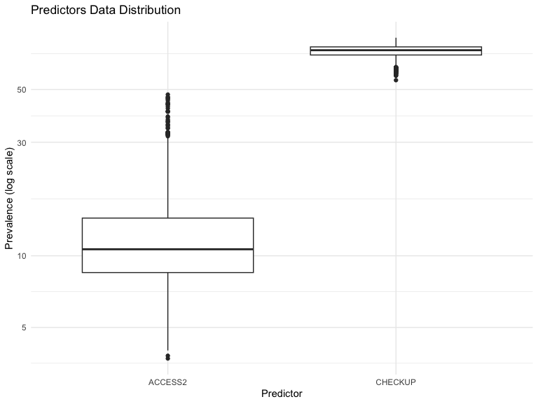<!-- -->

Lets perform Normality Test on the predictors data to check if the data is normally distributed.

```r
    # normality test for predictors data
    predictors_data_normality_test <- predictors_data %>% 
        gather(key = 'predictor', value = 'prevalence', -LocationID) %>%
        mutate(predictor = gsub('_AdjPrev', '', predictor)) %>%
        group_by(predictor) %>%
        summarize(shapiro_test_p_value = shapiro.test(prevalence)$p.value)

    predictors_data_normality_test
```

<div data-pagedtable="false">
  <script data-pagedtable-source type="application/json">
{"columns":[{"label":["predictor"],"name":[1],"type":["chr"],"align":["left"]},{"label":["shapiro_test_p_value"],"name":[2],"type":["dbl"],"align":["right"]}],"data":[{"1":"ACCESS2","2":"4.990353e-50"},{"1":"CHECKUP","2":"1.113963e-28"}],"options":{"columns":{"min":{},"max":[10]},"rows":{"min":[10],"max":[10]},"pages":{}}}
  </script>
</div>

The Shapiro-Wilk test for normality indicates that the predictors data is not normally distributed.
As the data is valid observations, we will proceed with the analysis without any transformations.
Given the non-normal distribution of the data, we will use non-parametric tests for the analysis.

We should also check for multicollinearity among the predictors to ensure that the predictors are not highly correlated.

```r
    library(corrplot)
    # correlation matrix for predictors data
    predictors_data_correlation <- predictors_data %>% 
        select(-LocationID) %>%
        cor()

    # plot correlation matrix
    corrplot(predictors_data_correlation, method = 'number', type = 'upper', tl.col = 'black')
```

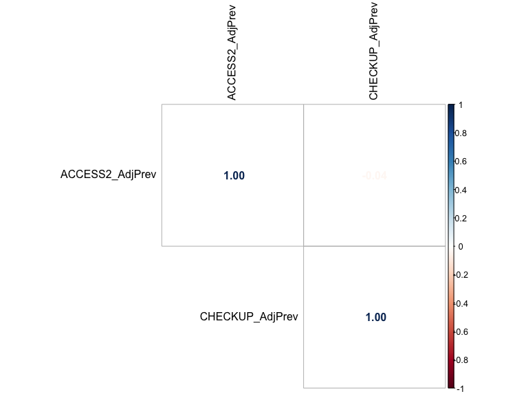<!-- -->


# Data Analysis
For our analysis, we theorize that the age-adjusted prevalence of chronic diseases is influenced by:
    * whether the county is urban or rural, 
    * the prevalence of disabilities, 
    * negative health behaviors, 
    * positive health behaviors, 
    * preventive care, 
    * and social determinants of health. 

We will analyze the relationship between these factors and the age-adjusted prevalence of chronic diseases.

## Influence of the county type on the age-adjusted prevalence of chronic diseases
We will analyze the influence of the county type (urban or rural) on the age-adjusted prevalence of chronic diseases.

```r
    # merge the chronic diseases data with the county type data
    chronic_diseases_data <- merge(chronic_disease_data, enriched_county_data, by = 'LocationID')

    # we will rename urban_rural_classification to urban_rural_sub_class
    # and based on the values of urban_rural_code, we will create a new column urban_rural_classification as follows:
    # 1 -> Urban, 2 -> Urban, 3 -> Urban, 4 -> Urban, 5 -> Rural, 6 -> Rural
    chronic_diseases_data$urban_rural_sub_class <- chronic_diseases_data$urban_rural_classification
    chronic_diseases_data$urban_rural_classification <- ifelse(chronic_diseases_data$urban_rural_code %in% c(1, 2, 3, 4), 'Urban', 'Rural')

    # calculate the mean age-adjusted prevalence of chronic diseases (chronic_disease_cols) by urban_rural_classification
    chronic_diseases_mean <- chronic_diseases_data %>% group_by(urban_rural_classification) %>% summarise(across(all_of(chronic_disease_cols), mean, na.rm = TRUE))

    # display the mean age-adjusted prevalence of chronic diseases by urban_rural_classification
    chronic_diseases_mean
```

<div data-pagedtable="false">
  <script data-pagedtable-source type="application/json">
{"columns":[{"label":["urban_rural_classification"],"name":[1],"type":["chr"],"align":["left"]},{"label":["ARTHRITIS_AdjPrev"],"name":[2],"type":["dbl"],"align":["right"]},{"label":["BPHIGH_AdjPrev"],"name":[3],"type":["dbl"],"align":["right"]},{"label":["CANCER_AdjPrev"],"name":[4],"type":["dbl"],"align":["right"]},{"label":["CASTHMA_AdjPrev"],"name":[5],"type":["dbl"],"align":["right"]},{"label":["CHD_AdjPrev"],"name":[6],"type":["dbl"],"align":["right"]},{"label":["COPD_AdjPrev"],"name":[7],"type":["dbl"],"align":["right"]},{"label":["DEPRESSION_AdjPrev"],"name":[8],"type":["dbl"],"align":["right"]},{"label":["DIABETES_AdjPrev"],"name":[9],"type":["dbl"],"align":["right"]},{"label":["KIDNEY_AdjPrev"],"name":[10],"type":["dbl"],"align":["right"]},{"label":["STROKE_AdjPrev"],"name":[11],"type":["dbl"],"align":["right"]}],"data":[{"1":"Rural","2":"25.26029","3":"33.11223","4":"6.236387","5":"10.44739","6":"6.107421","7":"7.561822","8":"23.17236","9":"10.81187","10":"2.998925","11":"3.173388"},{"1":"Urban","2":"24.40463","3":"31.89537","4":"6.201070","5":"10.25517","6":"5.518271","7":"6.586542","8":"22.81818","9":"10.13993","10":"2.848574","11":"2.905437"}],"options":{"columns":{"min":{},"max":[10]},"rows":{"min":[10],"max":[10]},"pages":{}}}
  </script>
</div>

```r
    # visualize the mean age-adjusted prevalence of chronic diseases by urban_rural_classification
    # box plot for each chronic disease column by urban_rural_classification
    chronic_diseases_data_long <- chronic_diseases_data %>% pivot_longer(cols = chronic_disease_cols, names_to = 'ChronicDisease', values_to = 'AgeAdjustedPrevalence')

    ggplot(chronic_diseases_data_long, aes(x = urban_rural_classification, y = AgeAdjustedPrevalence, fill = urban_rural_classification)) +
        geom_boxplot() +
        facet_wrap(~ChronicDisease, scales = 'free_y') +
        labs(title = 'Mean Age-Adjusted Prevalence of Chronic Diseases by County Type', x = 'County Type', y = 'Age-Adjusted Prevalence') +
        theme_minimal()
```

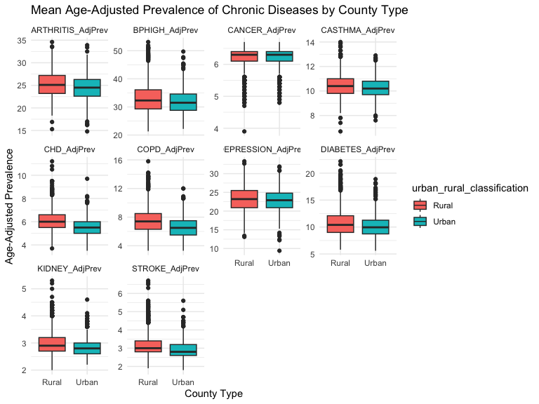<!-- -->

```r
    # perform a t-test to determine if there is a significant difference in the age-adjusted prevalence of chronic diseases between urban and rural counties
    t_test_results <- lapply(chronic_disease_cols, function(col) {
        t_test <- t.test(chronic_diseases_data[[col]] ~ chronic_diseases_data$urban_rural_classification)
        data.frame(ChronicDisease = col, p_value = t_test$p.value, mean_urban = t_test$estimate[1], mean_rural = t_test$estimate[2])
    }) %>% bind_rows()

    # display the t-test results
    # display columns without truncation
    options(width = 120)
    t_test_results
```

<div data-pagedtable="false">
  <script data-pagedtable-source type="application/json">
{"columns":[{"label":[""],"name":["_rn_"],"type":[""],"align":["left"]},{"label":["ChronicDisease"],"name":[1],"type":["chr"],"align":["left"]},{"label":["p_value"],"name":[2],"type":["dbl"],"align":["right"]},{"label":["mean_urban"],"name":[3],"type":["dbl"],"align":["right"]},{"label":["mean_rural"],"name":[4],"type":["dbl"],"align":["right"]}],"data":[{"1":"ARTHRITIS_AdjPrev","2":"6.340180e-17","3":"25.260287","4":"24.404635","_rn_":"mean in group Rural...1"},{"1":"BPHIGH_AdjPrev","2":"8.620106e-13","3":"33.112231","4":"31.895365","_rn_":"mean in group Rural...2"},{"1":"CANCER_AdjPrev","2":"1.536628e-03","3":"6.236387","4":"6.201070","_rn_":"mean in group Rural...3"},{"1":"CASTHMA_AdjPrev","2":"4.050142e-09","3":"10.447390","4":"10.255169","_rn_":"mean in group Rural...4"},{"1":"CHD_AdjPrev","2":"7.858001e-83","3":"6.107421","4":"5.518271","_rn_":"mean in group Rural...5"},{"1":"COPD_AdjPrev","2":"4.359327e-63","3":"7.561822","4":"6.586542","_rn_":"mean in group Rural...6"},{"1":"DEPRESSION_AdjPrev","2":"3.394998e-03","3":"23.172364","4":"22.818182","_rn_":"mean in group Rural...7"},{"1":"DIABETES_AdjPrev","2":"3.299947e-17","3":"10.811873","4":"10.139929","_rn_":"mean in group Rural...8"},{"1":"KIDNEY_AdjPrev","2":"1.331367e-32","3":"2.998925","4":"2.848574","_rn_":"mean in group Rural...9"},{"1":"STROKE_AdjPrev","2":"1.098867e-44","3":"3.173388","4":"2.905437","_rn_":"mean in group Rural...10"}],"options":{"columns":{"min":{},"max":[10]},"rows":{"min":[10],"max":[10]},"pages":{}}}
  </script>
</div>

The p-values from the t-tests indicate that there is a significant difference in the age-adjusted prevalence of chronic diseases between urban and rural counties for all chronic diseases. 
The mean age-adjusted prevalence of chronic diseases is generally higher in urban counties compared to rural counties.

## Factors Influencing the Age-Adjusted Prevalence of Chronic Diseases
Next, while controlling for the county type, we will analyze the influence predictor variables on the age-adjusted prevalence of chronic diseases.

Our predictors are:
    * Access to Health Insurance (ACCESS2_AdjPrev)
    * Regular Health Checkup (CHECKUP_AdjPrev)

We will analyze the relationship between these predictors and the age-adjusted prevalence of chronic diseases, while controlling for the county type.
    

```r
    # merge the predictors data with the chronic diseases data
    predictors_chronic_diseases_data <- merge(predictors_data, chronic_diseases_data, by = 'LocationID')

    # create a new column for urban_rural_classification based on urban_rural_code
    predictors_chronic_diseases_data$urban_rural_classification <- ifelse(predictors_chronic_diseases_data$urban_rural_code %in% c(1, 2, 3, 4), 'Urban', 'Rural')

    # create a linear regression model for each chronic disease column with predictors
    linear_regression_results <- lapply(chronic_disease_cols, function(col) {
        lm_model <- lm(predictors_chronic_diseases_data[[col]] ~ ACCESS2_AdjPrev + CHECKUP_AdjPrev + urban_rural_classification, data = predictors_chronic_diseases_data)
        summary(lm_model)
    })

    # extract coefficients and p-values from the linear regression models
    coefficients_p_values <- lapply(linear_regression_results, function(lm_summary) {
        data.frame(
            Predictor = rownames(lm_summary$coefficients)[-1],
            Coefficient = lm_summary$coefficients[-1, 'Estimate'],
            P_Value = lm_summary$coefficients[-1, 'Pr(>|t|)']
        )
    }) %>% bind_rows()

    # display the coefficients and p-values
    coefficients_p_values
```

<div data-pagedtable="false">
  <script data-pagedtable-source type="application/json">
{"columns":[{"label":[""],"name":["_rn_"],"type":[""],"align":["left"]},{"label":["Predictor"],"name":[1],"type":["chr"],"align":["left"]},{"label":["Coefficient"],"name":[2],"type":["dbl"],"align":["right"]},{"label":["P_Value"],"name":[3],"type":["dbl"],"align":["right"]}],"data":[{"1":"ACCESS2_AdjPrev","2":"0.002298727","3":"7.453650e-01","_rn_":"ACCESS2_AdjPrev...1"},{"1":"CHECKUP_AdjPrev","2":"0.355223103","3":"1.232241e-278","_rn_":"CHECKUP_AdjPrev...2"},{"1":"urban_rural_classificationUrban","2":"-1.333461781","3":"7.652735e-55","_rn_":"urban_rural_classificationUrban...3"},{"1":"ACCESS2_AdjPrev","2":"0.349730405","3":"2.041149e-218","_rn_":"ACCESS2_AdjPrev...4"},{"1":"CHECKUP_AdjPrev","2":"0.658765598","3":"0.000000e+00","_rn_":"CHECKUP_AdjPrev...5"},{"1":"urban_rural_classificationUrban","2":"-1.458199916","3":"8.004593e-33","_rn_":"urban_rural_classificationUrban...6"},{"1":"ACCESS2_AdjPrev","2":"-0.037569482","3":"0.000000e+00","_rn_":"ACCESS2_AdjPrev...7"},{"1":"CHECKUP_AdjPrev","2":"0.004686673","3":"4.307756e-08","_rn_":"CHECKUP_AdjPrev...8"},{"1":"urban_rural_classificationUrban","2":"-0.111796582","3":"3.915593e-43","_rn_":"urban_rural_classificationUrban...9"},{"1":"ACCESS2_AdjPrev","2":"-0.003832443","3":"1.730322e-01","_rn_":"ACCESS2_AdjPrev...10"},{"1":"CHECKUP_AdjPrev","2":"0.056352798","3":"1.828778e-54","_rn_":"CHECKUP_AdjPrev...11"},{"1":"urban_rural_classificationUrban","2":"-0.275854015","3":"1.744445e-16","_rn_":"urban_rural_classificationUrban...12"},{"1":"ACCESS2_AdjPrev","2":"0.061318374","3":"1.409204e-155","_rn_":"ACCESS2_AdjPrev...13"},{"1":"CHECKUP_AdjPrev","2":"0.070593901","3":"9.187653e-132","_rn_":"CHECKUP_AdjPrev...14"},{"1":"urban_rural_classificationUrban","2":"-0.570515245","3":"6.521331e-101","_rn_":"urban_rural_classificationUrban...15"},{"1":"ACCESS2_AdjPrev","2":"0.074594956","3":"9.989822e-62","_rn_":"ACCESS2_AdjPrev...16"},{"1":"CHECKUP_AdjPrev","2":"0.153705409","3":"2.166868e-150","_rn_":"CHECKUP_AdjPrev...17"},{"1":"urban_rural_classificationUrban","2":"-1.044663401","3":"3.426115e-84","_rn_":"urban_rural_classificationUrban...18"},{"1":"ACCESS2_AdjPrev","2":"-0.024578666","3":"1.769199e-02","_rn_":"ACCESS2_AdjPrev...19"},{"1":"CHECKUP_AdjPrev","2":"0.161137720","3":"5.082398e-34","_rn_":"CHECKUP_AdjPrev...20"},{"1":"urban_rural_classificationUrban","2":"-0.618747600","3":"4.775986e-07","_rn_":"urban_rural_classificationUrban...21"},{"1":"ACCESS2_AdjPrev","2":"0.266696898","3":"0.000000e+00","_rn_":"ACCESS2_AdjPrev...22"},{"1":"CHECKUP_AdjPrev","2":"0.201138521","3":"3.134312e-218","_rn_":"CHECKUP_AdjPrev...23"},{"1":"urban_rural_classificationUrban","2":"-0.447169466","3":"5.992951e-16","_rn_":"urban_rural_classificationUrban...24"},{"1":"ACCESS2_AdjPrev","2":"0.041062847","3":"0.000000e+00","_rn_":"ACCESS2_AdjPrev...25"},{"1":"CHECKUP_AdjPrev","2":"0.021378755","3":"5.816402e-89","_rn_":"CHECKUP_AdjPrev...26"},{"1":"urban_rural_classificationUrban","2":"-0.102727549","3":"8.056109e-26","_rn_":"urban_rural_classificationUrban...27"},{"1":"ACCESS2_AdjPrev","2":"0.047785687","3":"2.954113e-234","_rn_":"ACCESS2_AdjPrev...28"},{"1":"CHECKUP_AdjPrev","2":"0.047861880","3":"5.842274e-157","_rn_":"CHECKUP_AdjPrev...29"},{"1":"urban_rural_classificationUrban","2":"-0.243722380","3":"1.404110e-51","_rn_":"urban_rural_classificationUrban...30"}],"options":{"columns":{"min":{},"max":[10]},"rows":{"min":[10],"max":[10]},"pages":{}}}
  </script>
</div>

# Conclusions:
The coefficients and p-values from the linear regression models indicate the following relationships between the predictors and the age-adjusted prevalence of chronic diseases, while controlling for the county type:

* Access to Health Insurance (ACCESS2_AdjPrev) does not have a significant impact on the age-adjusted prevalence of chronic diseases for most chronic diseases.
* Regular Health Checkup (CHECKUP_AdjPrev) has a significant positive impact on the age-adjusted prevalence of chronic diseases for most chronic diseases.
* Urban counties have a significantly lower age-adjusted prevalence of chronic diseases compared to rural counties for most chronic diseases.
