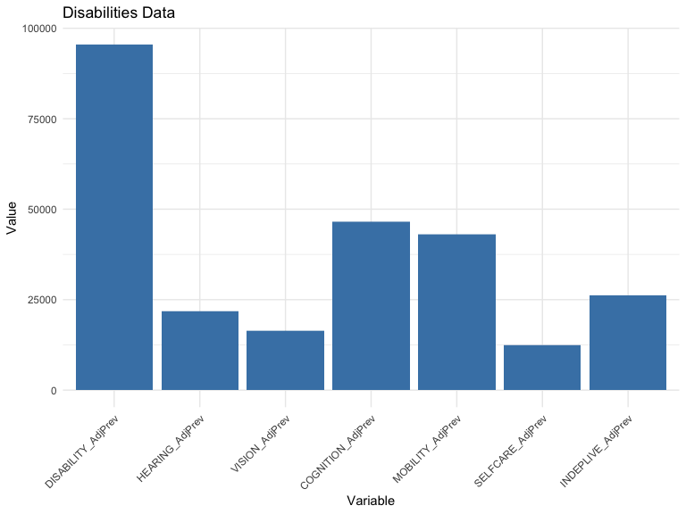
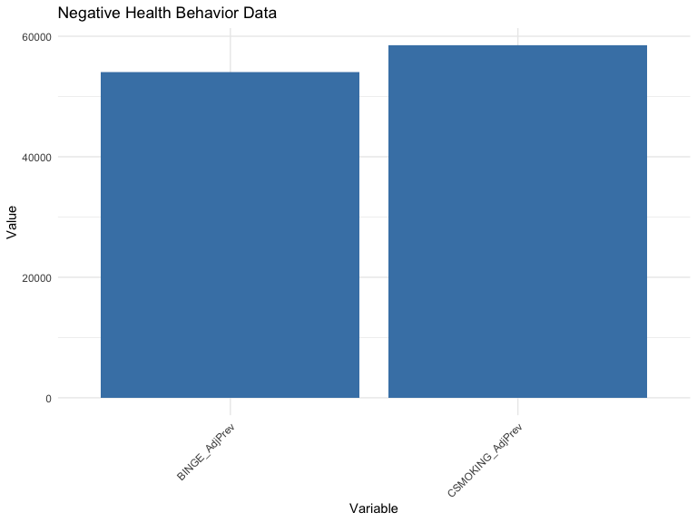

# Loading the data
Lets start by loading the data and examining the first few rows.

```r
    # loading data
    library(readr)

    # google drive location of the files
    places_county_2023_url <- 'https://drive.google.com/file/d/1XN8AfQ36pSBkfFXMI3rLpjij0Rt67WCj/view?usp=sharing'

    # define a function to read the data
    read_data <- function(url){
    # extract file id from the url
    file_id <- strsplit(url, '/')[[1]][6]
    
    # create a read path
    read_path <- paste0('https://drive.usercontent.google.com/download?id=', file_id, '&export=download&authuser=0&confirm=t')
    
    # read the data
    df <- read_csv(read_path)
    return(df)
    }

    # read the data
    places_county_2023 <- read_data(places_county_2023_url)

    # display the first few rows
    head(places_county_2023)
```

<div data-pagedtable="false">
  <script data-pagedtable-source type="application/json">
{"columns":[{"label":["StateAbbr"],"name":[1],"type":["chr"],"align":["left"]},{"label":["StateDesc"],"name":[2],"type":["chr"],"align":["left"]},{"label":["CountyName"],"name":[3],"type":["chr"],"align":["left"]},{"label":["CountyFIPS"],"name":[4],"type":["chr"],"align":["left"]},{"label":["TotalPopulation"],"name":[5],"type":["dbl"],"align":["right"]},{"label":["ACCESS2_CrudePrev"],"name":[6],"type":["dbl"],"align":["right"]},{"label":["ACCESS2_Crude95CI"],"name":[7],"type":["chr"],"align":["left"]},{"label":["ACCESS2_AdjPrev"],"name":[8],"type":["dbl"],"align":["right"]},{"label":["ACCESS2_Adj95CI"],"name":[9],"type":["chr"],"align":["left"]},{"label":["ARTHRITIS_CrudePrev"],"name":[10],"type":["dbl"],"align":["right"]},{"label":["ARTHRITIS_Crude95CI"],"name":[11],"type":["chr"],"align":["left"]},{"label":["ARTHRITIS_AdjPrev"],"name":[12],"type":["dbl"],"align":["right"]},{"label":["ARTHRITIS_Adj95CI"],"name":[13],"type":["chr"],"align":["left"]},{"label":["BINGE_CrudePrev"],"name":[14],"type":["dbl"],"align":["right"]},{"label":["BINGE_Crude95CI"],"name":[15],"type":["chr"],"align":["left"]},{"label":["BINGE_AdjPrev"],"name":[16],"type":["dbl"],"align":["right"]},{"label":["BINGE_Adj95CI"],"name":[17],"type":["chr"],"align":["left"]},{"label":["BPHIGH_CrudePrev"],"name":[18],"type":["dbl"],"align":["right"]},{"label":["BPHIGH_Crude95CI"],"name":[19],"type":["chr"],"align":["left"]},{"label":["BPHIGH_AdjPrev"],"name":[20],"type":["dbl"],"align":["right"]},{"label":["BPHIGH_Adj95CI"],"name":[21],"type":["chr"],"align":["left"]},{"label":["BPMED_CrudePrev"],"name":[22],"type":["dbl"],"align":["right"]},{"label":["BPMED_Crude95CI"],"name":[23],"type":["chr"],"align":["left"]},{"label":["BPMED_AdjPrev"],"name":[24],"type":["dbl"],"align":["right"]},{"label":["BPMED_Adj95CI"],"name":[25],"type":["chr"],"align":["left"]},{"label":["CANCER_CrudePrev"],"name":[26],"type":["dbl"],"align":["right"]},{"label":["CANCER_Crude95CI"],"name":[27],"type":["chr"],"align":["left"]},{"label":["CANCER_AdjPrev"],"name":[28],"type":["dbl"],"align":["right"]},{"label":["CANCER_Adj95CI"],"name":[29],"type":["chr"],"align":["left"]},{"label":["CASTHMA_CrudePrev"],"name":[30],"type":["dbl"],"align":["right"]},{"label":["CASTHMA_Crude95CI"],"name":[31],"type":["chr"],"align":["left"]},{"label":["CASTHMA_AdjPrev"],"name":[32],"type":["dbl"],"align":["right"]},{"label":["CASTHMA_Adj95CI"],"name":[33],"type":["chr"],"align":["left"]},{"label":["CERVICAL_CrudePrev"],"name":[34],"type":["dbl"],"align":["right"]},{"label":["CERVICAL_Crude95CI"],"name":[35],"type":["chr"],"align":["left"]},{"label":["CERVICAL_AdjPrev"],"name":[36],"type":["dbl"],"align":["right"]},{"label":["CERVICAL_Adj95CI"],"name":[37],"type":["chr"],"align":["left"]},{"label":["CHD_CrudePrev"],"name":[38],"type":["dbl"],"align":["right"]},{"label":["CHD_Crude95CI"],"name":[39],"type":["chr"],"align":["left"]},{"label":["CHD_AdjPrev"],"name":[40],"type":["dbl"],"align":["right"]},{"label":["CHD_Adj95CI"],"name":[41],"type":["chr"],"align":["left"]},{"label":["CHECKUP_CrudePrev"],"name":[42],"type":["dbl"],"align":["right"]},{"label":["CHECKUP_Crude95CI"],"name":[43],"type":["chr"],"align":["left"]},{"label":["CHECKUP_AdjPrev"],"name":[44],"type":["dbl"],"align":["right"]},{"label":["CHECKUP_Adj95CI"],"name":[45],"type":["chr"],"align":["left"]},{"label":["CHOLSCREEN_CrudePrev"],"name":[46],"type":["dbl"],"align":["right"]},{"label":["CHOLSCREEN_Crude95CI"],"name":[47],"type":["chr"],"align":["left"]},{"label":["CHOLSCREEN_AdjPrev"],"name":[48],"type":["dbl"],"align":["right"]},{"label":["CHOLSCREEN_Adj95CI"],"name":[49],"type":["chr"],"align":["left"]},{"label":["COLON_SCREEN_CrudePrev"],"name":[50],"type":["dbl"],"align":["right"]},{"label":["COLON_SCREEN_Crude95CI"],"name":[51],"type":["chr"],"align":["left"]},{"label":["COLON_SCREEN_AdjPrev"],"name":[52],"type":["dbl"],"align":["right"]},{"label":["COLON_SCREEN_Adj95CI"],"name":[53],"type":["chr"],"align":["left"]},{"label":["COPD_CrudePrev"],"name":[54],"type":["dbl"],"align":["right"]},{"label":["COPD_Crude95CI"],"name":[55],"type":["chr"],"align":["left"]},{"label":["COPD_AdjPrev"],"name":[56],"type":["dbl"],"align":["right"]},{"label":["COPD_Adj95CI"],"name":[57],"type":["chr"],"align":["left"]},{"label":["COREM_CrudePrev"],"name":[58],"type":["dbl"],"align":["right"]},{"label":["COREM_Crude95CI"],"name":[59],"type":["chr"],"align":["left"]},{"label":["COREM_AdjPrev"],"name":[60],"type":["dbl"],"align":["right"]},{"label":["COREM_Adj95CI"],"name":[61],"type":["chr"],"align":["left"]},{"label":["COREW_CrudePrev"],"name":[62],"type":["dbl"],"align":["right"]},{"label":["COREW_Crude95CI"],"name":[63],"type":["chr"],"align":["left"]},{"label":["COREW_AdjPrev"],"name":[64],"type":["dbl"],"align":["right"]},{"label":["COREW_Adj95CI"],"name":[65],"type":["chr"],"align":["left"]},{"label":["CSMOKING_CrudePrev"],"name":[66],"type":["dbl"],"align":["right"]},{"label":["CSMOKING_Crude95CI"],"name":[67],"type":["chr"],"align":["left"]},{"label":["CSMOKING_AdjPrev"],"name":[68],"type":["dbl"],"align":["right"]},{"label":["CSMOKING_Adj95CI"],"name":[69],"type":["chr"],"align":["left"]},{"label":["DENTAL_CrudePrev"],"name":[70],"type":["dbl"],"align":["right"]},{"label":["DENTAL_Crude95CI"],"name":[71],"type":["chr"],"align":["left"]},{"label":["DENTAL_AdjPrev"],"name":[72],"type":["dbl"],"align":["right"]},{"label":["DENTAL_Adj95CI"],"name":[73],"type":["chr"],"align":["left"]},{"label":["DEPRESSION_CrudePrev"],"name":[74],"type":["dbl"],"align":["right"]},{"label":["DEPRESSION_Crude95CI"],"name":[75],"type":["chr"],"align":["left"]},{"label":["DEPRESSION_AdjPrev"],"name":[76],"type":["dbl"],"align":["right"]},{"label":["DEPRESSION_Adj95CI"],"name":[77],"type":["chr"],"align":["left"]},{"label":["DIABETES_CrudePrev"],"name":[78],"type":["dbl"],"align":["right"]},{"label":["DIABETES_Crude95CI"],"name":[79],"type":["chr"],"align":["left"]},{"label":["DIABETES_AdjPrev"],"name":[80],"type":["dbl"],"align":["right"]},{"label":["DIABETES_Adj95CI"],"name":[81],"type":["chr"],"align":["left"]},{"label":["GHLTH_CrudePrev"],"name":[82],"type":["dbl"],"align":["right"]},{"label":["GHLTH_Crude95CI"],"name":[83],"type":["chr"],"align":["left"]},{"label":["GHLTH_AdjPrev"],"name":[84],"type":["dbl"],"align":["right"]},{"label":["GHLTH_Adj95CI"],"name":[85],"type":["chr"],"align":["left"]},{"label":["HIGHCHOL_CrudePrev"],"name":[86],"type":["dbl"],"align":["right"]},{"label":["HIGHCHOL_Crude95CI"],"name":[87],"type":["chr"],"align":["left"]},{"label":["HIGHCHOL_AdjPrev"],"name":[88],"type":["dbl"],"align":["right"]},{"label":["HIGHCHOL_Adj95CI"],"name":[89],"type":["chr"],"align":["left"]},{"label":["KIDNEY_CrudePrev"],"name":[90],"type":["dbl"],"align":["right"]},{"label":["KIDNEY_Crude95CI"],"name":[91],"type":["chr"],"align":["left"]},{"label":["KIDNEY_AdjPrev"],"name":[92],"type":["dbl"],"align":["right"]},{"label":["KIDNEY_Adj95CI"],"name":[93],"type":["chr"],"align":["left"]},{"label":["LPA_CrudePrev"],"name":[94],"type":["dbl"],"align":["right"]},{"label":["LPA_Crude95CI"],"name":[95],"type":["chr"],"align":["left"]},{"label":["LPA_AdjPrev"],"name":[96],"type":["dbl"],"align":["right"]},{"label":["LPA_Adj95CI"],"name":[97],"type":["chr"],"align":["left"]},{"label":["MAMMOUSE_CrudePrev"],"name":[98],"type":["dbl"],"align":["right"]},{"label":["MAMMOUSE_Crude95CI"],"name":[99],"type":["chr"],"align":["left"]},{"label":["MAMMOUSE_AdjPrev"],"name":[100],"type":["dbl"],"align":["right"]},{"label":["MAMMOUSE_Adj95CI"],"name":[101],"type":["chr"],"align":["left"]},{"label":["MHLTH_CrudePrev"],"name":[102],"type":["dbl"],"align":["right"]},{"label":["MHLTH_Crude95CI"],"name":[103],"type":["chr"],"align":["left"]},{"label":["MHLTH_AdjPrev"],"name":[104],"type":["dbl"],"align":["right"]},{"label":["MHLTH_Adj95CI"],"name":[105],"type":["chr"],"align":["left"]},{"label":["OBESITY_CrudePrev"],"name":[106],"type":["dbl"],"align":["right"]},{"label":["OBESITY_Crude95CI"],"name":[107],"type":["chr"],"align":["left"]},{"label":["OBESITY_AdjPrev"],"name":[108],"type":["dbl"],"align":["right"]},{"label":["OBESITY_Adj95CI"],"name":[109],"type":["chr"],"align":["left"]},{"label":["PHLTH_CrudePrev"],"name":[110],"type":["dbl"],"align":["right"]},{"label":["PHLTH_Crude95CI"],"name":[111],"type":["chr"],"align":["left"]},{"label":["PHLTH_AdjPrev"],"name":[112],"type":["dbl"],"align":["right"]},{"label":["PHLTH_Adj95CI"],"name":[113],"type":["chr"],"align":["left"]},{"label":["SLEEP_CrudePrev"],"name":[114],"type":["dbl"],"align":["right"]},{"label":["SLEEP_Crude95CI"],"name":[115],"type":["chr"],"align":["left"]},{"label":["SLEEP_AdjPrev"],"name":[116],"type":["dbl"],"align":["right"]},{"label":["SLEEP_Adj95CI"],"name":[117],"type":["chr"],"align":["left"]},{"label":["STROKE_CrudePrev"],"name":[118],"type":["dbl"],"align":["right"]},{"label":["STROKE_Crude95CI"],"name":[119],"type":["chr"],"align":["left"]},{"label":["STROKE_AdjPrev"],"name":[120],"type":["dbl"],"align":["right"]},{"label":["STROKE_Adj95CI"],"name":[121],"type":["chr"],"align":["left"]},{"label":["TEETHLOST_CrudePrev"],"name":[122],"type":["dbl"],"align":["right"]},{"label":["TEETHLOST_Crude95CI"],"name":[123],"type":["chr"],"align":["left"]},{"label":["TEETHLOST_AdjPrev"],"name":[124],"type":["dbl"],"align":["right"]},{"label":["TEETHLOST_Adj95CI"],"name":[125],"type":["chr"],"align":["left"]},{"label":["HEARING_CrudePrev"],"name":[126],"type":["dbl"],"align":["right"]},{"label":["HEARING_Crude95CI"],"name":[127],"type":["chr"],"align":["left"]},{"label":["HEARING_AdjPrev"],"name":[128],"type":["dbl"],"align":["right"]},{"label":["HEARING_Adj95CI"],"name":[129],"type":["chr"],"align":["left"]},{"label":["VISION_CrudePrev"],"name":[130],"type":["dbl"],"align":["right"]},{"label":["VISION_Crude95CI"],"name":[131],"type":["chr"],"align":["left"]},{"label":["VISION_AdjPrev"],"name":[132],"type":["dbl"],"align":["right"]},{"label":["VISION_Adj95CI"],"name":[133],"type":["chr"],"align":["left"]},{"label":["COGNITION_CrudePrev"],"name":[134],"type":["dbl"],"align":["right"]},{"label":["COGNITION_Crude95CI"],"name":[135],"type":["chr"],"align":["left"]},{"label":["COGNITION_AdjPrev"],"name":[136],"type":["dbl"],"align":["right"]},{"label":["COGNITION_Adj95CI"],"name":[137],"type":["chr"],"align":["left"]},{"label":["MOBILITY_CrudePrev"],"name":[138],"type":["dbl"],"align":["right"]},{"label":["MOBILITY_Crude95CI"],"name":[139],"type":["chr"],"align":["left"]},{"label":["MOBILITY_AdjPrev"],"name":[140],"type":["dbl"],"align":["right"]},{"label":["MOBILITY_Adj95CI"],"name":[141],"type":["chr"],"align":["left"]},{"label":["SELFCARE_CrudePrev"],"name":[142],"type":["dbl"],"align":["right"]},{"label":["SELFCARE_Crude95CI"],"name":[143],"type":["chr"],"align":["left"]},{"label":["SELFCARE_AdjPrev"],"name":[144],"type":["dbl"],"align":["right"]},{"label":["SELFCARE_Adj95CI"],"name":[145],"type":["chr"],"align":["left"]},{"label":["INDEPLIVE_CrudePrev"],"name":[146],"type":["dbl"],"align":["right"]},{"label":["INDEPLIVE_Crude95CI"],"name":[147],"type":["chr"],"align":["left"]},{"label":["INDEPLIVE_AdjPrev"],"name":[148],"type":["dbl"],"align":["right"]},{"label":["INDEPLIVE_Adj95CI"],"name":[149],"type":["chr"],"align":["left"]},{"label":["DISABILITY_CrudePrev"],"name":[150],"type":["dbl"],"align":["right"]},{"label":["DISABILITY_Crude95CI"],"name":[151],"type":["chr"],"align":["left"]},{"label":["DISABILITY_AdjPrev"],"name":[152],"type":["dbl"],"align":["right"]},{"label":["DISABILITY_Adj95CI"],"name":[153],"type":["chr"],"align":["left"]},{"label":["Geolocation"],"name":[154],"type":["chr"],"align":["left"]}],"data":[{"1":"AL","2":"Alabama","3":"Autauga","4":"01001","5":"59095","6":"10.0","7":"( 7.7, 12.6)","8":"10.4","9":"( 8.0, 13.1)","10":"31.6","11":"(27.5, 36.2)","12":"28.2","13":"(24.4, 32.5)","14":"14.4","15":"(11.6, 17.5)","16":"15.5","17":"(12.5, 18.7)","18":"40.7","19":"(36.3, 45.4)","20":"37.2","21":"(33.0, 41.9)","22":"80.9","23":"(77.9, 83.7)","24":"65.3","25":"(60.5, 70.0)","26":"7.2","27":"( 6.5,  8.0)","28":"6.3","29":"( 5.7,  7.0)","30":"10.1","31":"( 8.9, 11.5)","32":"10.2","33":"( 8.9, 11.6)","34":"84.1","35":"(81.7, 86.3)","36":"84.3","37":"(82.0, 86.5)","38":"6.7","39":"( 5.8,  7.6)","40":"5.7","41":"( 4.9,  6.5)","42":"77.5","43":"(72.8, 81.7)","44":"76.0","45":"(71.2, 80.5)","46":"86.7","47":"(84.1, 89.3)","48":"85.1","49":"(82.1, 88.0)","50":"72.9","51":"(70.0, 75.6)","52":"71.5","53":"(68.5, 74.5)","54":"7.6","55":"( 6.3,  9.2)","56":"6.8","57":"( 5.6,  8.1)","58":"43.5","59":"(35.1, 52.0)","60":"44.0","61":"(35.5, 52.3)","62":"41.7","63":"(34.5, 48.6)","64":"41.3","65":"(34.1, 48.1)","66":"16.8","67":"(13.5, 20.9)","68":"16.9","69":"(13.6, 21.1)","70":"63.2","71":"(59.6, 66.4)","72":"62.9","73":"(59.1, 66.2)","74":"22.2","75":"(18.6, 26.5)","76":"22.7","77":"(19.0, 27.1)","78":"12.3","79":"(10.5, 14.4)","80":"10.7","81":"( 9.2, 12.5)","82":"18.4","83":"(15.6, 21.6)","84":"17.3","85":"(14.6, 20.4)","86":"36.9","87":"(32.3, 41.7)","88":"32.1","89":"(27.5, 36.9)","90":"3.2","91":"( 2.9,  3.6)","92":"2.9","93":"( 2.6,  3.2)","94":"30.0","95":"(25.2, 36.0)","96":"29.1","97":"(24.3, 35.1)","98":"74.7","99":"(70.9, 78.6)","100":"74.8","101":"(70.9, 78.5)","102":"17.1","103":"(14.9, 19.8)","104":"18.0","105":"(15.7, 20.7)","106":"39.3","107":"(32.1, 47.0)","108":"38.9","109":"(31.8, 46.3)","110":"12.4","111":"(10.7, 14.6)","112":"11.7","113":"(10.0, 13.6)","114":"37.0","115":"(35.4, 38.5)","116":"37.5","117":"(35.9, 39.1)","118":"3.4","119":"( 3.0,  3.9)","120":"3.0","121":"( 2.6,  3.4)","122":"12.1","123":"( 8.2, 16.6)","124":"12.7","125":"( 8.5, 17.5)","126":"6.7","127":"( 5.8,  7.7)","128":"6.0","129":"( 5.2,  6.9)","130":"4.9","131":"( 4.2,  5.7)","132":"4.7","133":"( 4.0,  5.4)","134":"13.8","135":"(11.9, 16.3)","136":"14.3","137":"(12.1, 16.8)","138":"16.5","139":"(14.0, 19.4)","140":"14.7","141":"(12.5, 17.2)","142":"4.0","143":"( 3.4,  4.7)","144":"3.7","145":"( 3.2,  4.2)","146":"8.3","147":"( 7.1,  9.8)","148":"8.2","149":"( 7.0,  9.6)","150":"31.5","151":"(27.1, 36.3)","152":"30.2","153":"(26.0, 34.9)","154":"POINT (-86.6464395 32.5322367)"},{"1":"AL","2":"Alabama","3":"Bullock","4":"01011","5":"10320","6":"18.7","7":"(15.3, 23.0)","8":"19.2","9":"(15.7, 23.6)","10":"33.8","11":"(29.4, 38.5)","12":"30.0","13":"(25.8, 34.4)","14":"11.5","15":"( 9.2, 14.2)","16":"12.4","17":"( 9.9, 15.3)","18":"52.7","19":"(47.9, 57.4)","20":"48.9","21":"(44.0, 53.7)","22":"82.7","23":"(80.2, 85.2)","24":"70.3","25":"(65.8, 74.9)","26":"6.5","27":"( 5.8,  7.2)","28":"5.5","29":"( 5.0,  6.1)","30":"11.6","31":"(10.1, 13.2)","32":"11.6","33":"(10.1, 13.3)","34":"82.5","35":"(80.2, 84.8)","36":"82.9","37":"(80.5, 85.1)","38":"9.3","39":"( 8.2, 10.4)","40":"7.9","41":"( 7.0,  8.8)","42":"79.6","43":"(75.0, 83.8)","44":"78.2","45":"(73.3, 82.6)","46":"84.1","47":"(81.0, 86.8)","48":"82.1","49":"(78.7, 85.2)","50":"72.3","51":"(69.7, 75.0)","52":"69.7","53":"(66.9, 72.7)","54":"11.1","55":"( 9.4, 12.8)","56":"9.8","57":"( 8.3, 11.2)","58":"31.9","59":"(25.8, 38.3)","60":"32.8","61":"(26.8, 38.9)","62":"31.6","63":"(26.0, 37.4)","64":"31.8","65":"(26.3, 37.5)","66":"25.5","67":"(21.2, 29.8)","68":"25.7","69":"(21.3, 30.0)","70":"45.3","71":"(41.7, 48.5)","72":"45.0","73":"(41.5, 48.3)","74":"19.7","75":"(16.0, 23.7)","76":"20.2","77":"(16.3, 24.2)","78":"21.3","79":"(18.7, 24.0)","80":"18.7","81":"(16.3, 21.2)","82":"32.3","83":"(28.2, 36.4)","84":"30.7","85":"(26.7, 34.7)","86":"38.7","87":"(33.9, 43.8)","88":"33.4","89":"(28.6, 38.5)","90":"4.7","91":"( 4.3,  5.1)","92":"4.1","93":"( 3.7,  4.5)","94":"44.9","95":"(38.8, 50.7)","96":"43.6","97":"(37.4, 49.5)","98":"75.1","99":"(71.7, 78.3)","100":"75.1","101":"(71.4, 78.5)","102":"19.6","103":"(16.9, 22.2)","104":"20.5","105":"(17.7, 23.3)","106":"49.2","107":"(40.4, 57.9)","108":"48.9","109":"(40.1, 57.5)","110":"17.7","111":"(15.4, 20.0)","112":"16.6","113":"(14.3, 18.8)","114":"45.5","115":"(44.0, 46.9)","116":"46.0","117":"(44.6, 47.4)","118":"5.9","119":"( 5.2,  6.6)","120":"5.1","121":"( 4.5,  5.7)","122":"22.6","123":"(17.6, 27.8)","124":"24.3","125":"(18.5, 30.2)","126":"7.7","127":"( 6.8,  8.7)","128":"6.9","129":"( 6.0,  7.7)","130":"11.0","131":"( 9.6, 12.6)","132":"10.4","133":"( 9.0, 11.8)","134":"20.0","135":"(17.2, 22.8)","136":"20.6","137":"(17.6, 23.5)","138":"26.8","139":"(23.6, 29.9)","140":"23.9","141":"(20.8, 26.8)","142":"8.7","143":"( 7.5,  9.9)","144":"8.0","145":"( 6.9,  9.0)","146":"14.5","147":"(12.5, 16.5)","148":"14.1","149":"(12.2, 16.1)","150":"43.5","151":"(38.4, 48.6)","152":"41.9","153":"(36.7, 47.1)","154":"POINT (-85.7172613 32.1017589)"},{"1":"AL","2":"Alabama","3":"Chilton","4":"01021","5":"45274","6":"13.5","7":"(10.8, 16.9)","8":"14.1","9":"(11.2, 17.6)","10":"33.4","11":"(29.0, 37.8)","12":"29.0","13":"(24.9, 33.1)","14":"14.3","15":"(11.6, 17.5)","16":"15.8","17":"(12.8, 19.2)","18":"41.9","19":"(37.3, 46.3)","20":"37.5","21":"(33.1, 41.7)","22":"81.2","23":"(78.3, 83.9)","24":"64.4","25":"(59.5, 69.3)","26":"7.5","27":"( 6.8,  8.3)","28":"6.3","29":"( 5.7,  7.0)","30":"10.3","31":"( 9.0, 11.7)","32":"10.4","33":"( 9.1, 11.8)","34":"81.1","35":"(78.8, 83.5)","36":"81.6","37":"(79.4, 83.9)","38":"7.9","39":"( 6.9,  9.1)","40":"6.5","41":"( 5.7,  7.4)","42":"74.8","43":"(69.7, 79.5)","44":"72.7","45":"(67.3, 77.7)","46":"85.1","47":"(82.3, 87.7)","48":"83.0","49":"(79.8, 85.9)","50":"72.2","51":"(69.3, 75.0)","52":"70.2","53":"(67.2, 73.2)","54":"9.7","55":"( 8.0, 11.4)","56":"8.3","57":"( 6.9,  9.8)","58":"44.4","59":"(35.7, 52.7)","60":"44.8","61":"(36.3, 52.8)","62":"36.3","63":"(29.1, 43.5)","64":"36.1","65":"(28.9, 43.3)","66":"21.3","67":"(17.2, 25.3)","68":"21.7","69":"(17.6, 25.8)","70":"55.5","71":"(51.8, 59.0)","72":"55.0","73":"(51.1, 58.6)","74":"23.6","75":"(19.5, 27.8)","76":"24.3","77":"(20.2, 28.7)","78":"13.7","79":"(11.6, 15.7)","80":"11.5","81":"( 9.8, 13.2)","82":"22.1","83":"(18.9, 25.5)","84":"20.6","85":"(17.6, 23.8)","86":"39.8","87":"(35.3, 44.5)","88":"33.8","89":"(29.2, 38.7)","90":"3.5","91":"( 3.2,  3.9)","92":"3.0","93":"( 2.7,  3.4)","94":"35.4","95":"(30.0, 41.1)","96":"34.1","97":"(28.8, 39.8)","98":"69.4","99":"(64.7, 74.1)","100":"69.3","101":"(64.3, 74.0)","102":"18.7","103":"(16.2, 21.3)","104":"19.7","105":"(17.1, 22.6)","106":"42.6","107":"(35.0, 50.1)","108":"42.3","109":"(34.7, 49.8)","110":"14.6","111":"(12.5, 16.8)","112":"13.6","113":"(11.6, 15.6)","114":"40.1","115":"(38.6, 41.5)","116":"40.8","117":"(39.2, 42.3)","118":"3.9","119":"( 3.4,  4.4)","120":"3.3","121":"( 2.9,  3.7)","122":"15.9","123":"(11.4, 20.8)","124":"16.8","125":"(12.0, 22.3)","126":"8.0","127":"( 7.0,  9.0)","128":"7.0","129":"( 6.1,  7.8)","130":"6.1","131":"( 5.2,  7.0)","132":"5.7","133":"( 4.9,  6.6)","134":"16.6","135":"(14.1, 19.2)","136":"17.2","137":"(14.6, 20.0)","138":"19.9","139":"(17.1, 22.8)","140":"17.3","141":"(14.8, 19.8)","142":"4.9","143":"( 4.2,  5.7)","144":"4.4","145":"( 3.8,  5.1)","146":"10.1","147":"( 8.7, 11.8)","148":"9.9","149":"( 8.4, 11.4)","150":"37.3","151":"(32.5, 42.0)","152":"35.4","153":"(30.6, 40.1)","154":"POINT (-86.7266071 32.8540514)"},{"1":"AL","2":"Alabama","3":"Cleburne","4":"01029","5":"15103","6":"11.8","7":"( 8.9, 15.1)","8":"12.5","9":"( 9.4, 16.0)","10":"34.6","11":"(29.9, 39.4)","12":"28.7","13":"(24.5, 33.2)","14":"13.9","15":"(11.2, 17.0)","16":"15.9","17":"(12.8, 19.5)","18":"41.7","19":"(37.0, 46.5)","20":"35.7","21":"(31.3, 40.4)","22":"82.2","23":"(79.2, 85.0)","24":"63.4","25":"(58.3, 68.5)","26":"8.2","27":"( 7.4,  9.1)","28":"6.4","29":"( 5.8,  7.1)","30":"10.3","31":"( 9.0, 11.8)","32":"10.5","33":"( 9.2, 12.0)","34":"82.0","35":"(79.2, 84.6)","36":"82.4","37":"(79.6, 85.1)","38":"8.5","39":"( 7.3,  9.7)","40":"6.5","41":"( 5.6,  7.4)","42":"76.6","43":"(71.6, 81.4)","44":"73.7","45":"(68.3, 79.0)","46":"85.8","47":"(82.8, 88.5)","48":"82.8","49":"(79.2, 86.2)","50":"72.7","51":"(69.4, 75.7)","52":"70.5","53":"(66.9, 73.8)","54":"10.3","55":"( 8.4, 12.3)","56":"8.5","57":"( 7.0, 10.2)","58":"41.7","59":"(32.3, 51.2)","60":"41.9","61":"(32.9, 51.3)","62":"37.8","63":"(29.9, 46.0)","64":"37.7","65":"(29.8, 46.0)","66":"20.0","67":"(15.9, 24.5)","68":"20.7","69":"(16.2, 25.5)","70":"59.6","71":"(55.4, 63.7)","72":"59.0","73":"(54.4, 63.1)","74":"24.7","75":"(20.5, 29.4)","76":"26.0","77":"(21.5, 30.9)","78":"13.8","79":"(11.7, 16.1)","80":"11.0","81":"( 9.3, 12.8)","82":"21.8","83":"(18.3, 25.6)","84":"19.8","85":"(16.4, 23.3)","86":"40.6","87":"(35.6, 45.9)","88":"33.4","89":"(28.6, 38.5)","90":"3.7","91":"( 3.3,  4.1)","92":"3.0","93":"( 2.7,  3.3)","94":"34.1","95":"(28.0, 40.1)","96":"32.2","97":"(26.5, 38.3)","98":"70.9","99":"(65.8, 75.7)","100":"71.1","101":"(65.7, 75.8)","102":"18.3","103":"(15.7, 21.0)","104":"19.9","105":"(17.1, 23.0)","106":"36.4","107":"(28.7, 44.8)","108":"36.1","109":"(28.4, 44.6)","110":"15.0","111":"(12.8, 17.5)","112":"13.6","113":"(11.5, 15.8)","114":"35.9","115":"(34.1, 37.6)","116":"36.9","117":"(35.0, 38.7)","118":"4.0","119":"( 3.5,  4.6)","120":"3.2","121":"( 2.8,  3.6)","122":"14.9","123":"( 9.9, 19.8)","124":"15.6","125":"(10.6, 21.3)","126":"8.7","127":"( 7.6,  9.9)","128":"7.1","129":"( 6.2,  8.1)","130":"5.9","131":"( 5.0,  7.0)","132":"5.3","133":"( 4.5,  6.2)","134":"16.3","135":"(13.6, 19.3)","136":"17.1","137":"(14.2, 20.4)","138":"20.2","139":"(17.2, 23.4)","140":"16.6","141":"(14.1, 19.4)","142":"4.9","143":"( 4.1,  5.7)","144":"4.2","145":"( 3.6,  5.0)","146":"10.1","147":"( 8.4, 11.9)","148":"9.7","149":"( 8.1, 11.4)","150":"37.2","151":"(32.1, 42.5)","152":"34.5","153":"(29.4, 39.8)","154":"POINT (-85.5161261 33.6719637)"},{"1":"AL","2":"Alabama","3":"DeKalb","4":"01049","5":"71813","6":"15.9","7":"(12.5, 20.1)","8":"16.7","9":"(13.2, 21.1)","10":"34.8","11":"(30.5, 39.3)","12":"30.2","13":"(26.1, 34.4)","14":"13.6","15":"(11.1, 16.5)","16":"15.0","17":"(12.2, 18.2)","18":"41.2","19":"(36.8, 45.9)","20":"36.7","21":"(32.4, 41.2)","22":"81.7","23":"(78.9, 84.4)","24":"64.4","25":"(59.5, 69.2)","26":"7.6","27":"( 6.9,  8.4)","28":"6.3","29":"( 5.7,  7.0)","30":"10.7","31":"( 9.4, 12.2)","32":"10.8","33":"( 9.4, 12.3)","34":"79.4","35":"(76.5, 82.0)","36":"80.0","37":"(77.3, 82.5)","38":"8.7","39":"( 7.5, 10.0)","40":"7.1","41":"( 6.2,  8.2)","42":"74.1","43":"(69.1, 78.8)","44":"71.8","45":"(66.6, 76.9)","46":"83.9","47":"(80.9, 86.9)","48":"81.7","49":"(78.2, 85.0)","50":"70.3","51":"(67.4, 73.3)","52":"68.3","53":"(65.1, 71.5)","54":"11.0","55":"( 9.2, 13.1)","56":"9.5","57":"( 7.9, 11.2)","58":"39.6","59":"(30.9, 49.3)","60":"39.7","61":"(31.2, 48.8)","62":"37.1","63":"(29.4, 45.6)","64":"36.8","65":"(29.1, 45.2)","66":"21.7","67":"(17.6, 26.0)","68":"22.2","69":"(17.9, 26.7)","70":"53.5","71":"(49.6, 57.2)","72":"52.9","73":"(49.1, 56.7)","74":"25.1","75":"(21.0, 29.5)","76":"25.8","77":"(21.6, 30.4)","78":"14.8","79":"(12.7, 17.2)","80":"12.5","81":"(10.7, 14.5)","82":"24.7","83":"(21.0, 28.7)","84":"23.1","85":"(19.6, 26.7)","86":"40.8","87":"(36.1, 45.7)","88":"34.5","89":"(29.9, 39.4)","90":"3.8","91":"( 3.4,  4.2)","92":"3.2","93":"( 2.9,  3.6)","94":"36.2","95":"(30.6, 42.0)","96":"35.0","97":"(29.3, 40.8)","98":"69.5","99":"(64.9, 74.0)","100":"69.8","101":"(64.8, 74.3)","102":"19.5","103":"(16.9, 22.2)","104":"20.7","105":"(17.9, 23.5)","106":"41.2","107":"(33.6, 49.0)","108":"41.0","109":"(33.6, 48.9)","110":"16.3","111":"(14.0, 18.7)","112":"15.1","113":"(13.0, 17.4)","114":"36.2","115":"(34.8, 37.5)","116":"37.0","117":"(35.4, 38.3)","118":"4.2","119":"( 3.6,  4.8)","120":"3.5","121":"( 3.1,  4.0)","122":"17.8","123":"(12.0, 24.3)","124":"18.6","125":"(12.6, 25.5)","126":"9.0","127":"( 7.9, 10.2)","128":"7.8","129":"( 6.8,  8.9)","130":"7.2","131":"( 6.1,  8.4)","132":"6.7","133":"( 5.8,  7.8)","134":"18.3","135":"(15.5, 21.1)","136":"18.9","137":"(16.0, 21.9)","138":"21.9","139":"(18.9, 25.1)","140":"19.0","141":"(16.3, 21.8)","142":"5.8","143":"( 4.9,  6.7)","144":"5.2","145":"( 4.5,  6.0)","146":"11.4","147":"( 9.7, 13.3)","148":"11.1","149":"( 9.4, 12.8)","150":"39.5","151":"(34.4, 44.8)","152":"37.5","153":"(32.5, 42.7)","154":"POINT (-85.8040207 34.4609148)"},{"1":"AL","2":"Alabama","3":"Lamar","4":"01075","5":"13689","6":"12.2","7":"( 9.6, 15.3)","8":"12.9","9":"(10.1, 16.3)","10":"36.0","11":"(31.0, 41.0)","12":"28.9","13":"(24.5, 33.4)","14":"13.1","15":"(10.5, 16.0)","16":"15.6","17":"(12.5, 18.9)","18":"44.8","19":"(39.8, 49.6)","20":"37.4","21":"(32.8, 42.0)","22":"83.3","23":"(80.3, 85.8)","24":"64.2","25":"(59.2, 69.1)","26":"8.6","27":"( 7.7,  9.5)","28":"6.3","29":"( 5.7,  7.0)","30":"10.4","31":"( 9.0, 11.9)","32":"10.6","33":"( 9.2, 12.2)","34":"81.5","35":"(79.0, 84.0)","36":"82.0","37":"(79.7, 84.3)","38":"9.2","39":"( 7.9, 10.4)","40":"6.6","41":"( 5.7,  7.5)","42":"77.5","43":"(72.5, 82.1)","44":"74.0","45":"(68.4, 79.1)","46":"86.3","47":"(83.6, 88.8)","48":"82.8","49":"(79.3, 86.0)","50":"73.8","51":"(71.1, 76.6)","52":"71.1","53":"(68.0, 74.3)","54":"10.8","55":"( 8.9, 12.7)","56":"8.6","57":"( 7.1, 10.2)","58":"43.2","59":"(34.6, 51.9)","60":"43.4","61":"(34.8, 52.1)","62":"36.0","63":"(29.2, 43.2)","64":"36.4","65":"(29.6, 43.7)","66":"20.5","67":"(16.4, 24.6)","68":"21.7","69":"(17.5, 25.8)","70":"55.8","71":"(52.1, 59.4)","72":"54.9","73":"(51.0, 58.9)","74":"23.4","75":"(19.1, 28.0)","76":"25.1","77":"(20.6, 29.9)","78":"15.0","79":"(12.7, 17.4)","80":"11.5","81":"( 9.8, 13.4)","82":"23.2","83":"(19.7, 26.8)","84":"20.7","85":"(17.4, 23.9)","86":"41.2","87":"(36.1, 46.8)","88":"33.1","89":"(28.3, 38.4)","90":"4.0","91":"( 3.6,  4.5)","92":"3.1","93":"( 2.7,  3.4)","94":"37.0","95":"(31.0, 42.9)","96":"34.6","97":"(28.8, 40.7)","98":"71.0","99":"(66.7, 75.1)","100":"71.5","101":"(67.0, 75.7)","102":"18.1","103":"(15.6, 20.6)","104":"20.1","105":"(17.4, 22.9)","106":"38.7","107":"(30.3, 47.4)","108":"38.7","109":"(30.5, 47.4)","110":"15.5","111":"(13.2, 17.8)","112":"13.8","113":"(11.8, 15.9)","114":"38.1","115":"(36.6, 39.6)","116":"39.6","117":"(37.9, 41.1)","118":"4.5","119":"( 4.0,  5.1)","120":"3.4","121":"( 3.0,  3.8)","122":"14.7","123":"(10.4, 19.8)","124":"15.7","125":"(11.1, 21.3)","126":"9.2","127":"( 8.1, 10.4)","128":"7.1","129":"( 6.2,  8.0)","130":"6.5","131":"( 5.5,  7.5)","132":"5.7","133":"( 4.8,  6.6)","134":"16.3","135":"(13.7, 19.0)","136":"17.4","137":"(14.6, 20.0)","138":"21.8","139":"(18.6, 24.8)","140":"17.2","141":"(14.7, 19.8)","142":"5.3","143":"( 4.6,  6.1)","144":"4.5","145":"( 3.9,  5.1)","146":"10.6","147":"( 9.0, 12.3)","148":"10.0","149":"( 8.5, 11.6)","150":"38.3","151":"(32.9, 43.6)","152":"34.8","153":"(29.8, 40.1)","154":"POINT (-88.0874309 33.7870852)"}],"options":{"columns":{"min":{},"max":[10]},"rows":{"min":[10],"max":[10]},"pages":{}}}
  </script>
</div>

The dataset contains the following columns:

```r
    # display the column names
    colnames(places_county_2023)
```

```
##   [1] "StateAbbr"              "StateDesc"              "CountyName"            
##   [4] "CountyFIPS"             "TotalPopulation"        "ACCESS2_CrudePrev"     
##   [7] "ACCESS2_Crude95CI"      "ACCESS2_AdjPrev"        "ACCESS2_Adj95CI"       
##  [10] "ARTHRITIS_CrudePrev"    "ARTHRITIS_Crude95CI"    "ARTHRITIS_AdjPrev"     
##  [13] "ARTHRITIS_Adj95CI"      "BINGE_CrudePrev"        "BINGE_Crude95CI"       
##  [16] "BINGE_AdjPrev"          "BINGE_Adj95CI"          "BPHIGH_CrudePrev"      
##  [19] "BPHIGH_Crude95CI"       "BPHIGH_AdjPrev"         "BPHIGH_Adj95CI"        
##  [22] "BPMED_CrudePrev"        "BPMED_Crude95CI"        "BPMED_AdjPrev"         
##  [25] "BPMED_Adj95CI"          "CANCER_CrudePrev"       "CANCER_Crude95CI"      
##  [28] "CANCER_AdjPrev"         "CANCER_Adj95CI"         "CASTHMA_CrudePrev"     
##  [31] "CASTHMA_Crude95CI"      "CASTHMA_AdjPrev"        "CASTHMA_Adj95CI"       
##  [34] "CERVICAL_CrudePrev"     "CERVICAL_Crude95CI"     "CERVICAL_AdjPrev"      
##  [37] "CERVICAL_Adj95CI"       "CHD_CrudePrev"          "CHD_Crude95CI"         
##  [40] "CHD_AdjPrev"            "CHD_Adj95CI"            "CHECKUP_CrudePrev"     
##  [43] "CHECKUP_Crude95CI"      "CHECKUP_AdjPrev"        "CHECKUP_Adj95CI"       
##  [46] "CHOLSCREEN_CrudePrev"   "CHOLSCREEN_Crude95CI"   "CHOLSCREEN_AdjPrev"    
##  [49] "CHOLSCREEN_Adj95CI"     "COLON_SCREEN_CrudePrev" "COLON_SCREEN_Crude95CI"
##  [52] "COLON_SCREEN_AdjPrev"   "COLON_SCREEN_Adj95CI"   "COPD_CrudePrev"        
##  [55] "COPD_Crude95CI"         "COPD_AdjPrev"           "COPD_Adj95CI"          
##  [58] "COREM_CrudePrev"        "COREM_Crude95CI"        "COREM_AdjPrev"         
##  [61] "COREM_Adj95CI"          "COREW_CrudePrev"        "COREW_Crude95CI"       
##  [64] "COREW_AdjPrev"          "COREW_Adj95CI"          "CSMOKING_CrudePrev"    
##  [67] "CSMOKING_Crude95CI"     "CSMOKING_AdjPrev"       "CSMOKING_Adj95CI"      
##  [70] "DENTAL_CrudePrev"       "DENTAL_Crude95CI"       "DENTAL_AdjPrev"        
##  [73] "DENTAL_Adj95CI"         "DEPRESSION_CrudePrev"   "DEPRESSION_Crude95CI"  
##  [76] "DEPRESSION_AdjPrev"     "DEPRESSION_Adj95CI"     "DIABETES_CrudePrev"    
##  [79] "DIABETES_Crude95CI"     "DIABETES_AdjPrev"       "DIABETES_Adj95CI"      
##  [82] "GHLTH_CrudePrev"        "GHLTH_Crude95CI"        "GHLTH_AdjPrev"         
##  [85] "GHLTH_Adj95CI"          "HIGHCHOL_CrudePrev"     "HIGHCHOL_Crude95CI"    
##  [88] "HIGHCHOL_AdjPrev"       "HIGHCHOL_Adj95CI"       "KIDNEY_CrudePrev"      
##  [91] "KIDNEY_Crude95CI"       "KIDNEY_AdjPrev"         "KIDNEY_Adj95CI"        
##  [94] "LPA_CrudePrev"          "LPA_Crude95CI"          "LPA_AdjPrev"           
##  [97] "LPA_Adj95CI"            "MAMMOUSE_CrudePrev"     "MAMMOUSE_Crude95CI"    
## [100] "MAMMOUSE_AdjPrev"       "MAMMOUSE_Adj95CI"       "MHLTH_CrudePrev"       
## [103] "MHLTH_Crude95CI"        "MHLTH_AdjPrev"          "MHLTH_Adj95CI"         
## [106] "OBESITY_CrudePrev"      "OBESITY_Crude95CI"      "OBESITY_AdjPrev"       
## [109] "OBESITY_Adj95CI"        "PHLTH_CrudePrev"        "PHLTH_Crude95CI"       
## [112] "PHLTH_AdjPrev"          "PHLTH_Adj95CI"          "SLEEP_CrudePrev"       
## [115] "SLEEP_Crude95CI"        "SLEEP_AdjPrev"          "SLEEP_Adj95CI"         
## [118] "STROKE_CrudePrev"       "STROKE_Crude95CI"       "STROKE_AdjPrev"        
## [121] "STROKE_Adj95CI"         "TEETHLOST_CrudePrev"    "TEETHLOST_Crude95CI"   
## [124] "TEETHLOST_AdjPrev"      "TEETHLOST_Adj95CI"      "HEARING_CrudePrev"     
## [127] "HEARING_Crude95CI"      "HEARING_AdjPrev"        "HEARING_Adj95CI"       
## [130] "VISION_CrudePrev"       "VISION_Crude95CI"       "VISION_AdjPrev"        
## [133] "VISION_Adj95CI"         "COGNITION_CrudePrev"    "COGNITION_Crude95CI"   
## [136] "COGNITION_AdjPrev"      "COGNITION_Adj95CI"      "MOBILITY_CrudePrev"    
## [139] "MOBILITY_Crude95CI"     "MOBILITY_AdjPrev"       "MOBILITY_Adj95CI"      
## [142] "SELFCARE_CrudePrev"     "SELFCARE_Crude95CI"     "SELFCARE_AdjPrev"      
## [145] "SELFCARE_Adj95CI"       "INDEPLIVE_CrudePrev"    "INDEPLIVE_Crude95CI"   
## [148] "INDEPLIVE_AdjPrev"      "INDEPLIVE_Adj95CI"      "DISABILITY_CrudePrev"  
## [151] "DISABILITY_Crude95CI"   "DISABILITY_AdjPrev"     "DISABILITY_Adj95CI"    
## [154] "Geolocation"
```

# Data Preparation
We will create new datasets for our analysis by filtering the columns of interest.

```r
    # key columns
    key_cols <- c('StateAbbr', 'StateDesc', 'CountyName', 'CountyFIPS', 'TotalPopulation', 'Geolocation')

    
    chronic_disease_cols <- c('ARTHRITIS_AdjPrev', 'BPHIGH_AdjPrev', 'CANCER_AdjPrev', 'CASTHMA_AdjPrev', 
                                'CERVICAL_AdjPrev', 'CHD_AdjPrev', 'COPD_AdjPrev', 'DEPRESSION_AdjPrev', 
                                'DIABETES_AdjPrev', 'KIDNEY_AdjPrev', 'STROKE_AdjPrev')

    gen_health_cols <- c('GHLTH_AdjPrev', 'MHLTH_AdjPrev', 'PHLTH_AdjPrev')

    risk_factors_cols <- c('HIGHCHOL_AdjPrev', 'OBESITY_AdjPrev')
    disabilities_cols <- c('DISABILITY_AdjPrev', 'HEARING_AdjPrev', 'VISION_AdjPrev', 'COGNITION_AdjPrev', 'MOBILITY_AdjPrev', 'SELFCARE_AdjPrev', 'INDEPLIVE_AdjPrev')

    negative_health_behavior_cols <- c('BINGE_AdjPrev', 'CSMOKING_AdjPrev')
    positive_health_behavior_cols <- c('LPA_AdjPrev')
    preventive_care_cols <- c('BPMED_AdjPrev', 'CHECKUP_AdjPrev', 'CHOLSCREEN_AdjPrev', 'COLON_SCREEN_AdjPrev')
    sdoh_cols <- c('ACCESS2_AdjPrev')

    # create the datasets
    chronic_disease_data <- places_county_2023[, c(key_cols, chronic_disease_cols)]
    gen_health_data <- places_county_2023[, c(key_cols, gen_health_cols)]
    risk_factors_data <- places_county_2023[, c(key_cols, risk_factors_cols)]
    disabilities_data <- places_county_2023[, c(key_cols, disabilities_cols)]
    negative_health_behavior_data <- places_county_2023[, c(key_cols, negative_health_behavior_cols)]
    positive_health_behavior_data <- places_county_2023[, c(key_cols, positive_health_behavior_cols)]
    preventive_care_data <- places_county_2023[, c(key_cols, preventive_care_cols)]
    sdoh_data <- places_county_2023[, c(key_cols, sdoh_cols)]

    # display the first few rows of the datasets
    head(chronic_disease_data)
```

<div data-pagedtable="false">
  <script data-pagedtable-source type="application/json">
{"columns":[{"label":["StateAbbr"],"name":[1],"type":["chr"],"align":["left"]},{"label":["StateDesc"],"name":[2],"type":["chr"],"align":["left"]},{"label":["CountyName"],"name":[3],"type":["chr"],"align":["left"]},{"label":["CountyFIPS"],"name":[4],"type":["chr"],"align":["left"]},{"label":["TotalPopulation"],"name":[5],"type":["dbl"],"align":["right"]},{"label":["Geolocation"],"name":[6],"type":["chr"],"align":["left"]},{"label":["ARTHRITIS_AdjPrev"],"name":[7],"type":["dbl"],"align":["right"]},{"label":["BPHIGH_AdjPrev"],"name":[8],"type":["dbl"],"align":["right"]},{"label":["CANCER_AdjPrev"],"name":[9],"type":["dbl"],"align":["right"]},{"label":["CASTHMA_AdjPrev"],"name":[10],"type":["dbl"],"align":["right"]},{"label":["CERVICAL_AdjPrev"],"name":[11],"type":["dbl"],"align":["right"]},{"label":["CHD_AdjPrev"],"name":[12],"type":["dbl"],"align":["right"]},{"label":["COPD_AdjPrev"],"name":[13],"type":["dbl"],"align":["right"]},{"label":["DEPRESSION_AdjPrev"],"name":[14],"type":["dbl"],"align":["right"]},{"label":["DIABETES_AdjPrev"],"name":[15],"type":["dbl"],"align":["right"]},{"label":["KIDNEY_AdjPrev"],"name":[16],"type":["dbl"],"align":["right"]},{"label":["STROKE_AdjPrev"],"name":[17],"type":["dbl"],"align":["right"]}],"data":[{"1":"AL","2":"Alabama","3":"Autauga","4":"01001","5":"59095","6":"POINT (-86.6464395 32.5322367)","7":"28.2","8":"37.2","9":"6.3","10":"10.2","11":"84.3","12":"5.7","13":"6.8","14":"22.7","15":"10.7","16":"2.9","17":"3.0"},{"1":"AL","2":"Alabama","3":"Bullock","4":"01011","5":"10320","6":"POINT (-85.7172613 32.1017589)","7":"30.0","8":"48.9","9":"5.5","10":"11.6","11":"82.9","12":"7.9","13":"9.8","14":"20.2","15":"18.7","16":"4.1","17":"5.1"},{"1":"AL","2":"Alabama","3":"Chilton","4":"01021","5":"45274","6":"POINT (-86.7266071 32.8540514)","7":"29.0","8":"37.5","9":"6.3","10":"10.4","11":"81.6","12":"6.5","13":"8.3","14":"24.3","15":"11.5","16":"3.0","17":"3.3"},{"1":"AL","2":"Alabama","3":"Cleburne","4":"01029","5":"15103","6":"POINT (-85.5161261 33.6719637)","7":"28.7","8":"35.7","9":"6.4","10":"10.5","11":"82.4","12":"6.5","13":"8.5","14":"26.0","15":"11.0","16":"3.0","17":"3.2"},{"1":"AL","2":"Alabama","3":"DeKalb","4":"01049","5":"71813","6":"POINT (-85.8040207 34.4609148)","7":"30.2","8":"36.7","9":"6.3","10":"10.8","11":"80.0","12":"7.1","13":"9.5","14":"25.8","15":"12.5","16":"3.2","17":"3.5"},{"1":"AL","2":"Alabama","3":"Lamar","4":"01075","5":"13689","6":"POINT (-88.0874309 33.7870852)","7":"28.9","8":"37.4","9":"6.3","10":"10.6","11":"82.0","12":"6.6","13":"8.6","14":"25.1","15":"11.5","16":"3.1","17":"3.4"}],"options":{"columns":{"min":{},"max":[10]},"rows":{"min":[10],"max":[10]},"pages":{}}}
  </script>
</div>

```r
    head(gen_health_data)
```

<div data-pagedtable="false">
  <script data-pagedtable-source type="application/json">
{"columns":[{"label":["StateAbbr"],"name":[1],"type":["chr"],"align":["left"]},{"label":["StateDesc"],"name":[2],"type":["chr"],"align":["left"]},{"label":["CountyName"],"name":[3],"type":["chr"],"align":["left"]},{"label":["CountyFIPS"],"name":[4],"type":["chr"],"align":["left"]},{"label":["TotalPopulation"],"name":[5],"type":["dbl"],"align":["right"]},{"label":["Geolocation"],"name":[6],"type":["chr"],"align":["left"]},{"label":["GHLTH_AdjPrev"],"name":[7],"type":["dbl"],"align":["right"]},{"label":["MHLTH_AdjPrev"],"name":[8],"type":["dbl"],"align":["right"]},{"label":["PHLTH_AdjPrev"],"name":[9],"type":["dbl"],"align":["right"]}],"data":[{"1":"AL","2":"Alabama","3":"Autauga","4":"01001","5":"59095","6":"POINT (-86.6464395 32.5322367)","7":"17.3","8":"18.0","9":"11.7"},{"1":"AL","2":"Alabama","3":"Bullock","4":"01011","5":"10320","6":"POINT (-85.7172613 32.1017589)","7":"30.7","8":"20.5","9":"16.6"},{"1":"AL","2":"Alabama","3":"Chilton","4":"01021","5":"45274","6":"POINT (-86.7266071 32.8540514)","7":"20.6","8":"19.7","9":"13.6"},{"1":"AL","2":"Alabama","3":"Cleburne","4":"01029","5":"15103","6":"POINT (-85.5161261 33.6719637)","7":"19.8","8":"19.9","9":"13.6"},{"1":"AL","2":"Alabama","3":"DeKalb","4":"01049","5":"71813","6":"POINT (-85.8040207 34.4609148)","7":"23.1","8":"20.7","9":"15.1"},{"1":"AL","2":"Alabama","3":"Lamar","4":"01075","5":"13689","6":"POINT (-88.0874309 33.7870852)","7":"20.7","8":"20.1","9":"13.8"}],"options":{"columns":{"min":{},"max":[10]},"rows":{"min":[10],"max":[10]},"pages":{}}}
  </script>
</div>

```r
    head(risk_factors_data)
```

<div data-pagedtable="false">
  <script data-pagedtable-source type="application/json">
{"columns":[{"label":["StateAbbr"],"name":[1],"type":["chr"],"align":["left"]},{"label":["StateDesc"],"name":[2],"type":["chr"],"align":["left"]},{"label":["CountyName"],"name":[3],"type":["chr"],"align":["left"]},{"label":["CountyFIPS"],"name":[4],"type":["chr"],"align":["left"]},{"label":["TotalPopulation"],"name":[5],"type":["dbl"],"align":["right"]},{"label":["Geolocation"],"name":[6],"type":["chr"],"align":["left"]},{"label":["HIGHCHOL_AdjPrev"],"name":[7],"type":["dbl"],"align":["right"]},{"label":["OBESITY_AdjPrev"],"name":[8],"type":["dbl"],"align":["right"]}],"data":[{"1":"AL","2":"Alabama","3":"Autauga","4":"01001","5":"59095","6":"POINT (-86.6464395 32.5322367)","7":"32.1","8":"38.9"},{"1":"AL","2":"Alabama","3":"Bullock","4":"01011","5":"10320","6":"POINT (-85.7172613 32.1017589)","7":"33.4","8":"48.9"},{"1":"AL","2":"Alabama","3":"Chilton","4":"01021","5":"45274","6":"POINT (-86.7266071 32.8540514)","7":"33.8","8":"42.3"},{"1":"AL","2":"Alabama","3":"Cleburne","4":"01029","5":"15103","6":"POINT (-85.5161261 33.6719637)","7":"33.4","8":"36.1"},{"1":"AL","2":"Alabama","3":"DeKalb","4":"01049","5":"71813","6":"POINT (-85.8040207 34.4609148)","7":"34.5","8":"41.0"},{"1":"AL","2":"Alabama","3":"Lamar","4":"01075","5":"13689","6":"POINT (-88.0874309 33.7870852)","7":"33.1","8":"38.7"}],"options":{"columns":{"min":{},"max":[10]},"rows":{"min":[10],"max":[10]},"pages":{}}}
  </script>
</div>

```r
    head(disabilities_data)
```

<div data-pagedtable="false">
  <script data-pagedtable-source type="application/json">
{"columns":[{"label":["StateAbbr"],"name":[1],"type":["chr"],"align":["left"]},{"label":["StateDesc"],"name":[2],"type":["chr"],"align":["left"]},{"label":["CountyName"],"name":[3],"type":["chr"],"align":["left"]},{"label":["CountyFIPS"],"name":[4],"type":["chr"],"align":["left"]},{"label":["TotalPopulation"],"name":[5],"type":["dbl"],"align":["right"]},{"label":["Geolocation"],"name":[6],"type":["chr"],"align":["left"]},{"label":["DISABILITY_AdjPrev"],"name":[7],"type":["dbl"],"align":["right"]},{"label":["HEARING_AdjPrev"],"name":[8],"type":["dbl"],"align":["right"]},{"label":["VISION_AdjPrev"],"name":[9],"type":["dbl"],"align":["right"]},{"label":["COGNITION_AdjPrev"],"name":[10],"type":["dbl"],"align":["right"]},{"label":["MOBILITY_AdjPrev"],"name":[11],"type":["dbl"],"align":["right"]},{"label":["SELFCARE_AdjPrev"],"name":[12],"type":["dbl"],"align":["right"]},{"label":["INDEPLIVE_AdjPrev"],"name":[13],"type":["dbl"],"align":["right"]}],"data":[{"1":"AL","2":"Alabama","3":"Autauga","4":"01001","5":"59095","6":"POINT (-86.6464395 32.5322367)","7":"30.2","8":"6.0","9":"4.7","10":"14.3","11":"14.7","12":"3.7","13":"8.2"},{"1":"AL","2":"Alabama","3":"Bullock","4":"01011","5":"10320","6":"POINT (-85.7172613 32.1017589)","7":"41.9","8":"6.9","9":"10.4","10":"20.6","11":"23.9","12":"8.0","13":"14.1"},{"1":"AL","2":"Alabama","3":"Chilton","4":"01021","5":"45274","6":"POINT (-86.7266071 32.8540514)","7":"35.4","8":"7.0","9":"5.7","10":"17.2","11":"17.3","12":"4.4","13":"9.9"},{"1":"AL","2":"Alabama","3":"Cleburne","4":"01029","5":"15103","6":"POINT (-85.5161261 33.6719637)","7":"34.5","8":"7.1","9":"5.3","10":"17.1","11":"16.6","12":"4.2","13":"9.7"},{"1":"AL","2":"Alabama","3":"DeKalb","4":"01049","5":"71813","6":"POINT (-85.8040207 34.4609148)","7":"37.5","8":"7.8","9":"6.7","10":"18.9","11":"19.0","12":"5.2","13":"11.1"},{"1":"AL","2":"Alabama","3":"Lamar","4":"01075","5":"13689","6":"POINT (-88.0874309 33.7870852)","7":"34.8","8":"7.1","9":"5.7","10":"17.4","11":"17.2","12":"4.5","13":"10.0"}],"options":{"columns":{"min":{},"max":[10]},"rows":{"min":[10],"max":[10]},"pages":{}}}
  </script>
</div>

```r
    head(negative_health_behavior_data)
```

<div data-pagedtable="false">
  <script data-pagedtable-source type="application/json">
{"columns":[{"label":["StateAbbr"],"name":[1],"type":["chr"],"align":["left"]},{"label":["StateDesc"],"name":[2],"type":["chr"],"align":["left"]},{"label":["CountyName"],"name":[3],"type":["chr"],"align":["left"]},{"label":["CountyFIPS"],"name":[4],"type":["chr"],"align":["left"]},{"label":["TotalPopulation"],"name":[5],"type":["dbl"],"align":["right"]},{"label":["Geolocation"],"name":[6],"type":["chr"],"align":["left"]},{"label":["BINGE_AdjPrev"],"name":[7],"type":["dbl"],"align":["right"]},{"label":["CSMOKING_AdjPrev"],"name":[8],"type":["dbl"],"align":["right"]}],"data":[{"1":"AL","2":"Alabama","3":"Autauga","4":"01001","5":"59095","6":"POINT (-86.6464395 32.5322367)","7":"15.5","8":"16.9"},{"1":"AL","2":"Alabama","3":"Bullock","4":"01011","5":"10320","6":"POINT (-85.7172613 32.1017589)","7":"12.4","8":"25.7"},{"1":"AL","2":"Alabama","3":"Chilton","4":"01021","5":"45274","6":"POINT (-86.7266071 32.8540514)","7":"15.8","8":"21.7"},{"1":"AL","2":"Alabama","3":"Cleburne","4":"01029","5":"15103","6":"POINT (-85.5161261 33.6719637)","7":"15.9","8":"20.7"},{"1":"AL","2":"Alabama","3":"DeKalb","4":"01049","5":"71813","6":"POINT (-85.8040207 34.4609148)","7":"15.0","8":"22.2"},{"1":"AL","2":"Alabama","3":"Lamar","4":"01075","5":"13689","6":"POINT (-88.0874309 33.7870852)","7":"15.6","8":"21.7"}],"options":{"columns":{"min":{},"max":[10]},"rows":{"min":[10],"max":[10]},"pages":{}}}
  </script>
</div>

```r
    head(positive_health_behavior_data)
```

<div data-pagedtable="false">
  <script data-pagedtable-source type="application/json">
{"columns":[{"label":["StateAbbr"],"name":[1],"type":["chr"],"align":["left"]},{"label":["StateDesc"],"name":[2],"type":["chr"],"align":["left"]},{"label":["CountyName"],"name":[3],"type":["chr"],"align":["left"]},{"label":["CountyFIPS"],"name":[4],"type":["chr"],"align":["left"]},{"label":["TotalPopulation"],"name":[5],"type":["dbl"],"align":["right"]},{"label":["Geolocation"],"name":[6],"type":["chr"],"align":["left"]},{"label":["LPA_AdjPrev"],"name":[7],"type":["dbl"],"align":["right"]}],"data":[{"1":"AL","2":"Alabama","3":"Autauga","4":"01001","5":"59095","6":"POINT (-86.6464395 32.5322367)","7":"29.1"},{"1":"AL","2":"Alabama","3":"Bullock","4":"01011","5":"10320","6":"POINT (-85.7172613 32.1017589)","7":"43.6"},{"1":"AL","2":"Alabama","3":"Chilton","4":"01021","5":"45274","6":"POINT (-86.7266071 32.8540514)","7":"34.1"},{"1":"AL","2":"Alabama","3":"Cleburne","4":"01029","5":"15103","6":"POINT (-85.5161261 33.6719637)","7":"32.2"},{"1":"AL","2":"Alabama","3":"DeKalb","4":"01049","5":"71813","6":"POINT (-85.8040207 34.4609148)","7":"35.0"},{"1":"AL","2":"Alabama","3":"Lamar","4":"01075","5":"13689","6":"POINT (-88.0874309 33.7870852)","7":"34.6"}],"options":{"columns":{"min":{},"max":[10]},"rows":{"min":[10],"max":[10]},"pages":{}}}
  </script>
</div>

```r
    head(preventive_care_data)
```

<div data-pagedtable="false">
  <script data-pagedtable-source type="application/json">
{"columns":[{"label":["StateAbbr"],"name":[1],"type":["chr"],"align":["left"]},{"label":["StateDesc"],"name":[2],"type":["chr"],"align":["left"]},{"label":["CountyName"],"name":[3],"type":["chr"],"align":["left"]},{"label":["CountyFIPS"],"name":[4],"type":["chr"],"align":["left"]},{"label":["TotalPopulation"],"name":[5],"type":["dbl"],"align":["right"]},{"label":["Geolocation"],"name":[6],"type":["chr"],"align":["left"]},{"label":["BPMED_AdjPrev"],"name":[7],"type":["dbl"],"align":["right"]},{"label":["CHECKUP_AdjPrev"],"name":[8],"type":["dbl"],"align":["right"]},{"label":["CHOLSCREEN_AdjPrev"],"name":[9],"type":["dbl"],"align":["right"]},{"label":["COLON_SCREEN_AdjPrev"],"name":[10],"type":["dbl"],"align":["right"]}],"data":[{"1":"AL","2":"Alabama","3":"Autauga","4":"01001","5":"59095","6":"POINT (-86.6464395 32.5322367)","7":"65.3","8":"76.0","9":"85.1","10":"71.5"},{"1":"AL","2":"Alabama","3":"Bullock","4":"01011","5":"10320","6":"POINT (-85.7172613 32.1017589)","7":"70.3","8":"78.2","9":"82.1","10":"69.7"},{"1":"AL","2":"Alabama","3":"Chilton","4":"01021","5":"45274","6":"POINT (-86.7266071 32.8540514)","7":"64.4","8":"72.7","9":"83.0","10":"70.2"},{"1":"AL","2":"Alabama","3":"Cleburne","4":"01029","5":"15103","6":"POINT (-85.5161261 33.6719637)","7":"63.4","8":"73.7","9":"82.8","10":"70.5"},{"1":"AL","2":"Alabama","3":"DeKalb","4":"01049","5":"71813","6":"POINT (-85.8040207 34.4609148)","7":"64.4","8":"71.8","9":"81.7","10":"68.3"},{"1":"AL","2":"Alabama","3":"Lamar","4":"01075","5":"13689","6":"POINT (-88.0874309 33.7870852)","7":"64.2","8":"74.0","9":"82.8","10":"71.1"}],"options":{"columns":{"min":{},"max":[10]},"rows":{"min":[10],"max":[10]},"pages":{}}}
  </script>
</div>

```r
    head(sdoh_data)
```

<div data-pagedtable="false">
  <script data-pagedtable-source type="application/json">
{"columns":[{"label":["StateAbbr"],"name":[1],"type":["chr"],"align":["left"]},{"label":["StateDesc"],"name":[2],"type":["chr"],"align":["left"]},{"label":["CountyName"],"name":[3],"type":["chr"],"align":["left"]},{"label":["CountyFIPS"],"name":[4],"type":["chr"],"align":["left"]},{"label":["TotalPopulation"],"name":[5],"type":["dbl"],"align":["right"]},{"label":["Geolocation"],"name":[6],"type":["chr"],"align":["left"]},{"label":["ACCESS2_AdjPrev"],"name":[7],"type":["dbl"],"align":["right"]}],"data":[{"1":"AL","2":"Alabama","3":"Autauga","4":"01001","5":"59095","6":"POINT (-86.6464395 32.5322367)","7":"10.4"},{"1":"AL","2":"Alabama","3":"Bullock","4":"01011","5":"10320","6":"POINT (-85.7172613 32.1017589)","7":"19.2"},{"1":"AL","2":"Alabama","3":"Chilton","4":"01021","5":"45274","6":"POINT (-86.7266071 32.8540514)","7":"14.1"},{"1":"AL","2":"Alabama","3":"Cleburne","4":"01029","5":"15103","6":"POINT (-85.5161261 33.6719637)","7":"12.5"},{"1":"AL","2":"Alabama","3":"DeKalb","4":"01049","5":"71813","6":"POINT (-85.8040207 34.4609148)","7":"16.7"},{"1":"AL","2":"Alabama","3":"Lamar","4":"01075","5":"13689","6":"POINT (-88.0874309 33.7870852)","7":"12.9"}],"options":{"columns":{"min":{},"max":[10]},"rows":{"min":[10],"max":[10]},"pages":{}}}
  </script>
</div>

# Descriptive Statistics
We will now calculate the descriptive statistics for the datasets.

```r
    # function to calculate descriptive statistics
    calculate_descriptive_statistics <- function(df){
        # calculate the descriptive statistics
        desc_stats <- summary(df)
        return(desc_stats)
    }

    # calculate the descriptive statistics
    chronic_disease_desc_stats <- calculate_descriptive_statistics(chronic_disease_data)
    gen_health_desc_stats <- calculate_descriptive_statistics(gen_health_data)
    risk_factors_desc_stats <- calculate_descriptive_statistics(risk_factors_data)
    disabilities_desc_stats <- calculate_descriptive_statistics(disabilities_data)
    negative_health_behavior_desc_stats <- calculate_descriptive_statistics(negative_health_behavior_data)
    positive_health_behavior_desc_stats <- calculate_descriptive_statistics(positive_health_behavior_data)
    preventive_care_desc_stats <- calculate_descriptive_statistics(preventive_care_data)
    sdoh_desc_stats <- calculate_descriptive_statistics(sdoh_data)

    # display the descriptive statistics
    chronic_disease_desc_stats
```

```
##   StateAbbr          StateDesc          CountyName         CountyFIPS       
##  Length:3143        Length:3143        Length:3143        Length:3143       
##  Class :character   Class :character   Class :character   Class :character  
##  Mode  :character   Mode  :character   Mode  :character   Mode  :character  
##                                                                             
##                                                                             
##                                                                             
##                                                                             
##  TotalPopulation   Geolocation        ARTHRITIS_AdjPrev BPHIGH_AdjPrev 
##  Min.   :     57   Length:3143        Min.   :14.80     Min.   :21.30  
##  1st Qu.:  10828   Class :character   1st Qu.:23.00     1st Qu.:29.10  
##  Median :  25787   Mode  :character   Median :24.90     Median :32.00  
##  Mean   : 105598                      Mean   :24.95     Mean   :32.67  
##  3rd Qu.:  68524                      3rd Qu.:26.90     3rd Qu.:35.52  
##  Max.   :9829544                      Max.   :34.60     Max.   :53.10  
##                                       NA's   :67        NA's   :67     
##  CANCER_AdjPrev  CASTHMA_AdjPrev CERVICAL_AdjPrev  CHD_AdjPrev    
##  Min.   :3.900   Min.   : 6.70   Min.   :68.40    Min.   : 3.500  
##  1st Qu.:6.100   1st Qu.: 9.80   1st Qu.:80.10    1st Qu.: 5.300  
##  Median :6.300   Median :10.40   Median :81.80    Median : 5.800  
##  Mean   :6.223   Mean   :10.38   Mean   :81.56    Mean   : 5.893  
##  3rd Qu.:6.400   3rd Qu.:11.00   3rd Qu.:83.20    3rd Qu.: 6.400  
##  Max.   :6.700   Max.   :14.00   Max.   :87.70    Max.   :11.200  
##  NA's   :67      NA's   :67                       NA's   :67      
##   COPD_AdjPrev    DEPRESSION_AdjPrev DIABETES_AdjPrev KIDNEY_AdjPrev 
##  Min.   : 3.300   Min.   : 9.40      Min.   : 5.60    Min.   :2.000  
##  1st Qu.: 6.000   1st Qu.:20.90      1st Qu.: 8.90    1st Qu.:2.700  
##  Median : 7.000   Median :23.10      Median :10.20    Median :2.900  
##  Mean   : 7.206   Mean   :23.04      Mean   :10.57    Mean   :2.944  
##  3rd Qu.: 8.200   3rd Qu.:25.20      3rd Qu.:11.80    3rd Qu.:3.100  
##  Max.   :15.800   Max.   :33.30      Max.   :22.20    Max.   :5.300  
##  NA's   :67       NA's   :67         NA's   :67       NA's   :67     
##  STROKE_AdjPrev 
##  Min.   :1.800  
##  1st Qu.:2.700  
##  Median :3.000  
##  Mean   :3.076  
##  3rd Qu.:3.300  
##  Max.   :6.700  
##  NA's   :67
```

```r
    gen_health_desc_stats
```

```
##   StateAbbr          StateDesc          CountyName         CountyFIPS       
##  Length:3143        Length:3143        Length:3143        Length:3143       
##  Class :character   Class :character   Class :character   Class :character  
##  Mode  :character   Mode  :character   Mode  :character   Mode  :character  
##                                                                             
##                                                                             
##                                                                             
##                                                                             
##  TotalPopulation   Geolocation        GHLTH_AdjPrev   MHLTH_AdjPrev  
##  Min.   :     57   Length:3143        Min.   : 8.40   Min.   : 9.80  
##  1st Qu.:  10828   Class :character   1st Qu.:14.20   1st Qu.:15.70  
##  Median :  25787   Mode  :character   Median :16.90   Median :17.10  
##  Mean   : 105598                      Mean   :17.72   Mean   :17.15  
##  3rd Qu.:  68524                      3rd Qu.:20.80   3rd Qu.:18.60  
##  Max.   :9829544                      Max.   :38.00   Max.   :24.70  
##                                       NA's   :67      NA's   :67     
##  PHLTH_AdjPrev  
##  Min.   : 6.60  
##  1st Qu.:10.40  
##  Median :11.90  
##  Mean   :12.03  
##  3rd Qu.:13.50  
##  Max.   :23.30  
##  NA's   :67
```

```r
    risk_factors_desc_stats
```

```
##   StateAbbr          StateDesc          CountyName         CountyFIPS       
##  Length:3143        Length:3143        Length:3143        Length:3143       
##  Class :character   Class :character   Class :character   Class :character  
##  Mode  :character   Mode  :character   Mode  :character   Mode  :character  
##                                                                             
##                                                                             
##                                                                             
##                                                                             
##  TotalPopulation   Geolocation        HIGHCHOL_AdjPrev OBESITY_AdjPrev
##  Min.   :     57   Length:3143        Min.   :23.60    Min.   :17.40  
##  1st Qu.:  10828   Class :character   1st Qu.:29.57    1st Qu.:35.20  
##  Median :  25787   Mode  :character   Median :31.60    Median :37.70  
##  Mean   : 105598                      Mean   :31.30    Mean   :37.42  
##  3rd Qu.:  68524                      3rd Qu.:33.10    3rd Qu.:40.30  
##  Max.   :9829544                      Max.   :37.10    Max.   :52.50  
##                                       NA's   :67       NA's   :67
```

```r
    disabilities_desc_stats
```

```
##   StateAbbr          StateDesc          CountyName         CountyFIPS       
##  Length:3143        Length:3143        Length:3143        Length:3143       
##  Class :character   Class :character   Class :character   Class :character  
##  Mode  :character   Mode  :character   Mode  :character   Mode  :character  
##                                                                             
##                                                                             
##                                                                             
##                                                                             
##  TotalPopulation   Geolocation        DISABILITY_AdjPrev HEARING_AdjPrev 
##  Min.   :     57   Length:3143        Min.   :16.60      Min.   : 4.000  
##  1st Qu.:  10828   Class :character   1st Qu.:26.68      1st Qu.: 6.300  
##  Median :  25787   Mode  :character   Median :30.70      Median : 7.000  
##  Mean   : 105598                      Mean   :31.02      Mean   : 7.052  
##  3rd Qu.:  68524                      3rd Qu.:35.00      3rd Qu.: 7.600  
##  Max.   :9829544                      Max.   :52.70      Max.   :14.800  
##                                       NA's   :67         NA's   :67      
##  VISION_AdjPrev   COGNITION_AdjPrev MOBILITY_AdjPrev SELFCARE_AdjPrev
##  Min.   : 2.200   Min.   : 7.40     Min.   : 6.50    Min.   : 1.600  
##  1st Qu.: 4.100   1st Qu.:12.80     1st Qu.:11.30    1st Qu.: 3.200  
##  Median : 4.900   Median :14.80     Median :13.60    Median : 3.700  
##  Mean   : 5.299   Mean   :15.11     Mean   :13.97    Mean   : 4.002  
##  3rd Qu.: 6.100   3rd Qu.:17.20     3rd Qu.:16.12    3rd Qu.: 4.600  
##  Max.   :16.400   Max.   :28.40     Max.   :29.10    Max.   :11.700  
##  NA's   :67       NA's   :67        NA's   :67       NA's   :67      
##  INDEPLIVE_AdjPrev
##  Min.   : 3.700   
##  1st Qu.: 6.900   
##  Median : 8.200   
##  Mean   : 8.476   
##  3rd Qu.: 9.700   
##  Max.   :19.400   
##  NA's   :67
```

```r
    negative_health_behavior_desc_stats
```

```
##   StateAbbr          StateDesc          CountyName         CountyFIPS       
##  Length:3143        Length:3143        Length:3143        Length:3143       
##  Class :character   Class :character   Class :character   Class :character  
##  Mode  :character   Mode  :character   Mode  :character   Mode  :character  
##                                                                             
##                                                                             
##                                                                             
##                                                                             
##  TotalPopulation   Geolocation        BINGE_AdjPrev   CSMOKING_AdjPrev
##  Min.   :     57   Length:3143        Min.   : 8.10   Min.   : 7.0    
##  1st Qu.:  10828   Class :character   1st Qu.:15.60   1st Qu.:16.4    
##  Median :  25787   Mode  :character   Median :17.50   Median :18.7    
##  Mean   : 105598                      Mean   :17.56   Mean   :19.0    
##  3rd Qu.:  68524                      3rd Qu.:19.00   3rd Qu.:21.5    
##  Max.   :9829544                      Max.   :26.20   Max.   :43.0    
##                                       NA's   :67      NA's   :67
```

```r
    positive_health_behavior_desc_stats
```

```
##   StateAbbr          StateDesc          CountyName         CountyFIPS       
##  Length:3143        Length:3143        Length:3143        Length:3143       
##  Class :character   Class :character   Class :character   Class :character  
##  Mode  :character   Mode  :character   Mode  :character   Mode  :character  
##                                                                             
##                                                                             
##                                                                             
##                                                                             
##  TotalPopulation   Geolocation         LPA_AdjPrev   
##  Min.   :     57   Length:3143        Min.   :12.00  
##  1st Qu.:  10828   Class :character   1st Qu.:23.07  
##  Median :  25787   Mode  :character   Median :26.30  
##  Mean   : 105598                      Mean   :26.63  
##  3rd Qu.:  68524                      3rd Qu.:30.10  
##  Max.   :9829544                      Max.   :47.00  
##                                       NA's   :67
```

```r
    preventive_care_desc_stats
```

```
##   StateAbbr          StateDesc          CountyName         CountyFIPS       
##  Length:3143        Length:3143        Length:3143        Length:3143       
##  Class :character   Class :character   Class :character   Class :character  
##  Mode  :character   Mode  :character   Mode  :character   Mode  :character  
##                                                                             
##                                                                             
##                                                                             
##                                                                             
##  TotalPopulation   Geolocation        BPMED_AdjPrev   CHECKUP_AdjPrev
##  Min.   :     57   Length:3143        Min.   :46.90   Min.   :54.70  
##  1st Qu.:  10828   Class :character   1st Qu.:58.30   1st Qu.:69.80  
##  Median :  25787   Mode  :character   Median :60.50   Median :73.10  
##  Mean   : 105598                      Mean   :60.22   Mean   :72.33  
##  3rd Qu.:  68524                      3rd Qu.:62.40   3rd Qu.:75.50  
##  Max.   :9829544                      Max.   :72.10   Max.   :82.50  
##                                       NA's   :67      NA's   :67     
##  CHOLSCREEN_AdjPrev COLON_SCREEN_AdjPrev
##  Min.   :53.60      Min.   :49.00       
##  1st Qu.:79.10      1st Qu.:64.80       
##  Median :81.20      Median :68.10       
##  Mean   :81.09      Mean   :67.73       
##  3rd Qu.:83.30      3rd Qu.:71.30       
##  Max.   :89.60      Max.   :82.10       
##  NA's   :67
```

```r
    sdoh_desc_stats
```

```
##   StateAbbr          StateDesc          CountyName         CountyFIPS       
##  Length:3143        Length:3143        Length:3143        Length:3143       
##  Class :character   Class :character   Class :character   Class :character  
##  Mode  :character   Mode  :character   Mode  :character   Mode  :character  
##                                                                             
##                                                                             
##                                                                             
##                                                                             
##  TotalPopulation   Geolocation        ACCESS2_AdjPrev
##  Min.   :     57   Length:3143        Min.   : 3.70  
##  1st Qu.:  10828   Class :character   1st Qu.: 8.50  
##  Median :  25787   Mode  :character   Median :10.65  
##  Mean   : 105598                      Mean   :12.26  
##  3rd Qu.:  68524                      3rd Qu.:14.40  
##  Max.   :9829544                      Max.   :47.60  
##                                       NA's   :67
```

# Data Visualization
We will now visualize the data using bar plots.

```r
    # load the required libraries
    library(ggplot2)
    library(dplyr)
    library(tidyr)

    # function to create bar plots
    create_bar_plot <- function(df, title){
        # create a dataframe for plotting
        df_plot <- df %>%
            gather(key = 'variable', value = 'value', -c(key_cols)) %>%
            mutate(variable = factor(variable, levels = colnames(df)[-(1:length(key_cols))]))
        
        # create the bar plot
        p <- ggplot(df_plot, aes(x = variable, y = value)) +
            geom_bar(stat = 'identity', fill = 'steelblue') +
            theme_minimal() +
            theme(axis.text.x = element_text(angle = 45, hjust = 1)) +
            labs(title = title, x = 'Variable', y = 'Value')
        
        return(p)
    }

    # create the bar plots
    chronic_disease_plot <- create_bar_plot(chronic_disease_data, 'Chronic Disease Data')
    gen_health_plot <- create_bar_plot(gen_health_data, 'General Health Data')
    risk_factors_plot <- create_bar_plot(risk_factors_data, 'Risk Factors Data')
    disabilities_plot <- create_bar_plot(disabilities_data, 'Disabilities Data')
    negative_health_behavior_plot <- create_bar_plot(negative_health_behavior_data, 'Negative Health Behavior Data')
    positive_health_behavior_plot <- create_bar_plot(positive_health_behavior_data, 'Positive Health Behavior Data')
    preventive_care_plot <- create_bar_plot(preventive_care_data, 'Preventive Care Data')
    sdoh_plot <- create_bar_plot(sdoh_data, 'Social Determinants of Health Data')

    # display the bar plots
    print(chronic_disease_plot)
```

<!-- -->

```r
    print(gen_health_plot)
```

<!-- -->

```r
    print(risk_factors_plot)
```

<!-- -->

```r
    print(disabilities_plot)
```

<!-- -->

```r
    print(negative_health_behavior_plot)
```

<!-- -->

```r
    print(positive_health_behavior_plot)
```

<!-- -->

```r
    print(preventive_care_plot)
```

<!-- -->

```r
    print(sdoh_plot)
```

<!-- -->

# Enrich County Data

```r
    # load urban rural classification data
    urban_rural_url <- 'https://drive.google.com/file/d/1-w2AvZj4_sqEzMMS-NCPsILAZzKPaVvE/view?usp=sharing'
    urban_rural_data <- read_data(urban_rural_url)

    # select the required columns
    # 'State Abr.', 'County name', 'FIPS code', '2013 code'
    # rename to: 'StateAbbr', 'LocationName', 'FIPS', 'urban_rural_code'
    # stip 'County' from 'County name'
    urban_rural_data <- urban_rural_data %>%
        select(`State Abr.` = 'State Abr.', `County name` = 'County name', `FIPS code` = 'FIPS code', `2013 code` = '2013 code') %>%
        rename(StateAbbr = `State Abr.`, LocationName = `County name`, FIPS = `FIPS code`, urban_rural_code = `2013 code`) %>%
        mutate(LocationName = gsub(' County', '', LocationName))

    # transform FIPS column
    # if length of FIPS is less than 5, add leading zeros
    urban_rural_data$FIPS <- sprintf('%05d', urban_rural_data$FIPS)

    # create a new column 'urban_rural_classification' based on 'urban_rural_code'
    # 1 - "Large central metro", 2 - "Large fringe metro", 3 - "Medium metro", 4 - "Small metro", 5 - "Micropolitan", 6 - "Noncore"
    urban_rural_data$urban_rural_classification <- case_when(
        urban_rural_data$urban_rural_code == 1 ~ 'Large central metro',
        urban_rural_data$urban_rural_code == 2 ~ 'Large fringe metro',
        urban_rural_data$urban_rural_code == 3 ~ 'Medium metro',
        urban_rural_data$urban_rural_code == 4 ~ 'Small metro',
        urban_rural_data$urban_rural_code == 5 ~ 'Micropolitan',
        urban_rural_data$urban_rural_code == 6 ~ 'Noncore'
    )

    head(urban_rural_data)
```

<div data-pagedtable="false">
  <script data-pagedtable-source type="application/json">
{"columns":[{"label":["StateAbbr"],"name":[1],"type":["chr"],"align":["left"]},{"label":["LocationName"],"name":[2],"type":["chr"],"align":["left"]},{"label":["FIPS"],"name":[3],"type":["chr"],"align":["left"]},{"label":["urban_rural_code"],"name":[4],"type":["dbl"],"align":["right"]},{"label":["urban_rural_classification"],"name":[5],"type":["chr"],"align":["left"]}],"data":[{"1":"AL","2":"Autauga","3":"01001","4":"3","5":"Medium metro"},{"1":"AL","2":"Baldwin","3":"01003","4":"4","5":"Small metro"},{"1":"AL","2":"Barbour","3":"01005","4":"6","5":"Noncore"},{"1":"AL","2":"Bibb","3":"01007","4":"2","5":"Large fringe metro"},{"1":"AL","2":"Blount","3":"01009","4":"2","5":"Large fringe metro"},{"1":"AL","2":"Bullock","3":"01011","4":"6","5":"Noncore"}],"options":{"columns":{"min":{},"max":[10]},"rows":{"min":[10],"max":[10]},"pages":{}}}
  </script>
</div>

```r
    # join urban_rural_data with key_cols and get the urban_rural_classification
    # join on 'FIPS' in urban_rural_data and 'CountyFIPS' in key_cols
    county_data <- places_county_2023[ , key_cols] %>%
        distinct() %>%
        left_join(urban_rural_data, by = c('CountyFIPS' = 'FIPS'))

    # display the county data
    head(county_data)
```

<div data-pagedtable="false">
  <script data-pagedtable-source type="application/json">
{"columns":[{"label":["StateAbbr.x"],"name":[1],"type":["chr"],"align":["left"]},{"label":["StateDesc"],"name":[2],"type":["chr"],"align":["left"]},{"label":["CountyName"],"name":[3],"type":["chr"],"align":["left"]},{"label":["CountyFIPS"],"name":[4],"type":["chr"],"align":["left"]},{"label":["TotalPopulation"],"name":[5],"type":["dbl"],"align":["right"]},{"label":["Geolocation"],"name":[6],"type":["chr"],"align":["left"]},{"label":["StateAbbr.y"],"name":[7],"type":["chr"],"align":["left"]},{"label":["LocationName"],"name":[8],"type":["chr"],"align":["left"]},{"label":["urban_rural_code"],"name":[9],"type":["dbl"],"align":["right"]},{"label":["urban_rural_classification"],"name":[10],"type":["chr"],"align":["left"]}],"data":[{"1":"AL","2":"Alabama","3":"Autauga","4":"01001","5":"59095","6":"POINT (-86.6464395 32.5322367)","7":"AL","8":"Autauga","9":"3","10":"Medium metro"},{"1":"AL","2":"Alabama","3":"Bullock","4":"01011","5":"10320","6":"POINT (-85.7172613 32.1017589)","7":"AL","8":"Bullock","9":"6","10":"Noncore"},{"1":"AL","2":"Alabama","3":"Chilton","4":"01021","5":"45274","6":"POINT (-86.7266071 32.8540514)","7":"AL","8":"Chilton","9":"2","10":"Large fringe metro"},{"1":"AL","2":"Alabama","3":"Cleburne","4":"01029","5":"15103","6":"POINT (-85.5161261 33.6719637)","7":"AL","8":"Cleburne","9":"6","10":"Noncore"},{"1":"AL","2":"Alabama","3":"DeKalb","4":"01049","5":"71813","6":"POINT (-85.8040207 34.4609148)","7":"AL","8":"DeKalb","9":"6","10":"Noncore"},{"1":"AL","2":"Alabama","3":"Lamar","4":"01075","5":"13689","6":"POINT (-88.0874309 33.7870852)","7":"AL","8":"Lamar","9":"6","10":"Noncore"}],"options":{"columns":{"min":{},"max":[10]},"rows":{"min":[10],"max":[10]},"pages":{}}}
  </script>
</div>

```r
    # get missing values (as %) in urban_rural_classification
    missing_values <- sum(is.na(county_data$urban_rural_classification)) / nrow(county_data) * 100
    missing_values
```

```
## [1] 0.06363347
```

```r
    # group by urban_rural_classification and get the count
    urban_rural_count <- county_data %>%
        group_by(urban_rural_classification) %>%
        summarise(count = n())

    # display the urban_rural_count
    urban_rural_count
```

<div data-pagedtable="false">
  <script data-pagedtable-source type="application/json">
{"columns":[{"label":["urban_rural_classification"],"name":[1],"type":["chr"],"align":["left"]},{"label":["count"],"name":[2],"type":["int"],"align":["right"]}],"data":[{"1":"Large central metro","2":"68"},{"1":"Large fringe metro","2":"368"},{"1":"Medium metro","2":"372"},{"1":"Micropolitan","2":"641"},{"1":"Noncore","2":"1334"},{"1":"Small metro","2":"358"},{"1":"NA","2":"2"}],"options":{"columns":{"min":{},"max":[10]},"rows":{"min":[10],"max":[10]},"pages":{}}}
  </script>
</div>

